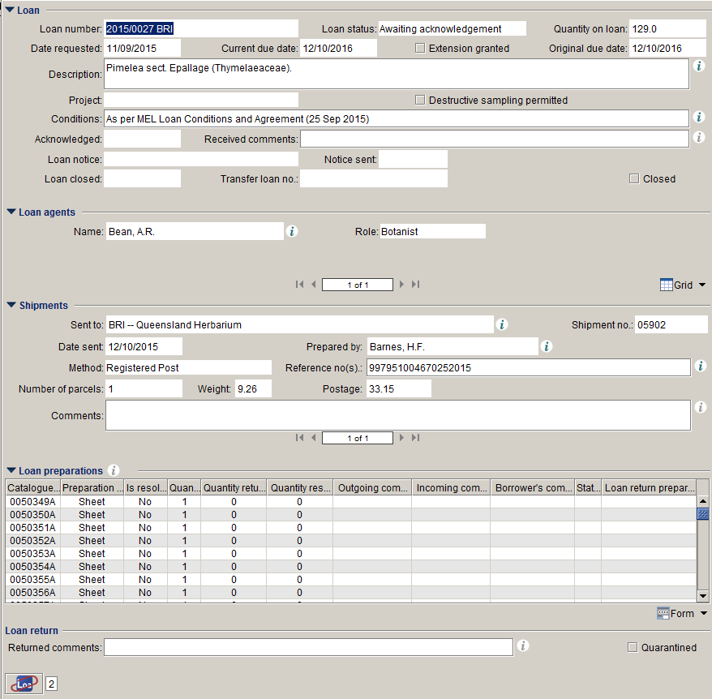
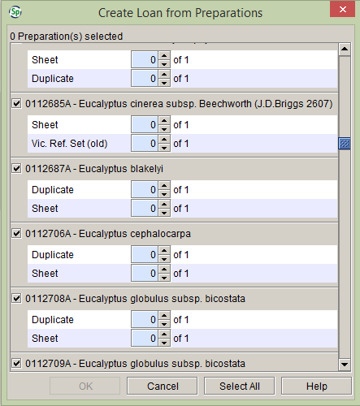
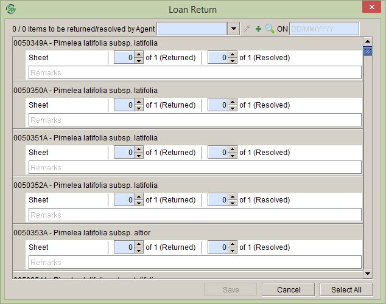
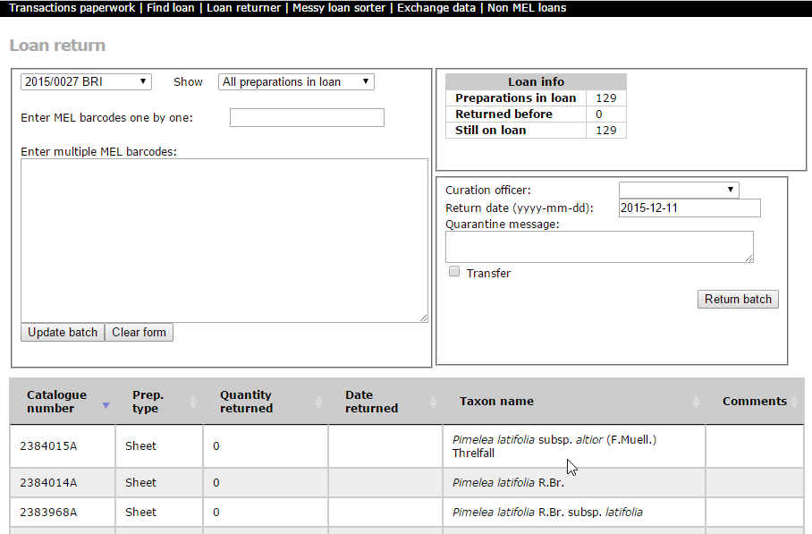
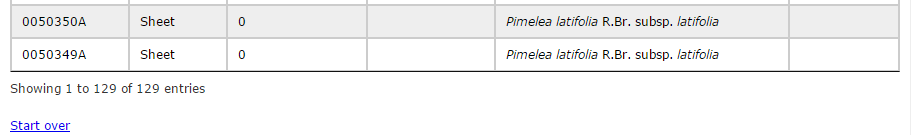

# Herbarium interactions in the MEL Specify instance

The National Herbarium of Victoria (MEL) at the Royal Botanic Gardens Victoria is home to about 1.4 million herbarium specimens. Our holdings include plants, algae and fungi. While most of our holdings originate from Australia, we have up to half a million foreign collections as well. Being established in 1853, MEL is the oldest scientific institute in Australia and therefore we have among our holdings more historical specimens, including types, than other Australian herbaria. We have over 25,000 type specimens, just over 20,000 of which have been imaged so far for the Global Plants Initiative.

Because of our participation in the *Australia's Virtual Herbarium* (AVH) databasing project, which ran between 2001 and 2006, a large part of our collections has been databased and geo-referenced. Apart from some backlog of unmounted specimens and some cryptogam groups, all our Australian holdings have been databased. Currently our collections database has records for over 850,000 of our specimens, all of which are accessible through AVH ([http://avh.chah.org.au](http://avh.chah.org.au)).

After the AVH databasing project it was felt (by some of us at least) that our collections management system – which used TEXPRESS, a precursor to EMu – no longer met the business needs of the National Herbarium of Victoria, most important among these being the delivery of high-quality data to AVH. We therefore started to look around for alternatives and eventually settled on Specify 6 and over the course of 2010 implemented Specify 6 for our use, cleaned up our data and made it ready for the Specify data model, and ultimately migrated at the very end of that year.

Before Specify, our loans and exchange administration was in a different database from the specimen metadata and there was no interaction between the two systems. An important factor in the choice of our new Collections Management System was that the new system had to be able to handle both the specimen metadata and all of our herbarium management functions. TEXPRESS was great for rapid data entry – if not for data quality – and it was to be expected that in any new system it would take longer to database a record than in TEXPRESS and we aimed to offset that – at least for the curation officers who do most of the databasing when we don't have special databasing projects going on – by increasing the efficiency of the administration of other herbarium tasks.

Specify is an off-the-shelf system that is meant to be suitable for all sorts of Natural History collections and therefore will never be able to do absolutely everything exactly the way individual collections want to. We chose between three existing collection management systems (EMu, BRAHMS and Specify), because we didn't have the resources or expertise to develop a CMS in-house, and we were willing to change some of our procedures in order to accommodate the new system. In the end I think the procedures we had to change were developed within the constraints of the old collections database and the new database enabled us to make our procedures more efficient, but some of our staff might disagree with that. While we now most definitely do have the expertise to develop our own system in-house, we think it is important that also the more resource-rich institutions – at least the ones that do not have large non-Natural History collections and therefore have to use general museum software like EMu – resist the temptation to develop their own perfect little systems, but keep conforming to the same general data model for Natural History collections. While we have developed several (internal) web-based applications around Specify, these are only to increase our efficiency. We have not made any changes to the Specify source code (of our instance) and have not changed anything to the database structure (we have added some extra indexes and are using some MySQL triggers). Almost exact copies of our Specify instance (without the data) are in use or being implemented at six Australian and New Zealand university herbaria, two of which already deliver their data to AVH.

The Interactions – which is what Specify calls transactions, possibly because 'transactions' in database language has its own meaning – seems to be the part of Specify that is most geared towards zoological rather than herbarium collections, which makes sense given that the developers of Specify are based at a Natural History museum and the Specify product manager is also the manager of the fish collections, and there are not many herbaria that have implemented Specify yet. Probably the main issue for herbaria is that our loans (and exchange) tend to be much bigger than those of musea – our loans often contain hundreds, sometimes over a thousand specimens – so we have a bigger need for efficiency and on the other hand are probably less variable in terms of preparation types, so we do not have the need of all the steps you have to go through now. Therefore, for herbaria, the way Interactions are implemented might seem rather cumbersome. We have made it work for us, but that is not to say that it cannot be improved. Specify Software has always been very good with taking our suggestions – they have also been very generous with their time to us – so I am sure that once more herbaria implement the Specify Interactions and we come up with some things that will make the Interactions work better for all herbaria, they'll be willing to make the necessary improvements.

## Accessions

We intended to use Accessions for our incoming exchange, but as in the old system the incoming exchange was not linked to Collection Objects, we made this a long-term goal and so far haven't come around to implementing it.

However, under the Nagoya Protocol, which Australia is a signatory of, from October this year we have to be able to supply permit information for all collections we send out of our country. In Specify Permit links (very sensibly) to Accessions, so in the coming few months we will be implementing Accessions to all our (new) records, not just exchange. Implementing Accessions in Specify seems very straightforward – we have already implemented it in our development database – so we just need to develop our procedures around it.

## Loans

Now that it is there, implementing Loans in Specify seems very straightforward, but I remember it was a lot of work, mostly because it was so different in our old system. An example of our Loan form is shown below. We have used up all the general Text fields in Loan table and re-purposed several fields for other things. The mapping of our form fields onto the Specify data model can be found at [https://data.rbg.vic.gov.au/specify/specifyschema/table/loan](https://data.rbg.vic.gov.au/specify/specifyschema/table/loan). The XML behind the form is there as well.

**Figure 1.** Our implementation of the Specify Loan form

As our catalogue numbers are not the same as our barcodes (barcodes are unique for specimens, but not for database records, so we add a suffix to make them unique) we probably mostly create loans from Record Sets, rather than by entering a list of Catalog Numbers. We have, however, developed an external application that turns a list of barcodes – that can be entered using a barcode scanner – into a Record Set or into a comma-separated list of Catalog Numbers that can be copied and pasted into the form when you chose to 'Enter Catalog Numbers'. We have also re-purposed the Name field in the Collection Object table for the barcode, the AltCatalogNumber field for the number without the Index Herbariorum acronym (we call that the \`MEL number\`) and the Modifier column for the suffix (which we call \`Part\`). These extra fields are populated by a MySQL trigger when the Collection Object record is saved.

**Figure 2.** Create Loan from Preparations window.

As said before, our loans can contain hundreds of specimens, so we never change the number of preparations from 0 to 1 one by one, but rather use the 'Select All' button to do that for all preparation at once. This often will include preparations that are not part of the loan. We use the 'Duplicate' Preparation Type for duplicates. These can not be sent on loan, but we can't set the IsLoanable field for the 'Duplicate' Preparation Type to FALSE, as then we can't use them for exchange either. To resolve this, in our web application we've got a button, clicking on which will remove all Duplicate Loan Preparations from the Loan. There are sometimes other preparations as well that are not part of the loan, but they are so few – we use separate Catalog Numbers for separate sheets for specimens that comprise multiple sheets (they are all included in the loan anyway) and for most preparation types (spirit, carpological etc.) – that they can be removed manually either at the 'Create Loan from Preparations' stage or later in the Loan form.

Loan returns is probably the area where the way Specify Interactions work causes us the most grief, as, again, our loans are pretty big, so we can't set all the quantities returned to 1 preparation by preparation. Especially the bigger loans are not always returned all at the same time and even if they were we still need to check for every specimen if it's there, so we can't use the 'Select All' button either.

**Figure 3.** Loan Return window.

To avoid a riot among our Curation Officers, we have set up an external application (see screen shot below) in which they can database returned loans by just scanning the barcodes on the specimens in the loan. From then on the application does exactly what the Specify client would do, so the end result is exactly the same whether people use the Specify client or trust my dodgy coding.

**Figure 4.** Loan return page in our ancillary web application.

## Incoming loans

Rather than use the Borrows for incoming loans, we have set up a new Collection (in a new Discipline, as Loans are shared between Collections in a Discipline) and use the Loan (and Loan Preparation, Loan Agent, Loan Return Preparation etc.) table and forms in that Collection to handle the loans we receive from other institutions. We mostly did this because the fields in the Borrows table were not sufficient to keep all the information we had recorded in our old system – and also because the fields are almost exactly the same as for the Loans, so it made implementation easier – but it has the fortunate side-effect that we can now use this Collection for DNA Sequences (and later maybe Attachments) from collections from other institutions that are made by our staff and that we otherwise could not record in our database.

## Gifts and exchange

At the time we implemented, Exchange In and Exchange Out could not be linked to Preparations, so we use Gifts for all our outgoing gifts and exchange. Even now that you can have Exchange Out Preparations, we see no reason to change this. We have a pick list on the SrcGeography field (see [https://data.rbg.vic.gov.au/specify/specifyschema/table/gift](https://data.rbg.vic.gov.au/specify/specifyschema/table/gift)) to distinguish between exchange and other types of gifts.

Our Gifts do not always have Gift Preparations – for example Shipping Material never has preparations – but in the Specify client you cannot create a new Gift without preparations. This is just a business rule and is not enforced in the data model: Gift Preparations (even the only remaining one) can be easily deleted in the Gift form once the Gift has been created. Our solution has been to have a dummy Preparation of a dummy Collection Object that can be added to the Gift when it is created and removed afterwards. It is not pretty, so it would be nice to have a 'Gift w/o Preps' option like you have for loans. Alternatively we can now use Exchange Out for all our gifts and exchange, but I am not sure if that would work for us with the fields and data types (as with other things, this hasn't been checked out properly yet mainly because the people implementing are not the same as the people using it and it apparently has not been annoying enough for people to complain; eventually we hope to fix all these issues).

Gifts are entirely dealt with in the Specify client. We don't have external applications for Gifts.

## Incoming exchange

As said under Accessions, we don't have incoming exchange linked to Collection Objects yet, so we are just using the Exchange In table and form.
