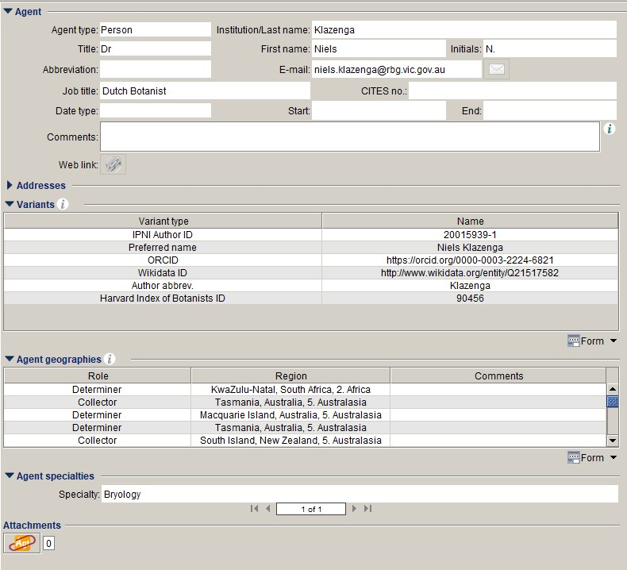

# People and people identifiers in Specify

::: warning
This article is still a draft
:::

## Background

Driven by the TDWG Attribution Interest Group, projects like the Biodiversity Heritage Library (BHL) and citizen scientists, a strong interest in people and the contributions they make to biodiversity data has emerged in the TDWG community. Since the Biodiversity_Next conference in October 2019, a People in Biodiversity Task Group has been working on a Darwin Core Archive (DwCA)/Internet Publishing Toolkit (IPT) Agent Action extension. Now that this work is coming to an end, the Task Group has spawned a Disambiguation working group.

Earlier this year, GBIF added two new terms, [`recordedByID`](http://rs.gbif.org/terms/1.0/recordedByID) and [`identifiedByID`](http://rs.gbif.org/terms/1.0/identifiedByID), to the [DwCA Occurrence Core](https://rs.gbif.org/core/dwc_occurrence_2020-07-15.xml).

Inspired by a talk from Quentin Groom from the Botanical Garden Meise at Biodiversity_Next, where he talked about a script that can be used to match agent names in a collecting database to WikiData records, I contacted Quentin around Easter this year and since then have been talking with Quentin and Mathias Dillen about how best to get identifiers for the agents in collections databases. Mathias's script is an R script, which for some reason I could not get to work and which seemed rather slow – Mathias tries to do a lot more in the script than I want to do – so I did a Google search for 'python really fast fuzzy matching' and implemented one of the first results that came up, which uses Python Pandas and machine learning. It is indeed impressively fast. For me it ends there, as we verify the matches manually, but Mathias is interested in post-processing that should cut out most of the manual verification.

More recently, I have been working on incorporating the [BioNomia](https://bionomia.net) attributions for [our data set](https://bionomia.net/dataset/4ce8e3f9-2546-4af1-b28d-e2eadf05dfd4) in GBIF into our collections database. This is not nearly as straightforward as it sounds and in the end I resorted to matching the BioNomia agents to the Agent table in Specify using the script described above.

We now have ORCIDs and/or Wikidata IDs for 833 of our agents – this will go up to about 950 when the BioNomia matches have been verified – which already allows us to deliver `recordedByID` and/or `identifiedByID` for more than half of our specimens.

The matching script deserves a better write-up, but here we will focus on how we store the identifiers in Specify and how we do the disambiguation of collectors – and try to prevent we have to do more disambiguation later on – in our collections database.

## Storing agent identifiers in Specify

We do not want to store just a single identifier, but multiple identifiers and we want the flexibility to easily add more kinds of identifiers or information. Therefore, rather than using a column or columns in the **Agent** table, we use the **Agent Variant** table, which seems to be made for this purpose. The **Agent Variant** table has a system pick list on the `VarType` field, which we have extended with `ORCID`, `Wikidata ID` etc. If there are any other kinds of identifiers or other pieces of information that we want to capture, we can easily extend it a bit more.



The following functions are used to get the `recordedByID` and `identifiedByID` respectively for our data export:

```sql
-- recorded_by_id
DROP function IF EXISTS `recorded_by_id`;

DELIMITER $$
USE `melisr`$$
CREATE FUNCTION `recorded_by_id`(in_collecting_event_id int) RETURNS varchar(256) CHARSET utf8
BEGIN
	DECLARE out_recorded_by_id varchar(256);
    SELECT GROUP_CONCAT(DISTINCT COALESCE(av1.Name, av2.Name) ORDER BY c.OrderNumber SEPARATOR ' | ')
    INTO out_recorded_by_id
    FROM collector c
    JOIN agent a ON c.AgentID=a.agentID
    LEFT JOIN agentvariant av1 ON a.AgentID=av1.AgentID AND av1.VarType=11 -- ORCID
    LEFT JOIN agentvariant av2 ON a.AgentID=av2.AgentID AND av2.VarType=9 -- Wikidata ID
    WHERE c.CollectingEventID=in_collecting_event_id AND (av1.AgentVariantID IS NOT NULL OR av2.AgentVariantID IS NOT NULL)
    GROUP BY c.CollectingEventID;
RETURN out_recorded_by_id;
END$$

DELIMITER ;
```

```sql
-- identified_by_id
DROP function IF EXISTS `identified_by_id`;

DELIMITER $$
USE `melisr`$$
CREATE FUNCTION `identified_by_id`(in_determination_id int) RETURNS varchar(256) CHARSET utf8
BEGIN
	DECLARE out_identified_by_id varchar(256);
    SELECT GROUP_CONCAT(DISTINCT COALESCE(av1.Name, av2.Name) ORDER BY gp.OrderNumber SEPARATOR ' | ')
    INTO out_identified_by_id
	FROM determination d
	JOIN agent a ON d.DeterminerID=a.AgentID
	LEFT JOIN groupperson gp ON a.AgentID=gp.GroupID
	LEFT JOIN agent m ON gp.MemberID=m.AgentID
	LEFT JOIN agentvariant av1 ON COALESCE(m.AgentID, a.AgentID)=av1.AgentID AND av1.VarType=11 -- ORCID
	LEFT JOIN agentvariant av2 ON COALESCE(m.AgentID, a.AgentID)=av2.AgentID AND av2.VarType=9 -- Wikidata ID
	WHERE d.DeterminationID=in_determination_id AND (av1.AgentVariantID IS NOT NULL OR av2.AgentID IS NOT NULL)
	GROUP BY d.DeterminationID;
RETURN out_identified_by_id;
END$$

DELIMITER ;
```

## Disambiguation of collectors

::: tip
Alison's preliminary notes on how we try to disambiguate our collector data
:::

We have three fields in MELISR that we use to try to record collectors accurately and unambiguously without losing any information on the label. 

The motivation for this is threefold: 

- knowing more about a collector can help us clarify localities and dates, which makes the specimens more useful for scientific research 
- it facilitates research on the social history of collections – telling stories about the people who contribute to natural history collections can engage audiences who might not be directly engaged by the science, and anything we can do to make collections better understood and valued by the wider community is important 
- it makes it easier to quantify the contributions of contemporary biologists, particularly taxonomists, for whom citation indices aren’t a useful indicator of output. 

### Collector(s) <small>(collectingevent.collectors&rarr;Collector)</small>

The Collector(s) field references the Agent table and records collectors in standardised form. Depending on how the collector’s name is presented on the label, the content of this field is often interpreted from an abbreviated or variant form of their name or, in the absence of a name entirely, inferred from handwriting or other collecting info.  

### Verbatim collectors <small>(collectingeventattribute.text1)</small>

The Verbatim collector field was added when we migrated from Texpress to Specify. It is used to record all the details of the collector’s name as it appears on the label, including titles, first names and abbreviations (e.g. Dr FvM, J.Dr., Miss Mary Bate) that are lost when we standardise their name in the Agent table. 

Some people are more methodical than others in using it, and I’d like to mandate its use for every record. Having undertaken extensive research on 19th-century female plant collectors – and spending WEEKS revisiting specimens to disambiguate collectors – I know that having this data available for every record greatly facilitates research on the social history of collections. 

### Collector previously recorded as <small>(collectingeventattribute.remarks)</small>

We’ve recently added a Coll. prev. recorded as field. This field will only be used for existing records without anything in the Verbatim collector field. It will store the collector’s name as it was previously been recorded in either Texpress or Specify, if their name has since been standardised in the Collector field. Having this field allows us to standardise variants of agent’s names in the Collector field, without losing the link between the agent variant and the collecting event. It will probably mainly be used for contemporary collectors for whom we have variations of their initials, e.g. ‘B. Rye’ and ‘B.L. Rye’. We are 99.9% sure that they are the same person, so we’ll update the ‘B. Rye’ entries in the Collector field to ‘B.L. Rye’ and populate Coll. prev. recorded as with ‘B. Rye’.  

This will make the management of the agent records much simpler; we can maintain a single record for each collector without losing any information about how a name was previously recorded. If it turns out that we made a mistake, then we haven’t lost that link and can change the records back. 

 
For records migrated from Texpress, the Coll. prev. recorded as field will include names from the Texpress collector field that had brackets to show information that wasn’t on the label, e.g. ‘Kotschy, [C.G.]T.’. 

Once our entire collection has been imaged, I plan to have DigiVol expeditions to populate the Verbatim collector field for all our records, which would then make the Coll. prev. recorded as field obsolete.  