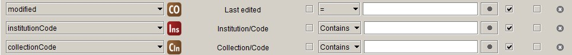
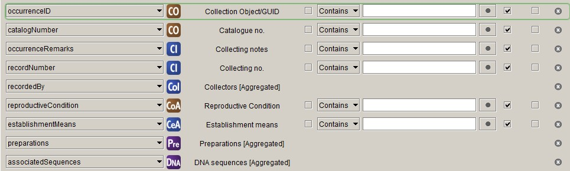
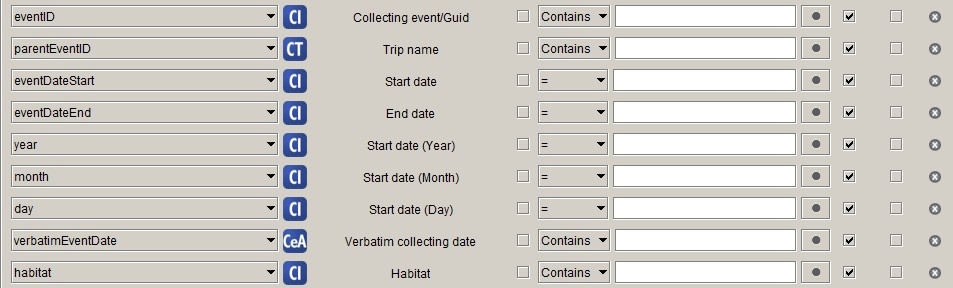
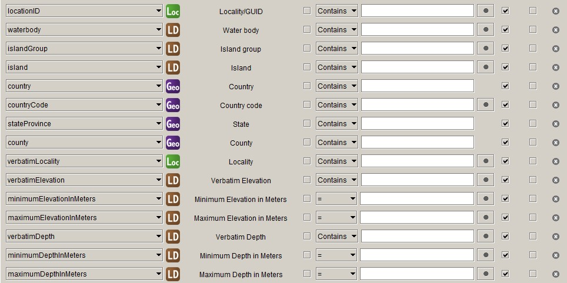
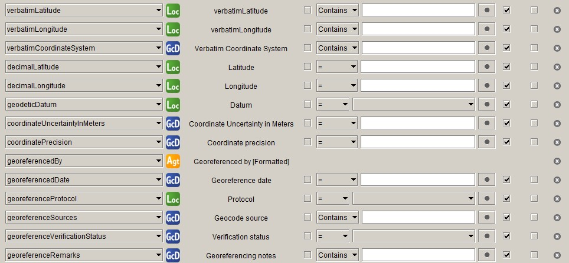
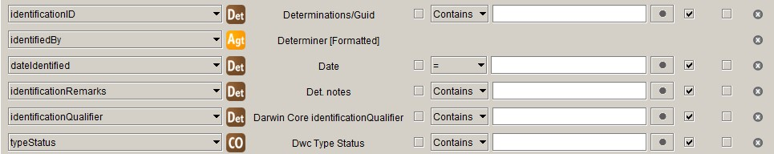
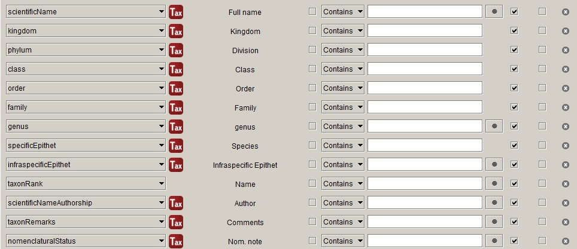

# Specify to Darwin Core mapping

The National Herbarium of Victoria (MEL), like other Australian herbaria, used 
to deliver data to the Australasian Virtual Herbarium (AVH) as ABCD 2.06 through 
a BioCASe provider. The table structure that fed the BioCASe provider was 
created using a PHP application that has become very hard to maintain. 

The Atlas of Living Australia (ALA), which has been hosting the AVH since 2012, 
has never accepted ABCD, so for the last eight years MEL has been harvesting the 
BioCASe providers of other Australian herbaria as well and has been transforming 
ABCD to Darwin Core, which was then delivered as deltas in Darwin Core Archives 
to ALA.

When the deltas became a problem for ALA – or we finally realised they were a 
problem – MEL has started weekly delivery of the full AVH data set of 5M records 
to ALA through the GBIF Integrated Publishing Toolkit (IPT). At that time, early 
2019, it was decided that we would phase out the BioCASe providers and that all 
Australian herbaria should prepare to deliver their own data as Darwin Core 
Archives directly to ALA.

The biggest barrier for MEL to export data from our collections database 
directly as Darwin Core was that the MEL AVH data set in ALA also contained the 
data that was harvested from other Australian herbaria's BioCASe providers and 
that some herbaria will keep depending on MEL harvesting their BioCASe providers 
longer than others. So we have had a Darwin Core mapping for over a year without 
being able to use it.

Over the first half of 2020 the MEL AVH data resource in ALA was split into 
individual data resources for each herbarium (which was not nearly as easy as it 
sounds). This opened the way for MEL to start exporting data from its Specify 
database directly as Darwin Core into an IPT using the Schema Mapper and Data 
Exporter tool that are available in Specify.

## Preparing the schema

Because Darwin Core has been updated since we first set up our database about 
ten years ago, I had to import the latest Darwin Core Schema. The Darwin Core 
schema is missing the record level terms that are borrowed from Dublin Core. We 
only need `modified`, as the other Dublin Core terms that we use have standard 
values for the entire data set.

I added `modified` to the schema like so:

```sql
INSERT INTO spexportschemaitem (TimestampCreated, TimestampModified, Version, 
    CreatedByAgentID, DataType, FieldName, SpExportSchemaID)
VALUES (now(), now(), 0, 1, 'xs:dateTimeIso', 'modified', 14);
```

Also, the collecting date is stored in Specify as `StartDate` and `EndDate`, 
the Darwin Core `eventDate` is an ISO 8601 date string with the start and end 
date separated by a slash ('/'). Therefore, if there is an end date (I 
discovered that almost 4,000 of our records have one), it can not be mapped 
correctly to `eventDate`. I have "resolved" this by adding `eventDateStart` 
and `eventDateEnd` to the schema.

```sql
INSERT INTO spexportschemaitem (TimestampCreated, TimestampModified, Version, 
    CreatedByAgentID, DataType, FieldName, SpExportSchemaID)
VALUES (now(), now(), 0, 1, 'xs:dateTimeIso', 'eventDateStart', 14),
    (now(), now(), 0, 1, 'xs:dateTimeIso', 'eventDateEnd', 14);
```

`eventDateStart` and `eventDateEnd` will be concatenated into `eventDate` in the 
query that feeds the IPT.


## Pre-processing

For many terms there is no straight mapping from the Specify data model – or 
at least the implementation at the National Herbarium of Victoria – to Darwin 
Core terms, so some pre-processing of data is necessary. 

I have tried to do this as much as possible in SQL, which can be stored in the 
database as functions and stored procedures, but for some of the **Location** 
terms the processing needed went beyond what I can do in MySQL, so I have 
used a bit of Python as well.

### Record Level Terms



### Occurrence

 [**Collection Object**](https://data.rbg.vic.gov.au/specify/specifyschema/table/collectionobject)



#### reproductiveCondition

We map what we call "Phenology" in the herbarium community to 
`reproductiveCondition` in Darwin Core, which is not ideal but the best we can 
do at the moment. Phenology in the herbarium world is mainly the presence of 
certain reproductive structures on specimens. We use five fields in the 
[**Collection Object Attribute**](https://data.rbg.vic.gov.au/specify/specifyschema/table/collectionobject) 
table to record a selection of terms from the 
[HISPID vocabulary](https://hiscom.github.io/hispid/vocabulary/reproductive_condition.xml):
flowers, fruit, buds, fertile and sterile. These values need to be concatenated 
into a string.

```sql
DELIMITER $$

DROP FUNCTION IF EXISTS `dwc_reproductive_condition` $$
CREATE FUNCTION `dwc_reproductive_condition`(in_collection_object_id INT) 
RETURNS varchar(128) CHARSET utf8
BEGIN
	declare var_flower varchar(8);
	declare var_fruit varchar(8);
	declare var_buds varchar(8);
	declare var_fertile varchar(8);
	declare var_sterile varchar(8);
    declare out_reproductive_condition varchar(128);
    
	SELECT coa.Text13, coa.Text14, coa.Text15, coa.Text17, coa.Text18
    INTO var_flower, var_fruit, var_buds, var_fertile, var_sterile
	FROM collectionobjectattribute coa
	JOIN collectionobject co ON coa.CollectionObjectAttributeID=co.CollectionObjectAttributeID
    WHERE co.CollectionObjectID=in_collection_object_id;
    
    SET out_reproductive_condition=NULL;
    IF var_flower='1' OR var_fruit='1' OR var_buds='1' THEN
        IF var_flower='1' THEN
            SET out_reproductive_condition='flowers';
        END IF;
        IF var_fruit='1' THEN
			IF out_reproductive_condition IS NOT NULL THEN
                SET out_reproductive_condition = CONCAT_WS('|', out_reproductive_condition, 'fruit');
			ELSE 
				SET out_reproductive_condition = 'fruit';
            END IF;
        END IF;
        IF var_buds='1' THEN
			IF out_reproductive_condition IS NOT NULL THEN
                SET out_reproductive_condition = CONCAT_WS('|', out_reproductive_condition, 'buds');
			ELSE 
				SET out_reproductive_condition = 'buds';
            END IF;
        END IF;
	ELSEIF var_fertile='1' OR var_sterile='1' THEN 
		IF var_fertile='1' THEN
			SET out_reproductive_condition='fertile';
		ELSEIF var_sterile='1' THEN
			SET out_reproductive_condition='sterile';
		END IF;
    END IF;
    
RETURN out_reproductive_condition;
END$$
DELIMITER ;
```

The resulting value is stored in the `Text28` field in the **Collection Object 
Attribute** table.

```sql
DELIMITER $$

DROP PROCEDURE IF EXISTS `update_dwc_reproductive_condition`$$
CREATE PROCEDURE `update_dwc_reproductive_condition`()
BEGIN
	UPDATE collectionobjectattribute coa
    JOIN collectionobject co ON coa.CollectionObjectAttributeID=co.CollectionObjectAttributeID
    SET coa.Text28=dwc_reproductive_condition(co.CollectionObjectID);
END$$
DELIMITER ;
```

#### establishmentMeans

We still record what is called `establishmentMeans` in Darwin Core in the way 
HISPID used to recommend and have two fields, **Introduced status** (`Text11`) 
and **Cultivated status** (`Text13`), in the 
[**Collecting Event Attribute**](https://data.rbg.vic.gov.au/specify/specifyschema/table/collectingeventattribute) 
table. We should probably adopt the Darwin Core recommendation, as that is what 
we do in our flora, but for now we need to convert the content of the two fields 
we have to the correct Darwin Core `establishmentMeans` values. The following 
function does just that:

```sql
DROP function IF EXISTS `dwc_establishment_means`;

DELIMITER $$
CREATE FUNCTION `dwc_establishment_means`(in_collection_object_id INT) 
RETURNS varchar(50) CHARSET utf8
BEGIN
    DECLARE var_introduced varchar(50);
    DECLARE var_cultivated varchar(50);
    DECLARE out_establishment_means varchar(50);
    
    SELECT cea.text11, cea.text13
    INTO var_introduced, var_cultivated
    FROM collectionobject co
    JOIN collectingevent ce ON co. CollectingEventID=ce.CollectingEventID
    JOIN collectingeventattribute cea ON ce.CollectingEventAttributeID=cea.CollectingEventAttributeID
    WHERE co.CollectionObjectID=in_collection_object_id;
    
    SET out_establishment_means = NULL;
    IF var_introduced = 'Native' THEN
        SET out_establishment_means = 'native';
	ELSE
        IF var_introduced = 'Not native' THEN
            SET out_establishment_means = 'introduced';
		END IF;
	END IF;
    
    IF var_cultivated='Cultivated' THEN
        SET out_establishment_means = 'cultivated';
	END IF;
    
RETURN out_establishment_means;
END$$
DELIMITER ;
```

The resulting value is stored in `Text7` in the **Collecting Event Attribute** 
table.

```sql
DELIMITER $$

DROP PROCEDURE IF EXISTS `update_dwc_establishment_means`$$
CREATE PROCEDURE `update_dwc_establishment_means`()
BEGIN
    UPDATE collectingeventattribute cea
    JOIN collectingevent ce ON cea.CollectingEventAttributeID=ce.CollectingEventAttributeID
    JOIN collectionobject co ON ce.CollectingEventID=co.CollectingEventID
    SET cea.Text7=NULL
    WHERE co.CollectionID=4;

    UPDATE collectingeventattribute cea
    JOIN collectingevent ce ON cea.CollectingEventAttributeID=ce.CollectingEventAttributeID
    JOIN collectionobject co ON ce.CollectingEventID=co.CollectingEventID
    SET cea.Text7=dwc_establishment_means(co.CollectionObjectID)
    WHERE co.CollectionID=4 AND (cea.Text11 IS NOT NULL OR cea.Text13 IS NOT NULL);
END$$
DELIMITER ;
```

### Event

 [**Collecting Event**](https://data.rbg.vic.gov.au/specify/specifyschema/table/collectingevent)



No pre-processing is necessary for any of the properties of the **Event** class. 
I concatenate `eventDateStart` and `eventDateEnd` into `eventDate`, fix up 
`eventDate` for incomplete dates and add `startDayOfYear` in post-processing. 

### Location

 [**Locality**](https://data.rbg.vic.gov.au/specify/specifyschema/table/locality)



#### countryCode

The Specify **Geography** table has a `GeographyCode` column that has the 
`countryCode` filled in for countries, but has different values or no value for 
administrative areas within a country. Therefore, if you map the Specify 
`GeographyCode` to the Darwin Core `countryCode`, you will end up with mostly 
*NULL* values.

The following function obtains the `countryCode` for administrative areas within 
countries:

```sql
DROP function IF EXISTS `dwc_countrycode`;

DELIMITER $$

CREATE FUNCTION `dwc_countrycode` (in_geography_id INTEGER)
RETURNS VARCHAR(32)
BEGIN
    DECLARE var_node_number INTEGER;
    DECLARE var_country_code VARCHAR(32);
    
    SELECT NodeNumber
    INTO var_node_number
    FROM geography
    WHERE GeographyID=in_geography_id;
    
    SELECT GeographyCode
    INTO var_country_code
    FROM geography
    WHERE NodeNumber<=var_node_number AND HighestChildNodeNumber>=var_node_number AND RankID=200
    LIMIT 1;

RETURN var_country_code;
END$$

DELIMITER ;
```

And this procedure stores the value in `Text1` in the **Geography** table:


```sql
DELIMITER $$

DROP PROCEDURE IF EXISTS `update_dwc_countrycode`$$
CREATE PROCEDURE `update_dwc_countrycode`()
BEGIN
    UPDATE geography
    SET Text1=dwc_countrycode(GeographyID)
    WHERE GeographyTreeDefID=1 AND RankID>=200;
END$$

DELIMITER ;
```

This has to be done only once and after that can be manually filled in when new 
areas are added to the database (a very infrequent event for us).

#### minimumElevationInMeters, maximumElevationInMeters, verbatimElevation

In Specify you can store altitude in different units and we make use use of 
that, as we have many historical collections with altitudes given in feet, so we 
have altitudes in metres and feet. Darwin Core only accepts altitude in metres, 
so we have to convert the ones in feet. We want to deliver the original values 
in feet as `verbatimElevation`, but do not want to overwrite the verbatim 
altitudes we already have. Therefore, we need fields for 
`minimumElevationInMeters`, `maximumElevationInMeters` and `verbatimElevation`. 
I have put them in `Number1`, `Number2` and `Text3` in the 
[**Locality Detail**](https://data.rbg.vic.gov.au/specify/specifyschema/table/locality) 
table.

```sql
DELIMITER $$

DROP PROCEDURE IF EXISTS `update_dwc_elevation_terms`$$
CREATE PROCEDURE `update_dwc_elevation_terms`()
BEGIN
    START TRANSACTION;

    UPDATE locality l
    JOIN localitydetail ld ON l.LocalityID=ld.LocalityID
    SET 
      ld.Number1 = CASE l.Text1 WHEN 'ft' THEN round(l.MinElevation * 0.3048) ELSE l.MinElevation END,
      ld.Number2 = CASE 
        WHEN l.MaxElevation Is Null THEN
              CASE l.Text1 WHEN 'ft' THEN round(l.MinElevation * 0.3048) ELSE l.MinElevation END
            ELSE 
              CASE l.Text1 WHEN 'ft' THEN round(l.MaxElevation * 0.3048) ELSE l.MaxElevation END
      END,
      ld.Text3 = CASE 
        WHEN l.VerbatimElevation IS NOT NULL THEN l.VerbatimElevation
        ELSE
              CASE l.Text1
            WHEN 'ft' THEN CASE WHEN l.MaxElevation IS NULL THEN CONCAT_WS(' ', l.MinElevation, l.Text1) ELSE CONCAT(l.MinElevation, '–', l.MaxElevation, ' ', l.Text1) END
                ELSE NULL
              END
      END
    WHERE l.MinElevation IS NOT NULL;

    INSERT INTO localitydetail (TimestampCreated, TimestampModified, Version, CreatedByAgentID, LocalityID, Number1, Number2, Text3)
    SELECT now(), now(), 0, 1, l.LocalityID,
    CASE l.Text1 WHEN 'ft' THEN round(l.MinElevation * 0.3048) ELSE l.MinElevation END as minimumElevationInMeters,
    CASE 
      WHEN l.MaxElevation Is Null THEN
        CASE l.Text1 WHEN 'ft' THEN round(l.MinElevation * 0.3048) ELSE l.MinElevation END
      ELSE 
        CASE l.Text1 WHEN 'ft' THEN round(l.MaxElevation * 0.3048) ELSE l.MaxElevation END
      END AS maximumElevationInMeters,
    CASE 
      WHEN l.VerbatimElevation IS NOT NULL THEN l.VerbatimElevation
      ELSE
        CASE l.Text1
          WHEN 'ft' THEN 
            CASE 
              WHEN l.MaxElevation IS NULL THEN CONCAT_WS(' ', l.MinElevation, l.Text1) 
              ELSE CONCAT(l.MinElevation, '–', l.MaxElevation, ' ', l.Text1) 
            END
          ELSE NULL
        END
    END AS VerbatimElevation
    FROM locality l
    LEFT JOIN localitydetail ld ON l.LocalityID=ld.LocalityID
    WHERE l.MinElevation IS NOT NULL AND ld.LocalityDetailID IS NULL;

    UPDATE locality l
    JOIN localitydetail ld ON l.LocalityID=ld.LocalityID
    SET ld.Number1=NULL, ld.Number2=NULL, ld.Text3=NULL
    WHERE l.MinElevation IS NULL AND ld.Number1 IS NOT NULL;

    COMMIT;
END$$
DELIMITER ;
```

#### minimumDepthInMeters, maximumDepthInMeters, verbatimDepth

The situation with the depth fields is like that for the altitude fields, only 
there is an extra unit, fathoms, and the depth field are already in the 
**Locality detail** table, so it is an easier procedure. I have put 
`minimumDepthInMeters`, `maximumDepthInMeters` and `verbatimDepth` in `Number3`, 
`Number4` and `Text4` respectively.

```sql
DELIMITER $$

DROP PROCEDURE IF EXISTS `update_dwc_depth_terms`$$
CREATE PROCEDURE `update_dwc_depth_terms`()
BEGIN
    START TRANSACTION;

    UPDATE localitydetail
    SET 
      Number3 = CASE StartDepthUnit WHEN '1' THEN StartDepth WHEN '2' THEN ROUND(StartDepth * 0.3048) WHEN '3' THEN ROUND(StartDepth * 1.8288) END,
      Number4 = CASE 
        WHEN EndDepth IS NULL THEN
          CASE StartDepthUnit WHEN '1' THEN StartDepth WHEN '2' THEN ROUND(StartDepth * 0.3048) WHEN '3' THEN ROUND(StartDepth * 1.8288) END
            ELSE
              CASE StartDepthUnit WHEN '1' THEN EndDepth WHEN '2' THEN ROUND(EndDepth * 0.3048) WHEN '3' THEN ROUND(EndDepth * 1.8288) END
      END,
      Text4 = CASE 
        WHEN EndDepth IS NULL THEN
          CASE StartDepthUnit
            WHEN '2' THEN CONCAT(StartDepth, ' ft')
            WHEN '3' THEN CONCAT(StartDepth, ' fathoms')
                ELSE NULL
              END
            ELSE
          CASE StartDepthUnit
            WHEN '2' THEN CONCAT(StartDepth, '–', EndDepth, ' ft')
            WHEN '3' THEN CONCAT(StartDepth, '–', ENDDepth, ' fathoms')
                ELSE NULL
              END
      END
    WHERE StartDepth IS NOT NULL;

    UPDATE localitydetail
    SET Number3=NULL, Number4=NULL, Text4=null
    WHERE StartDepth IS NULL AND Number3 IS NOT NULL;

    COMMIT;
END$$
DELIMITER ;
```

### Geo-reference

 [**Geo-coord. Detail**](https://data.rbg.vic.gov.au/specify/specifyschema/table/geocoorddetail)



Geo-reference data is in the **Location** class in Darwin Core, but the class 
has too many properties to fit in a single screenshot and Specify has a separate 
table for at least some of the geo-reference related properties.

#### coordinateUncertaintyInMeters

We – and some other Australian herbaria – have traditionally used a – now 
seeming rather crude – rank system to record coordinate uncertainty:

- 1: &lt; 50 m
- 2: 50–1000 m
- 3: 1000–10000 m
- 4: 10000–25000 m
- 5: &gt; 25000 m.

For modern collections (as in specimens) it is possible to get much more accurate 
uncertainties. We have not quite worked out how to do that well, but we already 
have the values that GeoLocate stores in the `MaxUncertaintyEst` fields that we 
would like to deliver in preference to what we have been delivering before (the 
upper limit of the classes mentioned above).

The following function returns the upper limit of the given uncertainty class:

```sql
DROP function IF EXISTS `coordinate_uncertainty_in_meters`;

DELIMITER $$

CREATE FUNCTION `coordinate_uncertainty_in_meters`(in_precision varchar(2)) 
RETURNS int(11)
BEGIN
	DECLARE out_uncertainty INTEGER;
    SET out_uncertainty = CASE in_precision
      WHEN '1' THEN 50
      WHEN '2' THEN 1000
      WHEN '3' THEN 10000
      WHEN '4' THEN 25000
      ELSE NULL
	END;
RETURN out_uncertainty;
END$$

DELIMITER ;
```

Specify has a `GeoRefAccuracy` field, which I think fits the bill. The following 
procedure will store the value of `MaxUncertaintyEst` if it's there and 
otherwise the returned value of the function above in that field. As the 
**Uncertainty** (`OriginalElevationUnit`) field is in the **Locality** table and 
we will have it for locality records that do not yet have a **Geo-coord. 
Detail** record, new **Geo-coord. Detail** records will need to be created for 
those records.

```sql
DROP procedure IF EXISTS `update_coordinate_uncertainty_in_meters`;

DELIMITER $$

CREATE PROCEDURE `update_coordinate_uncertainty_in_meters` ()
BEGIN
	START TRANSACTION; 

	UPDATE locality l
	JOIN geocoorddetail gc ON l.LocalityID=gc.LocalityID
	SET gc.GeoRefAccuracy=if(gc.MaxUncertaintyEst IS NOT NULL, ROUND(gc.MaxUncertaintyEst), coordinate_uncertainty_in_meters(l.OriginalElevationUnit))
	WHERE (l.OriginalElevationUnit IS NOT NULL OR gc.MaxUncertaintyEst IS NOT NULL) AND (l.Latitude1 IS NOT NULL AND l.Longitude1 IS NOT NULL);

	INSERT INTO geocoorddetail (TimestampCreated, TimestampModified, Version, CreatedByAgentID, GeoRefAccuracy)
	SELECT now(), now(), 0, 1, 
	  coordinate_uncertainty_in_meters(l.OriginalElevationUnit) as geoRefAccuracy
	FROM locality l
	LEFT JOIN geocoorddetail gc ON l.LocalityID=gc.LocalityID
	WHERE (l.OriginalElevationUnit IS NOT NULL AND l.Latitude1 IS NOT NULL AND l.Longitude1 IS NOT NULL) AND gc.GeoCoordDetailID IS NULL;

	COMMIT;
END$$

DELIMITER ;
```

#### verbatimCoordinateSystem and coordinatePrecision

I used to derive `verbatimCoordinateSystem` from the `OriginalLatLongUnit` field 
in the **Locality** table, but, since we started using Specify 7 we have been 
finding some incorrect values for `OriginalLatLongUnit`, so, for the moment, 
I infer `verbatimCoordinateSystem` myself from the `Lat1Text` and `Long1Text` 
fields. The obtained value is stored in the `OriginalCoordSystem` field in the 
**Geo-coord. Detail** table.

Specify does not have `coordinatePrecision`, so it is calculated from the 
`Lat1Text` and `Long1Text` fields. ALA has a (rather senseless) data quality 
test that fails when the number of decimals of the `coordinatePrecision` is 
different from that of `decimalLatitude` and `decimalLongitude`, so we need a 
field of type Decimal with 10 digits – because that is what `Latitude1` and 
`Longitude1` have – to store the value. We are using `NamedPlaceExtent` in the 
**Geo-coord. Detail** table, which fits the bill and was not used before, but it 
would be good to have a dedicated field for `coordinatePrecision`.

The Python code below calculates `verbatimCoordinateSystem` and 
`coordinatePrecision`. As for the calculation of both terms `Lat1Text` and 
`Long1Text` need to be parsed into degrees, minutes and seconds, which takes up 
about half of the code, the two terms are taken together here.

```python
#!/usr/bin/env python3

import re

def verbatim_coord_system(lattext, lngtext):
    verbatim_coordinate_system = None
    lat_deg, lat_min, lat_sec, lng_deg, lng_min, lng_sec = parse_latlng_text(lattext, lngtext)
            
    if lat_sec or lng_sec:
        verbatim_coordinate_system = 'degrees minutes decimal seconds'
    elif lat_min or lng_min:
        verbatim_coordinate_system = 'degrees decimal minutes'
    elif float(lat_deg)>0 or float(lng_deg)>0:
        verbatim_coordinate_system = 'decimal degrees'
        
    return verbatim_coordinate_system

def coordinate_precision(lattext, lngtext):
    coordinate_precision = None
    lat_deg, lat_min, lat_sec, lng_deg, lng_min, lng_sec = parse_latlng_text(lattext, lngtext)
    
    if lat_sec and lng_sec:
        coordinate_precision = 1 / (60 * 60 * decimal_precision_latlng(lat_sec, lng_sec))
    elif lat_min and lng_min:
        coordinate_precision = 1 / (60 * decimal_precision_latlng(lat_min, lng_min))
    elif float(lat_deg)>0 or float(lng_deg)>0:
        coordinate_precision = 1 / decimal_precision_latlng(lat_deg, lng_deg)
    
    return coordinate_precision

def parse_latlng_text(lattext, lngtext):
    lat_pattern = r"^([-+]?\d*\.?\d*)?[d°]? ?(\d*\.?\d*)?'? ?(\d*\.?\d*)?\"? ?([NS]{1})?$"
    lng_pattern = r"^([-+]?\d*\.?\d*)?[d°]? ?(\d*\.?\d*)?'? ?(\d*\.?\d*)?\"? ?([EW]{1})?$"
    
    lat_deg = None
    lat_min = None
    lat_sec = None
    lng_deg = None
    lng_min = None
    lng_sec = None
    
    lat_match = re.search(lat_pattern, lattext)
    if lat_match:
        lat_deg = lat_match.group(1).replace('-', '')
        lat_min = lat_match.group(2)
        lat_sec = lat_match.group(3)
    lng_match = re.search(lng_pattern, lngtext)
    if lng_match:
        lng_deg = lng_match.group(1).replace('-', '')
        lng_min = lng_match.group(2)
        lng_sec = lng_match.group(3)
    return (lat_deg, lat_min, lat_sec, lng_deg, lng_min, lng_sec)

def decimal_precision_latlng(lat, lng):
    dp_lat = decimal_precision(lat)
    dp_lng = decimal_precision(lng)
    return dp_lat if dp_lat < dp_lng else dp_lng
        
def decimal_precision(str):
    if '.' in str:
        return 10**(len(str) - str.find('.') - 1)
    else:
        return 1
```

### Identification

 [**Determination**](https://data.rbg.vic.gov.au/specify/specifyschema/table/determination)



#### identificationQualifier

Specify has the `Qualifier`, `SubSpQualifier` and `VarQualifier` fields to deal 
with uncertain determinations. In our implementation we just use the `Qualifier` 
field and have a pick list field for the rank that the qualifier applies to on 
the `VarQualifier` field.

The Darwin Core [`identificationQualifier`](https://dwc.tdwg.org/terms/#dwc:identificationQualifier) 
is a string that contains the qualifier and all parts of the name that come 
after it. We use the following function to create the Darwin Core 
`identificationQualifier` string from the data in our database:

```sql
DELIMITER $$

/*
* Function creates the Darwin Core identificationQualifier string from elements
* in the Determination and Taxon tables. The DwC identificationQualifier is the 
* qualifier plus the part of the scientific name that follows it.
*/
DROP FUNCTION IF EXISTS `dwc_identification_qualifier` $$
CREATE FUNCTION `dwc_identification_qualifier` (in_qualifier VARCHAR(8), in_rank VARCHAR(16), in_taxonID INT) 
    RETURNS VARCHAR(255) CHARSET utf8
BEGIN
    DECLARE var_name VARCHAR(255);
    DECLARE var_rank_id INT;

    DECLARE num INT;
    DECLARE ins INT;
    DECLARE spacer VARCHAR(1);

    SELECT t.RankID, t.FullName
    INTO var_rank_id, var_name
    FROM taxon t
    WHERE t.TaxonID=in_taxonID;

    IF in_qualifier IS NULL THEN
        RETURN NULL;
    ELSE
        -- number of name elements
        CASE 
            WHEN var_rank_id < 220 THEN SET num = 1; -- genus or monomial
            WHEN var_rank_id = 220 THEN SET num = 2; -- species
            WHEN var_rank_id > 220 THEN SET num = 3; -- infraspecific taxon
        END CASE;

        -- qualifier insertion point
        CASE in_rank
            WHEN 'family' THEN SET ins = 1;     -- preceding name
            WHEN 'genus' THEN SET ins = 1;      --    ,,
            WHEN 'species' THEN SET ins = 2;    -- preceding first epithet
            WHEN 'subspecies' THEN SET ins = 3; -- preceding second epithet
            WHEN 'variety' THEN SET ins = 3;    --    ,,
            WHEN 'forma' THEN SET ins = 3;      --    ,,
            ELSE SET ins = num;
        END CASE;

        -- by default the qualifier is inserted before the last name element 
        IF ins > num THEN 
            SET ins = num;
        END IF;

        IF in_qualifier='?' THEN
            SET spacer='';
        ELSE
            SET spacer=' ';
        END IF;

        -- return dwc:identificationQualifier
        CASE ins
            WHEN 1 THEN
                RETURN CONCAT(in_qualifier, spacer, CONCAT_WS(' ', split_string(var_name, ' ', 1), split_string(var_name, ' ', 2),
                    split_string(var_name, ' ', 3), split_string(var_name, ' ', 4)));
            WHEN 2 THEN
                RETURN CONCAT(in_qualifier, spacer, CONCAT_WS(' ', split_string(var_name, ' ', 2),
                    split_string(var_name, ' ', 3), split_string(var_name, ' ', 4)));
            WHEN 3 THEN
                RETURN CONCAT(in_qualifier, spacer, CONCAT_WS(' ', split_string(var_name, ' ', 3), split_string(var_name, ' ', 4)));
        END CASE;
        
    END IF;

END $$
DELIMITER ;
```

```sql
DELIMITER $$

/*
* Function splits the input string (str) on a delimiter (del) and returns the
* bit indicated by the third parameter (i).
* http://stackoverflow.com/questions/14950466/how-to-split-the-name-string-in-mysql#answer-26491403
*/
DROP FUNCTION IF EXISTS `split_string` $$
CREATE FUNCTION `split_string`(str VARCHAR(1024) , del VARCHAR(1) , i INT) 
    RETURNS VARCHAR(1024) CHARSET utf8
BEGIN
    DECLARE n INT ;
    SET n = LENGTH(str) - LENGTH(REPLACE(str, del, '')) + 1;
    IF i > n THEN
        RETURN NULL;
    ELSE
        RETURN SUBSTRING_INDEX(SUBSTRING_INDEX(str, del, i) , del , -1 );
    END IF;
END $$

DELIMITER ;
```

The value that is returned by this function is stored in the `Text1` field:

```sql
DELIMITER $$

DROP PROCEDURE IF EXISTS update_dwc_identification_qualifier $$
CREATE PROCEDURE update_dwc_identification_qualifier ()
BEGIN
    UPDATE determination
    SET Text1=dwc_identification_qualifier(Qualifier, VarQualifier, TaxonID)
    WHERE Qualifier IS NOT NULL AND TaxonID IS NOT NULL;
END $$

DELIMITER ;
```

#### typeStatus

Specify deals with nomenclatural type designations as determinations, so so do 
we. We have a determination type – in the `FeatureOrBasis` field – 'Type 
status' to indicate that a determination is really a nomenclatural type status 
designation. As, in our implementation, 'Type status' determinations are never 
current determinations, they will be excluded from the Darwin Core Occurrence 
Core mapping, because in the query underlying the mapping `Is Current` will be 
set to 'Yes'. Also, the Darwin Core `typeStatus` is different from the Specify 
`Type Status` in that, apart from the type of type, it also contains the 
typified name and, optionally, other information. Therefore we store the Darwin 
Core `typeStatus` in a field in the **Collection Object** table.

The following function compiles the Darwin Core `typeStatus` string:

```sql
DELIMITER $$

/*
* Function checks if a collection object is a type and, if so, concatenates the
* Darwin Core typeStatus string from values of fields in the Determination and 
* Taxon tables. 
*/
DROP FUNCTION IF EXISTS `dwc_type_status` $$
CREATE FUNCTION `dwc_type_status` (colobjid INT) 
RETURNS VARCHAR(1024) CHARSET utf8
BEGIN
    DECLARE var_typeOfType VARCHAR(32);
    DECLARE var_scientificName VARCHAR(128);
    DECLARE var_author VARCHAR(128);
    DECLARE var_protologue VARCHAR(255);
    DECLARE var_year INT;

    DECLARE str VARCHAR(1024);

    SELECT d.TypeStatusName, t.FullName, t.Author, t.CommonName, t.Number2
    INTO var_typeOfType, var_scientificName, var_author, var_protologue, var_year
    FROM determination d
    JOIN taxon t ON d.TaxonID=t.TaxonID
    WHERE d.CollectionObjectID=colobjid AND d.TypeStatusName IS NOT NULL AND d.YesNo1=1
        -- exclude type status designations with qualifiers and authentic specimens
        -- for invalid names
        AND d.SubspQualifier IS NULL AND d.TypeStatusName!='Authentic specimen'
    LIMIT 1;

    IF var_typeOfType IS NULL THEN
        RETURN NULL;
    ELSE
        SET str = CONCAT_WS(' ', var_typeOfType, 'of', var_scientificName, var_author);
        IF var_protologue IS NOT NULL AND var_year IS NOT NULL THEN
            SET str = CONCAT(str, ', ', var_protologue, ' (', var_year, ')');
        END IF;
        RETURN str;
    END IF;

END $$

DELIMITER ;
```

This procedure stores the returned value in the `Description` field in the 
**Collection Object** table:

```sql
DELIMITER $$

DROP PROCEDURE IF EXISTS update_dwc_type_status $$
CREATE PROCEDURE update_dwc_type_status ()
BEGIN
    UPDATE collectionobject
    SET Description=dwc_type_status(CollectionObjectID)
    WHERE CollectionObjectID IN (
        SELECT CollectionObjectID
        FROM determination
        WHERE TypeStatusName IS NOT NULL
            AND YesNo1=1 AND SubspQualifier IS NULL AND TypeStatusName!='Authentic specimen'
    );

    UPDATE collectionobject
    SET Description=NULL
    WHERE CollectionObjectID NOT IN (
        SELECT CollectionObjectID
        FROM determination
        WHERE TypeStatusName IS NOT NULL
            AND YesNo1=1 AND SubspQualifier IS NULL AND TypeStatusName!='Authentic specimen'
    );
END $$

DELIMITER ;
```

### Taxon

 [**Taxon**](https://data.rbg.vic.gov.au/specify/specifyschema/table/taxon)



#### infraspecificEpithet

Because we are a herbarium we have to deal with multiple infraspecific ranks. 
The Specify query provides subspecies, variety etc., but not a single 
infraspecific epithet. So we have to store it somewhere ourselves.

We have been doing this for years with a trigger, which I will not show, as the 
use of triggers is frowned upon by the Specify Collections Consortium, but it 
does something like this:

```sql
UPDATE taxon SET Text5="Name" WHERE RankID>220;
```

## Post-processing

The following query is used for the **Occurrence Core** in the IPT:

```sql
SELECT
  m.occurrenceID,
  
  -- Record Level Terms
  'PhysicalObject' AS `type`,
  modified,
  'https://creativecommons.org/licenses/by/4.0/legalcode' AS license,
  'Royal Botanic Gardens Board' AS rightsHolder,
  m.institutionCode,
  m.collectionCode,
  'PreservedSpecimen' AS basisOfRecord,
  
  -- Occurrence
  m.catalogNumber,
  m.occurrenceRemarks,
  m.recordNumber,
  replace(m.recordedBy, '; ', '|') AS recordedBy,
  ai.recordedByID,
  m.reproductiveCondition,
  m.establishmentMeans,
  'present' AS occurrenceStatus,
  replace(m.preparations, '; ', '|') AS preparations,
  replace(m.associatedSequences, ' | ', '|') AS associatedSequences,
  -- associatedTaxa,
  
  -- Organism
  -- previousIdentifications,
  
  -- Event
  m.eventID,
  m.parentEventID,
  CONCAT_WS('/', ipt_iso_date(m.eventDateStart)/ipt_iso_date(m.eventDateEnd)) AS eventDate,
  IF(m.eventDateEnd IS NULL, ipt_startDayOfYear(m.eventDateStart), NULL) AS startDayOfYear,
  m.`year`,
  m.`month`,
  m.`day`,
  m.verbatimEventDate,
  m.habitat,
  
  -- Location
  m.locationID,
  m.waterBody,
  m.islandGroup,
  m.island,
  m.country,
  m.countryCode,
  m.stateProvince,
  m.county,
  m.verbatimLocality AS locality,
  m.verbatimLocality,
  m.verbatimElevation,
  m.minimumElevationInMeters,
  m.maximumElevationInMeters,
  m.verbatimDepth,
  m.minimumDepthInMeters,
  m.maximumDepthInMeters,
  IF(m.decimalLatitude IS NOT NULL, m.verbatimLatitude, NULL) AS verbatimLatitude,
  IF(m.verbatimLongitude IS NOT NULL, m.verbatimLongitude, NULL) AS verbatimLongitude,
  m.verbatimCoordinateSystem,
  srs_from_datum(m.geodeticDatum) AS verbatimSRS,
  m.decimalLatitude,
  m.decimalLongitude,
  srs_from_datum(m.geodeticDatum) AS geodeticDatum,
  m.coordinateUncertaintyInMeters,
  ROUND(m.coordinatePrecision, 7) AS coordinatePrecision,
  m.georeferencedBy,
  m.georeferencedDate,
  m.georeferenceProtocol,
  m.georeferenceSources,
  m.georeferenceVerificationStatus,
  m.georeferenceRemarks,
  
  -- Identification
  m.identificationID,
  replace(m.identifiedBy, '; ', '|') AS identifiedBy,
  ai.identifiedByID,
  m.dateIdentified,
  m.identificationRemarks,
  m.identificationQualifier,
  m.typeStatus,
  
  -- Taxon
  m.scientificName,
  m.kingdom,
  m.phylum,
  m.class,
  m.`order`,
  m.family,
  m.genus,
  m.specificEpithet,
  m.taxonRank,
  m.scientificNameAuthorship,
  m.taxonRemarks,
  'ICN' AS nomenclaturalCode,
  m.nomenclaturalStatus
  
FROM mel_avh_occurrence_core m
JOIN mel_avh_occurrence_core_agent_id ai ON m.mel_avh_occurrence_coreId=ai.CollectionObjectID
```

#### Default values

Many terms have the same value for every record in the data set. Currently, the 
ALA ingestion pipeline does not honour the defaults set in the `meta.xml` file 
of the Darwin Core Archive. You can set default values elsewhere, but I prefer 
to have everything in the data.

#### Aggregated terms

We prefer to use a semicolon as the separator in aggregated values, but Darwin 
Core recommends pipes, so I replace the semicolons with pipes.

#### Incomplete dates

The Specify Data Exporter leaves in the '-00' for incomplete dates, which makes 
them invalid ISO dates and makes the IPT throw a tantrum. The following function 
strips the '-00' of incomplete dates:

```sql
DELIMITER $$

DROP FUNCTION IF EXISTS `ipt_iso_date` $$
CREATE FUNCTION `ipt_iso_date`(in_date varchar(16)) RETURNS varchar(16) CHARSET utf8
BEGIN
  RETURN replace(in_date, '-00', '');
END $$

DELIMITER ;
```

#### eventDate

We concatenate `eventDateStart` and `eventDateEnd` with 
`CONCAT_WS('/', ipt_iso_date(m.eventDateStart, m.eventDateEnd)`.

#### startDayOfYear

I am not sure how useful `startDayOfYear` is, but I can imagine a use for it in 
phenology studies and it is calculated easily enough from the `eventDate`.

```sql
DROP function IF EXISTS `ipt_startDayOfYear`;

DELIMITER $$
CREATE FUNCTION `ipt_startDayOfYear`(in_date varchar(16)) 
RETURNS int(11)
BEGIN
	DECLARE var_iso_date varchar(16);
    SET var_iso_date=ipt_iso_date(in_date);
    IF LENGTH(var_iso_date)=10 THEN
        RETURN DAYOFYEAR(var_iso_date);
	ELSE
        RETURN NULL;
    END IF;  
END$$

DELIMITER ;
```

#### verbatimLatitude, verbatimLongitude

Specify often puts '0° S' in `Lat1Text` when there is no latitude and 
longitude, which is harmless, but does not look so good if it ends up in a data 
set, so we only deliver a value for `verbatimLatitude` and `verbatimLongitude` 
if we also have `decimalLatitude` and `decimalLongitude`.

#### verbatimSRS, geodeticDatum

We have datums in our database, but Darwin Core recommends Spatial Reference 
System (SRS). You could map the values in the IPT, but then you would have to 
verify that the mapping is still there every time you change something in the 
IPT and, moreover, you would have to do it twice. So I do it in the query.

```sql
DROP function IF EXISTS `srs_from_datum`;

DELIMITER $$
USE `melisr`$$
CREATE FUNCTION `srs_from_datum`(in_datum varchar(16)) RETURNS varchar(16) CHARSET utf8
BEGIN
    DECLARE out_srs VARCHAR(16);
    SET out_srs = CASE in_datum
      WHEN 'WGS84' THEN 'epsg:4326'
      WHEN 'GDA94' THEN 'epsg:4283'
      WHEN 'AGD84' THEN 'epsg:4203'
      WHEN 'AGD66' THEN 'epsg:4202'
      WHEN 'Minna' THEN 'epsg:4263'
      ELSE null
	END;
RETURN 1;
END$$

DELIMITER ;
```

#### coordinatePrecision

While `Latitude1` and `Longitude1` are stored with ten decimal places, the 
exported values only have seven. Therefore, we round the values of 
`coordinatePrecision` to seven decimal places as well in order to try and pass 
the 'Coordinate precision not valid' test in ALA.

#### recordedByID, identifiedByID

I will explain later.

## Update 2 November 2020

I found out that the command line tool to update the exported data, ExpCmdLine, 
requires a graphics card, which makes that I cannot run it from the server. 
Therefore, inspired by Andy's presentation of the DwCA tool in Specify 7, I 
decided to try and write an SQL query that I could use directly in the IPT. This 
worked after a bit of trial and error.

This is the rather impressive-looking (if I may say so myself) query I came up 
with.

```sql
select co.CollectionObjectID as id, co.GUID as occurrenceID,
  -- record level terms
  'PhysicalObject' as "type",
  co.TimestampModified as modified,
  'https://creativecommons.org/licenses/by/4.0/legalcode' AS license,
  'Royal Botanic Gardens Board' AS rightsHolder,
  'MEL' as institutionCode,
  'MEL' as collectionCode,
  'PreservedSpecimen' as basisOfRecord,
  
  -- Occurrence
  concat('MEL ', co.CatalogNumber) as catalogNumber,
  ce.VerbatimLocality as occurrenceRemarks,
  ce.StationFieldNumber as recordNumber,
  collectorstring(ce.CollectingEventID, '|', true) as recordedBy,
  recorded_by_id(ce.CollectingEventID) as recordedByID,
  dwc_reproductive_condition(co.CollectionObjectID) as reproductiveCondition,
  dwc_establishment_means(co.CollectionObjectID) as establishmentMeans,
  'present' as occurrenceStatus,
  preparations(co.CollectionObjectID) as preparations,
  associated_sequences(co.CollectionObjectID) as associatedSequences,
  -- associatedTaxa,
  
  -- Organism
  previous_identifications(co.CollectionObjectID) previousIdentifications,
  
  -- Event
  ce.GUID as eventID,
  ctr.CollectingTripName as parentEventID,
  concat_ws('/', dateWithPrecision(ce.StartDate, ce.StartDatePrecision), dateWithPrecision(ce.EndDate, ce.EndDatePrecision)) as eventDate,
  if(ce.EndDate is null and ce.StartDatePrecision=1, dayofyear(ce.StartDate), null) as startDayOfYear,
  if(ce.EndDate is null, year(ce.StartDate), null) as "year",
  if(ce.EndDate is null and ce.StartDatePrecision in (1, 2), month(ce.StartDate), null) as "month",
  if(ce.EndDate is null and ce.StartDatePrecision=1, day(ce.StartDate), null) as "day",
  ce.VerbatimDate as verbatimEventDate,
  ce.Remarks as habitat,
  
  -- Location
  l.GUID as locationID,
  hg.higherGeography,
  ld.WaterBody as waterBody,
  ld.IslandGroup as islandGroup,
  ld.Island as island,
  hg.continent,
  hg.Country as country,
  g.Text1 as countryCode,
  hg.State as stateProvince,
  hg.County as county,
  l.LocalityName as verbatimLocality,
  l.LocalityName as locality,
  CASE 
  WHEN l.VerbatimElevation IS NOT NULL THEN l.VerbatimElevation
  ELSE
    CASE l.Text1
    WHEN 'ft' THEN CASE WHEN l.MaxElevation IS NULL THEN CONCAT_WS(' ', l.MinElevation, l.Text1) ELSE CONCAT(l.MinElevation, '–', l.MaxElevation, ' ', l.Text1) END
    ELSE NULL
    END
  END as verbatimElevation,
  CASE l.Text1 WHEN 'ft' THEN round(l.MinElevation * 0.3048) ELSE l.MinElevation END as minimumElevationInMeters,
  CASE 
  WHEN l.MaxElevation Is Null THEN
    CASE l.Text1 WHEN 'ft' THEN round(l.MinElevation * 0.3048) ELSE l.MinElevation END
  ELSE 
    CASE l.Text1 WHEN 'ft' THEN round(l.MaxElevation * 0.3048) ELSE l.MaxElevation END
  END as maximumElevationInMeters,
  CASE 
  WHEN EndDepth IS NULL THEN
    CASE StartDepthUnit
    WHEN '2' THEN CONCAT(StartDepth, ' ft')
    WHEN '3' THEN CONCAT(StartDepth, ' fathoms')
    ELSE NULL
    END
  ELSE
    CASE StartDepthUnit
    WHEN '2' THEN CONCAT(StartDepth, '–', EndDepth, ' ft')
    WHEN '3' THEN CONCAT(StartDepth, '–', ENDDepth, ' fathoms')
    ELSE NULL
    END
  END as verbatimDepth,
  CASE StartDepthUnit WHEN '1' THEN StartDepth WHEN '2' THEN ROUND(StartDepth * 0.3048) WHEN '3' THEN ROUND(StartDepth * 1.8288) END as minimumDepthInMeters,
  CASE 
  WHEN EndDepth IS NULL THEN
    CASE StartDepthUnit WHEN '1' THEN StartDepth WHEN '2' THEN ROUND(StartDepth * 0.3048) WHEN '3' THEN ROUND(StartDepth * 1.8288) END
  ELSE
    CASE StartDepthUnit WHEN '1' THEN EndDepth WHEN '2' THEN ROUND(EndDepth * 0.3048) WHEN '3' THEN ROUND(EndDepth * 1.8288) END
  END as maximumDepthInMeters,
  if(l.Latitude1 is not null and l.Longitude1 is not null, l.Lat1Text, null) as verbatimLatitude,
  if(l.Latitude1 is not null and l.Longitude1 is not null, l.Long1Text, null) as verbatimLongitude,
  gc.OriginalCoordSystem as verbatimCoordinateSystem,
  srs_from_datum(l.Datum) as verbatimSRS,
  l.Latitude1 as decimalLatitude,
  l.Longitude1 as decimalLongitude,
  srs_from_datum(l.Datum) as geodeticDatum,
  if(gc.MaxUncertaintyEst IS NOT NULL, ROUND(gc.MaxUncertaintyEst), coordinate_uncertainty_in_meters(l.OriginalElevationUnit)) as coordinateUncertaintyInMeters,
  gc.NamedPlaceExtent as coordinatePrecision,
  concat_ws(', ', gca.LastName, gca.FirstName) as georeferencedBy,
  gc.GeoRefDetDate as georeferencedDate,
  l.LatLongMethod as georeferenceProtocol,
  gc.Text1 as georeferenceSources,
  replace(gc.GeoRefVerificationStatus, 'Corrected', 'Verified') as georeferenceVerificationStatus,
  gc.GeoRefRemarks as georeferenceRemarks,
  
  -- Identification
  d.GUID as identificationID,
  concat_ws(', ', da.LastName, da.FirstName) as identifiedBy,
  identified_by_id(d.DeterminationID) as identifiedByID,
  dateWithPrecision(d.DeterminedDate, d.DeterminedDatePrecision) as dateIdentified,
  d.Remarks as identificationRemarks,
  dwc_identification_qualifier(d.Qualifier, d.VarQualifier, t.TaxonID) as identificationQualifier,
  dwc_type_status(co.CollectionObjectID) as typeStatus,
    
  -- Taxon
  if(t.FullName LIKE '% [%' , substring(t.FullName, 1, LOCATE(' [', t.FullName)-1), t.FullName) as scientificName,
  t.Author as scientificNameAuthorship,
  hc.higherTaxonomy as higherClassification,
  hc.kingdom,
  hc.phylum,
  hc.`class`,
  hc.`order`,
  hc.family,
  hc.genus,
  hc.specificEpithet,
  hc.infraspecificEpithet,
  hc.taxonRank,
  t.Remarks as taxonRemarks,
  'ICN' as nomenclaturalCode,
  t.EsaStatus as nomenclaturalStatus

from collectionobject co
join collectingevent ce on co.CollectingEventID=ce.CollectingEventID
left join collectingtrip ctr ON ce.CollectingTripID=ctr.CollectingTripID
join locality l on ce.LocalityID=l.LocalityID
left join geography g on l.GeographyID=g.GeographyID
left join aux_highergeography_test hg on g.GeographyID=hg.GeographyID
left join localitydetail ld on l.LocalityID=ld.LocalityID
left join geocoorddetail gc on l.LocalityID=gc.LocalityID
left join agent gca on gc.AgentID=gca.AgentID
left join determination d on co.CollectionObjectID=d.CollectionObjectID and d.IsCurrent=true
left join agent da on d.DeterminerID=da.AgentID
left join taxon t on d.TaxonID=t.TaxonID
left join aux_highertaxonomy_test hc on t.TaxonID=hc.TaxonID
where co.CollectionID=4
```

This query uses all the functions described earlier in this document, but there 
is no need anymore to store the returned values in the database. The only extra 
thing that is needed are tables to cache the higher classification and higher 
geography, which I had already in place for use with the BioCASe provider. 
Without those tables the query would run very slow indeed and most likely time 
out.

As it is now, the IPT takes just over 20 minutes to publish our entire data set 
of almost a million records. In comparison, the Darwin Core Archive creation 
tool in Specify 7 is almost twice as quick, but we cannot use the archives that 
are produced with Specify 7, as our data is stored in a different way than we 
want to export/publish it in and we also add extensions with external data (for 
images for example).

### Extra functions

These extra functions were written to do what is done by formatters and 
aggregators in Specify.

```sql
-- collector_string
DROP function IF EXISTS `collectorstring`;

DELIMITER $$
USE `melisr`$$
CREATE FUNCTION `collectorstring`(p_collectingeventid int, p_separator varchar(4), p_primary bit) RETURNS varchar(256) CHARSET utf8
    READS SQL DATA
BEGIN
  DECLARE out_collector_string varchar(256);
  IF p_primary=true THEN
    SELECT REPLACE(GROUP_CONCAT(IF(!isnull(a.FirstName), CONCAT(a.LastName, ', ', a.FirstName), a.LastName) ORDER BY c.OrderNumber SEPARATOR 'placeholder-sep'), 'placeholder-sep', p_separator)
    INTO out_collector_string
    FROM collector c
    JOIN agent a ON c.AgentID=a.AgentID
    WHERE c.CollectingEventID=p_collectingeventid AND c.IsPrimary=p_primary
    GROUP BY c.CollectingEventID;
  ELSE
    SELECT REPLACE(GROUP_CONCAT(IF(!isnull(a.FirstName), CONCAT(a.LastName, ', ', a.FirstName), a.LastName) ORDER BY c.OrderNumber SEPARATOR 'placeholder-sep'), 'placeholder-sep', p_separator)
    INTO out_collector_string
    FROM collector c
    JOIN agent a ON c.AgentID=a.AgentID
    WHERE c.CollectingEventID=p_collectingeventid
    GROUP BY c.CollectingEventID;
  END IF;

  RETURN out_collector_string;
END$$

DELIMITER ;
```

```sql
-- recorded_by_id
DROP function IF EXISTS `recorded_by_id`;

DELIMITER $$
USE `melisr`$$
CREATE FUNCTION `recorded_by_id`(in_collecting_event_id int) RETURNS varchar(256) CHARSET utf8
BEGIN
	DECLARE out_recorded_by_id varchar(256);
    SELECT GROUP_CONCAT(DISTINCT COALESCE(av1.Name, av2.Name) ORDER BY c.OrderNumber SEPARATOR ' | ')
    INTO out_recorded_by_id
    FROM collector c
    JOIN agent a ON c.AgentID=a.agentID
    LEFT JOIN agentvariant av1 ON a.AgentID=av1.AgentID AND av1.VarType=11
    LEFT JOIN agentvariant av2 ON a.AgentID=av2.AgentID AND av2.VarType=9
    WHERE c.CollectingEventID=in_collecting_event_id AND (av1.AgentVariantID IS NOT NULL OR av2.AgentVariantID IS NOT NULL)
    GROUP BY c.CollectingEventID;
RETURN out_recorded_by_id;
END$$

DELIMITER ;
```

```sql
-- preparations
DROP function IF EXISTS `preparations`;

DELIMITER $$
USE `melisr`$$
CREATE FUNCTION `preparations`(in_collection_object_id INTEGER) RETURNS varchar(256) CHARSET utf8
BEGIN
	DECLARE out_preparations VARCHAR(256);
	SELECT GROUP_CONCAT(DISTINCT pt.Name ORDER BY pt.PrepTypeID SEPARATOR ' | ')
    INTO out_preparations
	FROM preparation p
	JOIN preptype pt ON p.PrepTypeID=pt.PrepTypeID
	WHERE p.CollectionObjectID=in_collection_object_id AND pt.PrepTypeID NOT IN (13, 15, 16, 17, 18, 24)
	GROUP BY p.CollectionObjectID;
RETURN out_preparations;
END$$

DELIMITER ;
```

```sql
-- associated_sequences
DROP function IF EXISTS `associated_sequences`;

DELIMITER $$
USE `melisr`$$
CREATE FUNCTION `associated_sequences`(in_collection_object_id int) RETURNS varchar(256) CHARSET utf8
BEGIN
	DECLARE out_associated_sequences varchar(256);
    SELECT group_concat(concat('https://www.ncbi.nlm.nih.gov/nuccore/', GenBankAccessionNumber) SEPARATOR ' | ')
    INTO out_associated_sequences
    FROM dnasequence
    WHERE CollectionObjectID=in_collection_object_id
    GROUP BY CollectionObjectID;
RETURN out_associated_sequences;
END$$

DELIMITER ;
```

```sql
-- previous_identifications
DROP function IF EXISTS `previous_identifications`;

DELIMITER $$
USE `melisr`$$
CREATE FUNCTION `previous_identifications`(in_collection_object_id INTEGER) RETURNS text CHARSET utf8
BEGIN
	DECLARE out_previous_identifications TEXT;
	select 
	  group_concat(identification_string(concat_ws(', ', concat_ws(' ', if(t.FullName LIKE '% [%' , substring(t.FullName, 1, LOCATE(' [', t.FullName)-1), t.FullName), t.author), t.EsaStatus), 
		concat_ws(' ', a.LastName, a.FirstName), dateWithPrecision(d.DeterminedDate, d.DeterminedDatePrecision), d.Remarks) SEPARATOR ' | ') as previousIdentifications
	into out_previous_identifications
	from determination d
	join taxon t on d.TaxonID=t.TaxonID
	left join agent a on d.DeterminerID=a.AgentID
	where d.CollectionObjectID=in_collection_object_id and (d.IsCurrent=false or d.IsCurrent is null) and (d.FeatureOrBasis!='Type status' or d.FeatureOrBasis is null)
	group by d.CollectionObjectID;
RETURN out_previous_identifications;
END$$

DELIMITER ;
```

```sql
-- identification_string
DROP function IF EXISTS `identification_string`;

DELIMITER $$
USE `melisr`$$
CREATE FUNCTION `identification_string`(in_scientific_name varchar(128), in_identified_by varchar(128), in_date_identified varchar(16), in_identification_remarks text) RETURNS text CHARSET utf8
BEGIN
	DECLARE out_identification_string TEXT;
    SET out_identification_string = in_scientific_name;
    IF in_identified_by IS NOT NULL AND in_identified_by!='' THEN
		SET out_identification_string = CONCAT(out_identification_string, ', ', in_identified_by);
        IF in_date_identified IS NOT NULL AND in_date_identified!='' THEN
			SET out_identification_string = CONCAT(out_identification_string, ', ', in_date_identified);
		END IF;
	ELSE
        IF in_date_identified IS NOT NULL AND in_date_identified!='' THEN
			SET out_identification_string = CONCAT(out_identification_string, ', ', in_date_identified);
		END IF;
    END IF;
    IF in_identification_remarks IS NOT NULL AND in_identification_remarks!='' THEN
		SET out_identification_string = CONCAT(out_identification_string, ', ', in_identification_remarks);
    END IF;
    
RETURN out_identification_string;
END$$

DELIMITER ;
```

```sql
-- identified_by_id
DROP function IF EXISTS `identified_by_id`;

DELIMITER $$
USE `melisr`$$
CREATE FUNCTION `identified_by_id`(in_determination_id int) RETURNS varchar(256) CHARSET utf8
BEGIN
	DECLARE out_identified_by_id varchar(256);
    SELECT GROUP_CONCAT(DISTINCT COALESCE(av1.Name, av2.Name) ORDER BY gp.OrderNumber SEPARATOR ' | ')
    INTO out_identified_by_id
	FROM determination d
	JOIN agent a ON d.DeterminerID=a.AgentID
	LEFT JOIN groupperson gp ON a.AgentID=gp.GroupID
	LEFT JOIN agent m ON gp.MemberID=m.AgentID
	LEFT JOIN agentvariant av1 ON COALESCE(m.AgentID, a.AgentID)=av1.AgentID AND av1.VarType=11
	LEFT JOIN agentvariant av2 ON COALESCE(m.AgentID, a.AgentID)=av2.AgentID AND av2.VarType=9
	WHERE d.DeterminationID=in_determination_id AND (av1.AgentVariantID IS NOT NULL OR av2.AgentID IS NOT NULL)
	GROUP BY d.DeterminationID;
RETURN out_identified_by_id;
END$$

DELIMITER ;
```

### Denormalised Taxon tree

In order for the publication of the Darwin Core Archive to complete in a 
reasonable amont of time, we need to cache a denormalised version of the Taxon 
tree. This table stores all taxonomic ranks in a single record, so we can just 
join it to the Taxon table and do not have to do a lot of recurrent querying.

We also add some other classification related terms, `taxonRank` and 
`higherTaxonomy` (I called it `higherTaxonomy` because I got my Darwin Core 
terms wrong and have not changed it to `higherClassification` yet, as I am not 
sure that I am not using this table for anything else).

While you could just update the records that have changed since the last update, 
I choose to replace all records every time – even though this takes almost three 
hours – as I am not sure every change in the Taxon tree will lead to a change of 
the `TimestampModified` in the Taxon table.

**Table create statement**
```sql
CREATE TABLE `aux_highertaxonomy_test` (
  `TaxonID` int(10) unsigned NOT NULL DEFAULT '0',
  `taxonRank` varchar(16) DEFAULT NULL,
  `kingdom` varchar(64) DEFAULT NULL,
  `phylum` varchar(64) DEFAULT NULL,
  `class` varchar(64) DEFAULT NULL,
  `order` varchar(64) DEFAULT NULL,
  `family` varchar(64) DEFAULT NULL,
  `genus` varchar(64) DEFAULT NULL,
  `specificEpithet` varchar(128) DEFAULT NULL,
  `infraspecificEpithet` varchar(128) DEFAULT NULL,
  `higherTaxonomy` text,
  `modified` datetime DEFAULT NULL,
  PRIMARY KEY (`TaxonID`)
) ENGINE=InnoDB DEFAULT CHARSET=utf8;
```

**Procedure to update the higher taxonomy table**
```sql
DROP PROCEDURE IF EXISTS `reindex_higher_taxonymy`;

DELIMITER $$

CREATE PROCEDURE `reindex_higher_taxonymy` ()
taxa: BEGIN
    
    DECLARE var_taxon_id INTEGER(11);
    DECLARE var_node_number INT;
    DECLARE var_taxon_rank VARCHAR(16);

    DECLARE var_finished INT DEFAULT 0;
    DECLARE taxon_cursor CURSOR FOR 
        SELECT t.TaxonID, t.NodeNumber, td.Name
        FROM taxon t
        JOIN taxontreedefitem td ON t.TaxonTreeDefItemID=td.TaxonTreeDefItemID
        JOIN determination d ON t.TaxonID=d.TaxonID
        WHERE d.CollectionMemberID=4
        GROUP BY t.TaxonID;

    DECLARE CONTINUE HANDLER FOR NOT FOUND SET var_finished = 1;

    TRUNCATE aux_highertaxonomy_test;

    OPEN taxon_cursor;
    taxon_loop: LOOP
        FETCH taxon_cursor 
        INTO var_taxon_id, var_node_number, var_taxon_rank;

        CALL replace_higher_taxonomy_record(var_taxon_id, var_node_number, var_taxon_rank);

        IF var_finished = 1 THEN
            LEAVE taxon_loop;
        END IF;
    END LOOP taxon_loop;
    CLOSE taxon_cursor;
```

**Procedure to replace a higher taxonomy record**
```sql
DROP procedure IF EXISTS `replace_higher_taxonomy_record`;

DELIMITER $$
USE `melisr`$$
CREATE PROCEDURE `replace_higher_taxonomy_record`(in_taxon_id INTEGER(11), in_node_number INT, in_taxon_rank VARCHAR(16))
BEGIN
    DECLARE var_kingdom VARCHAR(64);
    DECLARE var_phylum VARCHAR(64);
    DECLARE var_class VARCHAR(64);
    DECLARE var_order VARCHAR(64);
    DECLARE var_family VARCHAR(64);
    DECLARE var_genus VARCHAR(64);
    DECLARE var_specific_epithet VARCHAR(64);
    DECLARE var_infraspecific_epithet VARCHAR(64);
    DECLARE var_higher_taxonomy TEXT;

    DECLARE var_taxonomy_rank VARCHAR(16);
    DECLARE var_taxonomy_name VARCHAR(128);
    DECLARE var_taxonomy_full_name VARCHAR(128);

    DECLARE var_finished INT DEFAULT 0;
    DECLARE higher_taxonomy_cursor CURSOR FOR
        SELECT td.Name as var_rank, t.name as var_name, if(t.FullName LIKE '% [%' , substring(t.FullName, 1, LOCATE(' [', t.FullName)-1), t.FullName)
        FROM taxon t
        JOIN taxontreedefitem td ON t.TaxonTreeDefItemID=td.TaxonTreeDefItemID
        WHERE NodeNumber<=in_node_number AND HighestChildNodeNumber>=in_node_number 
            AND NodeNumber>1 AND t.Name NOT LIKE '%indet.'
        ORDER BY td.RankID;
    DECLARE CONTINUE HANDLER FOR NOT FOUND SET var_finished = 1;

    OPEN higher_taxonomy_cursor;
    higher_taxonomy_loop: LOOP
        FETCH higher_taxonomy_cursor
        INTO var_taxonomy_rank, var_taxonomy_name, var_taxonomy_full_name;

        IF var_taxonomy_rank != in_taxon_rank THEN
            IF var_higher_taxonomy IS NULL THEN
                SET var_higher_taxonomy = var_taxonomy_full_name;
            ELSE
                SET var_higher_taxonomy = CONCAT_WS(' | ', var_higher_taxonomy, var_taxonomy_full_name);
            END IF;
        END IF;

        CASE var_taxonomy_rank
            WHEN 'kingdom' THEN 
				SET var_kingdom = var_taxonomy_name;
            WHEN 'division' THEN 
				SET var_phylum = var_taxonomy_name; 
            WHEN 'class' THEN 
				SET var_class = var_taxonomy_name;
            WHEN 'order' THEN 
				SET var_order = var_taxonomy_name;
            WHEN 'family' THEN 
				SET var_family = var_taxonomy_name;
            WHEN 'genus' THEN SET var_genus = var_taxonomy_name;
            WHEN 'species' THEN 
				SET var_specific_epithet = var_taxonomy_name;
            WHEN 'subspecies' THEN 
				SET var_infraspecific_epithet = var_taxonomy_name;
            WHEN 'variety' THEN 
				SET var_infraspecific_epithet = var_taxonomy_name;
            WHEN 'subvariety' THEN 
				SET var_infraspecific_epithet = var_taxonomy_name;
            WHEN 'forma' THEN 
				SET var_infraspecific_epithet = var_taxonomy_name;
            WHEN 'subforma' THEN 
				SET var_infraspecific_epithet = var_taxonomy_name;
            ELSE 
				BEGIN END;
        END CASE;

        IF var_finished = 1 THEN
            LEAVE higher_taxonomy_loop;
        END IF;
    END LOOP higher_taxonomy_loop;
    
    IF in_taxon_rank='division' THEN 
		SET in_taxon_rank='phylum'; 
	END IF;

    REPLACE INTO aux_highertaxonomy_test (TaxonID, taxonRank,
        kingdom, phylum, `class`, `order`, family, genus, specificEpithet, infraspecificEpithet,
        higherTaxonomy, modified)
    VALUES (in_taxon_id, in_taxon_rank, 
        var_kingdom, var_phylum, var_class, var_order, var_family, var_genus,
        var_specific_epithet, var_infraspecific_epithet, var_higher_taxonomy, now());
    CLOSE higher_taxonomy_cursor;
END$$

DELIMITER ;
```

### Denormalise Geography tree

The Geography tree also needs to be flattened. I have added `countryCode` to 
this table as well, so it does not need to be stored in a custom field in the 
Geography table.

We use the [TDWG World Geographical Scheme for Recording Plant Distributions (WGSRPD)](https://www.tdwg.org/standards/wgsrpd/) 
in our Geography tree and, while we are moving away from that, the WGSRPD Level 
1 regions play an important role in how we store specimens and are printed on 
our labels, so we cannot change them in our Geography tree. Therefore, I have 
created a function that maps the WGSRPD Level 1 regions (which we just call 
'Continents' in our database) to continents and store the latter in the 
auxilliary table.

A full re-index of this table takes well under a minute.

**Table create statement**
```sql
CREATE TABLE `aux_highergeography_test` (
  `GeographyID` int(11) NOT NULL,
  `GeographyRank` varchar(16) DEFAULT NULL,
  `Continent` varchar(64) DEFAULT NULL,
  `Country` varchar(64) DEFAULT NULL,
  `State` varchar(64) DEFAULT NULL,
  `County` varchar(64) DEFAULT NULL,
  `higherGeography` text,
  `countryCode` varchar(4) DEFAULT NULL,
  `modified` datetime DEFAULT NULL,
  UNIQUE KEY `GeographyIDUNIQ` (`GeographyID`)
) ENGINE=InnoDB DEFAULT CHARSET=utf8;
```

**Procedure to update higher geography table**
```sql
DROP PROCEDURE IF EXISTS `reindex_higher_geography`;

DELIMITER $$

CREATE PROCEDURE `reindex_higher_geography` ()
BEGIN
    
    DECLARE var_geography_id INTEGER(11);
    DECLARE var_node_number INT;
    DECLARE var_geography_rank VARCHAR(16);

    DECLARE var_finished INT DEFAULT 0;
    DECLARE geography_cursor CURSOR FOR 
        SELECT g.GeographyID, g.NodeNumber, gd.Name
        FROM geography g
        JOIN geographytreedefitem gd ON g.GeographyTreeDefItemID=gd.GeographyTreeDefItemID
        JOIN locality l ON g.GeographyID=l.GeographyID
        JOIN collectingevent ce ON l.LocalityID=ce.CollectingEventID
        JOIN collectionobject co ON ce.CollectingEventID=co.CollectingEventID
        WHERE co.CollectionID=4
        GROUP BY g.GeographyID;

    DECLARE CONTINUE HANDLER FOR NOT FOUND SET var_finished = 1;

    TRUNCATE aux_highergeography_test;

    OPEN geography_cursor;
    geography_loop: LOOP
        FETCH geography_cursor 
        INTO var_geography_id, var_node_number, var_geography_rank;

        CALL replace_higher_geography_record(var_geography_id, var_node_number, var_geography_rank);

        IF var_finished = 1 THEN
            LEAVE geography_loop;
        END IF;
    END LOOP geography_loop;
    CLOSE geography_cursor;
END $$

DELIMITER ;
```

**Procedure to replace a higher geography record**
```sql
DROP procedure IF EXISTS `replace_higher_geography_record`;

DELIMITER $$
USE `melisr`$$
CREATE PROCEDURE `replace_higher_geography_record`(in_geography_id INTEGER(11), in_node_number INT, in_geography_rank VARCHAR(16))
BEGIN
    DECLARE var_continent VARCHAR(64);
    DECLARE var_country VARCHAR(64);
    DECLARE var_state VARCHAR(64);
    DECLARE var_county VARCHAR(64);
    DECLARE var_higher_geography TEXT;

    DECLARE var_geography_rank VARCHAR(16);
    DECLARE var_geography_name VARCHAR(128);
    DECLARE var_geography_full_name VARCHAR(128);
    DECLARE var_geography_code VARCHAR(16);
    DECLARE var_country_code VARCHAR(4);

    DECLARE var_finished INT DEFAULT 0;
    DECLARE higher_geography_cursor CURSOR FOR
        SELECT gd.Name as var_rank, g.name as var_name, g.GeographyCode AS var_code
        FROM geography g
        JOIN geographytreedefitem gd ON g.GeographyTreeDefItemID=gd.GeographyTreeDefItemID
        WHERE g.NodeNumber<=in_node_number AND g.HighestChildNodeNumber>=in_node_number 
            AND g.NodeNumber>1 AND g.GeographyTreeDefID=1
        ORDER BY gd.RankID;

    DECLARE CONTINUE HANDLER FOR NOT FOUND SET var_finished = 1;

    OPEN higher_geography_cursor;
    higher_geography_loop: LOOP
        FETCH higher_geography_cursor
        INTO var_geography_rank, var_geography_name, var_geography_code;
        
        IF var_geography_rank = 'Continent' THEN
			SET var_geography_name = map_continent(var_geography_name);
        END IF;

        IF var_geography_rank != in_geography_rank THEN
            IF var_higher_geography IS NULL THEN
                SET var_higher_geography = var_geography_name;
            ELSE
                SET var_higher_geography = CONCAT_WS(' | ', var_higher_geography, var_geography_name);
            END IF;
        END IF;

        CASE var_geography_rank
            WHEN 'continent' THEN 
				SET var_continent = var_geography_name;
            WHEN 'country' THEN 
				SET var_country = var_geography_name; 
                SET var_country_code=var_geography_code;
            WHEN 'state' THEN 
				SET var_state = var_geography_name;
            WHEN 'county' THEN 
				SET var_county = var_geography_name;
            ELSE BEGIN END;
        END CASE;

        IF var_finished = 1 THEN
            LEAVE higher_geography_loop;
        END IF;
    END LOOP higher_geography_loop;

    REPLACE INTO aux_highergeography_test (GeographyID, geographyRank,
        continent, country, `state`, county, higherGeography, countryCode, modified)
    VALUES (in_geography_id, in_geography_rank, 
        var_continent, var_country, var_state, var_county, var_higher_geography, var_country_code, now());
    CLOSE higher_geography_cursor;
END$$

DELIMITER ;
```

**map_continent() function**
```sql
DROP function IF EXISTS `map_continent`;

DELIMITER $$
CREATE FUNCTION `map_continent`(in_continent varchar(64)) RETURNS varchar(32) CHARSET utf8
BEGIN
	DECLARE out_continent VARCHAR(32);
    SET out_continent = CASE in_continent
      WHEN '1. Europe' THEN 'Europe'
      WHEN '2. Africa' THEN 'Africa'
      WHEN '3. Asia-Temperate' THEN 'Asia'
      WHEN '4. Asia-Tropical' THEN 'Asia'
      WHEN '5. Australasia' THEN 'Oceania'
      WHEN '6. Pacific' THEN 'Oceania'
      WHEN '7. Northern America' THEN 'North America'
	  WHEN '8. Southern America' THEN 'South America'
      WHEN '9. Antarctica' THEN 'Antarctica' 
      ELSE NULL
	END;
RETURN out_continent;
END$$

DELIMITER ;
```