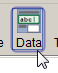
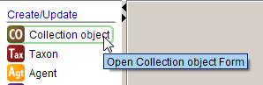
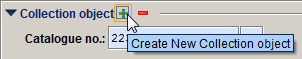
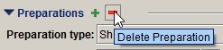

# General conventions

-   Information added or interpreted by data entry staff should be entered in brackets \[ \], unless it is entered in the **Curation** **notes** field or the **Georeferencing notes** field.

-   Include a full stop after information in the following text fields: **Locality**, **Habitat**, **Associated taxa**, **Descriptive notes**, **Collecting notes**, **Miscellaneous notes**, **Ethnobotanical info.**, **Toxicity** and **Curation notes**.

-   Include a space between measurements and the unit of measurement (e.g. ‘4 km’, ‘1500 ft’).

-   Where it is necessary to abbreviate words, use only standard abbreviations (see **Appendix** **1. Abbreviations**).

## Creating and editing records

### Opening a form

To open a blank data entry form:

1.  Click on the **Data** button in the task bar:

    

2.  Select the form that you want to use from the side bar:

    

    To open a new **Collection object** form after saving a record, click on the **Add** symbol at the top of the **Collection object** form:

    

### Adding records to subforms

To add a record to subform of a primary form (e.g. to add a **Determination** record to a **Collection object** record), click on the **Add** symbol in the relevant subform:

If you accidentally add an extra record to a subform, you can delete it by clicking the **Delete** symbol in the relevant subform:

Note that, before you can delete a record in a subform, or add a new record to a subform, the form must contain data in at least one field, and any required fields must be completed.

### Saving a record

To save a record, press **Ctrl+S**, or click the **Save** button at the lower right-hand corner of the form. The **Save** button will not be activated if there are errors in formatted fields or if any required fields have not been completed. Note that, although the record has been saved, it will remain in edit mode unless you click the **View** button, which makes the record read-only (the **View** button appears next to the **Save** button once a record has been saved).

### Editing a record

To edit a record, click the **Edit** button at the lower right-hand corner of the form to change it from view (read-only) mode to edit mode. See **Querying Specify** (p. 153) for instructions on how to query for records and open them in form view.

