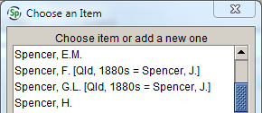

# Agent form

The **Agent** form is used to record information about people and organisations who are involved in the collection, determination or curation of specimens. Note that when the **Agent** form is opened from within the **Collection object** form (i.e. when adding a new collector), you may not be able to see the **Agent attachment** icon at the bottom of the form, depending on the size of your screen. If you wish to add (or view) an **Agent** attachment, click the **Collapse** symbol next to the **Agent geographies** heading to collapse that subform.

## Agent type

The type of agent. **Agents** can be one of the following:

-   Person: an individual botanist, collector, student or data entry person
-   Organisation: an institution or organisation that acts as a collector (e.g. ‘Ballarat Field Naturalists Club’) or that is involved in transactions (e.g. ‘National Herbarium of New South Wales’)
-   Group: more than one individual who act together as, for example, determiners
-   Other: any other type of agent (it is unlikely that we will need to use this category).

## Institution/Last name

The last name (for a ‘Person’ agent), the organisation/institution name (for an ‘Organisation’ agent), or the combination of agent names (for a ‘Group’ agent). See **Formatting agent names** (below) for information on how to enter ‘Group’ agents, foreign names, name variants and names of registered herbaria.

::: tip
## Formatting agent names

### ‘Group’ agents

While the **Collector** table allows you to add multiple individuals as collectors, some tables in Specify only allow you to enter a single agent for a task that may have been performed by more than one person (e.g. **Determiner**, or **Prepared by**). In order to record all the people involved in the task, they will need to be entered as ‘Group’ agent. Note that, before creating a new ‘Group’ agent, each individual needs to have a ‘Person’ agent record in the **Agent** table.

To create a new ‘Group’ agent, select ‘Group’ from the **Agent** type pick list, then enter the names of the people in the group in the **Last name** field. Names should be formatted as follows:

\[last name\], \[initials (separated by full stops)\] \[preposition (where applicable)\]; last name\], \[initials (separated by full stops)\] \[preposition (where applicable)\] (etc)

Use the form controls under the **Groups** subform to add the individual agents to the group.

### Names with prepositions 

If the agent’s last name consists of a preposition and a substantive, as in many European names (e.g. C.G.G.J. van Steenis), then the preposition is in lower case and should be entered in the **Initials** field:

If the name has been anglicised the preposition is treated as part of the substantive, and should be entered in the **Last name** field:

### Arab names

Arabic surnames prefixed by *al* or *el* (the) are alphabetised under the element following the article; the article is treated like *de* in French names:

Names beginning with *Abu*, *Abd* and *Ibn* \[or *Bin/bin*\], elements as integral to the names as *Mc* or *Fitz*, are alphabetised under those elements:

The following website is quite informative if you want to read more about Arab names: <https://duncanflfh.wordpress.com/2013/02/11/no-one-is-called-abdul-a-guide-to-arab-names/>.

### Variants of agent names

It is sometimes difficult to determine the correct format of an agent’s name, especially where variants exist on labels or in the literature. In these cases, it’s worth adding the variant name as a separate agent record, and cross-referencing it to the preferred name. For example, Ilias bin Paie (see example above) is listed in the Harvard Botanists Index – and potentially on some herbarium labels – as ‘Paie, Ilias bin’. Adding an entry for ‘Paie, Ilias bin’, with a note to use the ‘bin Paie, Ilias’ record will direct other database users to the preferred agent entry, ensuring that all specimens collected or identified by him can be retrieved in a single query:

### Names of registered herbaria

If the agent is an organisation that is involved in loan or exchange transactions with MEL, prefix the organisation name with the Index Herbariorum acronym, and use two hyphens with a space either side to separate it from the institution name:

Prefixing the institution name with the herbarium code makes it much easier to look up an institution in the gift and loan forms. It is important that two hyphens are used as the separator, as that is what the transaction paperwork program uses to identify which part of the name to print on reports and labels.
:::

## Title

The agent’s salutation or honorary title (for a ‘Person’ agent). If a title is not in the pick list, see the Digital Collections Advisor.

## First name

The agent’s first name (for a ‘Person’ agent). Entering data in the **First name** field is not as important as entering data into the **Initials** field.

## Initials

The agent’s first and middle initials. If the first name needs to be spelt out to avoid ambiguity, it should be repeated here (as well as being entered in the **First name** field). For example:

-   Paul G. \[Wilson\]
-   Peter G. \[Wilson\]
-   Stephen \[Johnson\]
-   Sidney \[Johnson\].

If a person’s name includes a preposition that has not been anglicised, e.g. ‘de’, ‘van’, ‘zu’, it should be entered after the initials:

If the preposition has been anglicised (and thus capitalised), it should be included as part of the **Last name**.

## Abbreviation

The Index Herbariorum code for the organisation agent, or for the institution that an agent works for.

## E-mail

The agent’s e-mail address.

## Job title

The agent’s job title (for a ‘Person’ agent).

## CITES no.

The CITES permit number of an organisation agent involved in transactions. Note that the **CITES no.** field is only activated when the **Agent type** is set to ‘Person’. If you need to edit an existing ‘Organisation’ record to add a CITES no., change the **Agent type** to ‘Person’ while you edit the form, then change it back to ‘Organisation’ once you’ve finished.

## Date type

Different types of date ranges can be entered in the **Agent** record, depending on the type of agent and/or the information available. The following date types can be selected from the drop-down list:

-   **Birth/Death** – the birth and/or death dates of a person agent
-   **Collected** – the period of activity for a collector (either a person or an organisation)
-   **Received specimens** – the period during which an organisation agent received specimens on loan or exchange.

## Start date

The earliest date corresponding to the date type, i.e. the agent’s date of birth (for a ‘Person’ agent), the earliest date of a period of collecting activity, or the earliest date that an organisation received specimens. The **Start date** can be entered as a full date, a month and year, or a year only.

## End date

The latest date corresponding to the date type, i.e. the agent’s date of death (for a ‘Person’ agent), the latest date of a period of collecting activity, or the latest date that an organisation received specimens. The **End date** can be entered as a full date, a month and year, or a year only.

## Comments

Any comments about the agent, such as period of collecting activity (for people agents, if the date entered in the **Start date** and **End date** fields is ‘Birth/Death’) or history of the institution (for organisation agents).

## Web link

A link to a website about the agent (whether a ‘Person’ agent or an ‘Organisation’ agent). The web link must include the protocol (i.e. ‘http://’).

::: tip
## Recording incorrect or misinterpreted versions of agent names

Sometimes collectors’ names have been recorded incorrectly on herbarium labels, or are frequently misinterpreted, for example, Jessie Spencer, who Mueller mostly referred to as Mrs F. Spencer (he mistook her initial for an F, and it can also be hard to tell the difference between Mueller’s capital I, T, J and F). Jessie was also incorrectly referred to as ‘Mrs G.L. Spencer’ in a 19th-century newspaper, and Jim Willis has pencilled those initials on some specimens. In cases such as this, it is useful to add the incorrect version of the name to the **Agent** table, with an indication of which name should be used instead. For example:

The correct version of the name should be recorded in the **Initials** field so it shows up in the agent list:

Make sure you include enough information to distinguish the name from other collectors with the same name: in the above example, the ‘Qld, 1880s’ is important in case we ever come across a collector whose initials and last name actually are ‘F. Spencer’.

Please always include an explanation of why the name has been assumed to be incorrect or misinterpreted, and references to the evidence that backs up your interpretation.

***Note:* You should never select one of these entries from the agent list; always use the entry it refers you to, and record the name as it appears on the label in the** Verbatim collector **field:**

:::

## Addresses

Multiple addresses can be entered for a single agent. If more than one address is entered, use the **Is current** check box to indicate the primary (or current) address, which will be used on mailing labels.

### Attn:

The person or position to whom correspondence should be forwarded (for ‘Organisation’ agents).

### Address

The organisation and/or street address of the agent.

### City

The city that the agent resides or works in.

### State

The state or province that the agent resides or works in.

### Post code

The postal code of the city that the agent resides or works in.

### Country

The country that the agent resides in.

### Phone

The agent’s primary telephone number.

### Fax

The agent’s fax number, if known.

### Is current 

The **Is current** field is used to record which of the agent’s addresses is current. An agent can only have one current address.

### Start date

If an agent has more than one address, the date at which MEL started using a new address should be entered in the **Start date** field. The **Start date** will default to the date that a new address record was added.

### Exchange

This is a read-only field that is used to indicate whether or not MEL has an exchange agreement with an institution agent. Changes to this field can only be made by a database administrator.

### Loan paperwork

The e-mail address of the person to whom loans paperwork should be sent.

### Exchange paperwork

The e-mail address of the person to whom exchange paperwork should be sent.

### Data format

The institution’s preferred format for exchange data.

## Agent geographies

### Region

The geographical region of interest to the agent, e.g. the region in which the agent collected or conducted research. This field links to the **Geography** tree, so only places listed in the **Geography** tree can be entered.

### Comments

Enter any comments about the agent’s interest in the geographic region (e.g. whether they collected in the region, or if it was a topic of research).

## Attachments

### Agent attachments

Any attachments that relate to the agent, such as images of handwriting samples, letters, or PDFs of articles about the agent.

## Administrative fields

The following fields are automatically completed and cannot be edited.

#### Created by

The person who created the database record.

#### Created

The date the record was created.

#### Last edited by

The person who last edited the record.

#### Last edited

The date the record was last edited.
