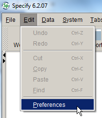
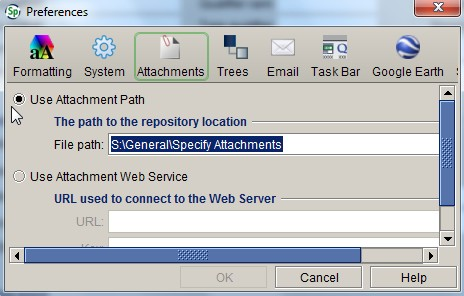
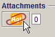
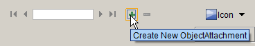

# Attachment forms

Specify allows many types of files to be attached to various tables. It’s important that attachments are properly curated so they can be effectively queried and can be made available to external researchers and projects such as the Australasian Virtual Herbarium (AVH), and not just used internally by herbarium staff. The requirements for curating non-image attachments (such as Word documents, PDF files and spreadsheets) are fairly straightforward, but the metadata requirements for curating images are more complex.

**Images should be only attached to specimen records if they augment the specimen data and are of sufficient quality and relevance to be of interest to other data users.** Once the mechanisms are in place for delivering images to the AVH, certain categories of images attached to specimen records will be delivered to the AVH by default.

**Please ensure images have the correct orientation before importing them into MELISR; you cannot alter the orientation once they’ve been imported, and we don’t want to deliver sideways images to the AVH or other services.**

## Attachment file formats

The following file formats can be attached to records in Specify:

-   JPEG
-   GIF
-   PNG
-   TIFF
-   PDF
-   CSV

Do not attach Word or Excel files to records. Note that Specify will not generate a thumbnail image for TIFF files. Avoid creating new TIFF images to attach to MELISR records, but if you are provided with TIFF images by a collector, don’t change them to another format.

## Types of attachments

Attachments can be added to the following forms:

-   **Collection object** – attachments that relate to the collection object, e.g.

    -   images of the specimen in the field (but not general habitat photos)
    -   images of the specimen in the lab (e.g. prior to being curated)
    -   images of the pressed or dried specimen (whether or not it has been mounted or curated)
    -   letters associated with herbarium specimens
    -   illustrations associated with herbarium specimens

-   **Collecting event** ­– attachments that relate to the collecting event more broadly, rather than to the individual specimen (or specimen-to-be), e.g.

    -   general habitat images (as opposed to a photo focussing on the specimen-to-be in the field; if in doubt, add the image as a **Collection object attachment**)
    -   a photo of the collector/s in the field

-   **Locality** – attachments that relate specifically to the collecting locality (and not to the specimen itself), e.g.
    -   a map of the collecting locality

-   **Agent** – attachments that relate to an agent, e.g.
    -   images of handwriting samples
    -   portraits
    -   letters (if a letter is from a herbarium specimen, add it as a **Collection object attachment**)
    -   PDFs of papers about the agent

-   **Conservator event** – attachments that relate to a conservator event, e.g.

    -   images of damage to a preparation
    -   treatment reports

-   **Taxon** – attachments that relate to a taxon name, e.g.

    -   PDFs of publications

-   **Loan** – attachments that relate to a loan, e.g.

    -   preparation lists for loans of unaccessioned material
    -   import permits

-   **Exchange** – attachments that relate to an exchange transaction, e.g.

    -   species lists for consignments of shipping material without preparations

-   **Permits –** attachments that demonstrate permission to collect, e.g.

    -   official collecting permits
    -   copies of correspondence permitting collection on private land.

::: tip
### Collection object attachment or Collecting event attachment?

An image of the habitat in which the specimen was growing, or of collectors at the collecting site, should be added as a **Collecting event attachment**. An image of the specimen, either before or after it was collected, should be added as a **Collection object attachment**. Sometimes an image of the plant, alga or fungus in the field will show habitat detail as well as the specimen itself. Use your own judgment to decide whether the main subject of the image is the specimen (or specimen-to-be), or the habitat. If in doubt, make the image a **Collection object attachment**.
:::

## Attachment metadata

Two tables are used to record information about attachments. The first is the **Attachment** table, which is used to record some of the technical, content and curatorial metadata. A second table, **Additional metadata**, is used to record additional metadata that mostly relates to image attachments.

Attachment metadata can either be added and edited within Specify, or, for attachments that have already been uploaded into Specify, you can add or edit metadata using the **Attachment metadata workbench** (see p. 106).

## Attachment storage location

When you first install Specify, the attachment storage location will default to your local drive. Before adding any attachments in Specify, the attachment storage location needs to be set; if you don’t change it, your attachments won’t be available to anyone else, and you won’t be able to view attachments added by other users. To set the storage location:

1.  Go to **Preferences** under the **Edit** file menu:

    

2.  Under the **Attachments** tab, set the attachment storage location as `S:\\General\\Specify Attachments`:

    

    Note that the file path is not case-sensitive on Windows computers.

## Attachment

### Original file name

The original file name of the attachment. The **Original file name** will be automatically taken from the file being uploaded.

### Title

The title of the attachment (the **Original file name** without the file path). The title will be automatically filled in from the **Original file name**; the **Title** does not have to be meaningful.

### Subject

The subject of the attachment. There is no need to repeat information that is elsewhere in the record, such as **Catalogue number**, **Taxon name** or **Collector**.

Examples of **Subject** for specimen-related images include:

-   ‘Part of inflorescence’
-   ‘Testa surface’
-   ‘Ascus with imm. spores’
-   ‘Whole plant’
-   ‘Internal view of spadix’
-   ‘Young fruit capsules’
-   ‘Flower’
-   ‘Fruiting body’.

If the attachment is a PDF of a published article, enter its title here. If a non-specimen-image attachment does not have a formal title, enter a brief description of it here. For example:

-   ‘Letter from McHard to Mueller, dated 1885’
-   ‘2014-0008 preparations list’.

### Image creation date

The date an image attachment was created (creation date is not required for non-image attachments such as PDF or csv files).

### Copyright holder

The person or organisation who owns copyright in an image. The **Copyright holder** will default to the photographer (in the **Image attributes** table), if left blank. Where the photographer was a member of staff at the time the photograph was taken, the **Copyright holder** should be entered as ‘RBG Victoria’.

### Copyright date

The date that copyright in the image was asserted.

### Restrictions on use

Any restrictions on use of the image instructed by the copyright holder or photographer (such as an embargo period). If a **Licence** has been provided and there are no restrictions on use entered, we will assume that we can use the image for any purpose that fits within the **Licence**.

### Attribution

How the image should be attributed.

## Additional metadata

The **Additional metadata** table contains additional metadata that is mostly only used for images, however, the **Category** field should be used for non-image attachments if there is a relevant category in the pick list (e.g. ‘Notes’ for a PDF of notes provided by the collector).

### Photographer

The name of the person who took the photograph. There is currently no link within Specify between the attachment metadata tables and the **Agent** table, so the photographer’s name will need to be entered by hand. We will make our own link between the **Photographer** field and the **Agent** table so we can properly attribute images when used outside of MELISR. For this to work, photographers’ names need to be entered in a standard format, as follows:

\[last name\], \[initials (separated by full stops)\] \[preposition (where applicable)\]

e.g. ‘Ratkowsky, D.A.’, ‘Heul, T. van der’

Make sure that there’s an entry for the photographer in the **Agent** table, and check that their **First name** has been entered there, if known.

### Image type

The method by which the image was produced. The values in the pick list are:

-   SEM
-   Light microscope image.

More terms can be added to the pick list as needed.

### Category

The **Category** field is used to indicate the broader subject of the image (more detail must be provided in the **Subject** field). These categories will allow us to determine which attachments are appropriate for different uses (e.g. which are suitable for sending to the AVH, which could be used for VicFlora, which could be used in an online database of collectors). There is some overlap in the categories (e.g. ‘Label’ is part of a ‘Herbarium specimen’); where more than one **Category** option applies, always use the more specific term.

The values currently in the pick list are:

-   Habitat – an image of the general habitat in which the plant, alga or fungus was growing (as opposed to an image of the specimen while still in the field) (used for **Collecting event** **attachments**)
-   Handwriting – a handwriting sample attached to an agent record (used for **Agent attachments**)
-   Herbarium specimen – all or part of a dried or pickled specimen that is (or will become) a herbarium specimen, regardless of whether or not it has been mounted or curated yet (used for **Collection object** **attachments**)
-   Illustration – an illustration associated with a herbarium specimen (used for **Collection object attachments**)
-   Label – detail of one or more labels on a herbarium specimen (used for **Collection object** **attachments**)
-   Letter – a letter attached to a herbarium specimen (if a **Collection object** attachment), or a non-specimen-related letter (if attached to an **Agent** record) (used for **Collection object** **attachments** or **Agent attachments**)
-   Notes – an image of any notes accompanying the specimen, such as lengthy notes with fungi, descriptions by Mueller, or Sonder’s diagnoses (used for **Collection object** **attachments**)
-   Person/s – a photo of a person or persons involved in a collecting event (used for **Collecting event** **attachments**, if relevant, or **Agent attachments**)
-   Specimen in field – all or part of the specimen in the field (i.e. an image of the individual specimen taken in the field, as opposed to a general habitat photo) (used for **Collection object** **attachments**)
-   Specimen – an image of all or part of the specimen taken somewhere other than in the field or once it has been curated, e.g. in the lab prior to being pressed and/or dried; use this category if you are unsure where the image was taken or whether or not it has been preserved yet (used for **Collection object** **attachments**).

### Magnification

The magnification of images taken under a microscope. Magnification should only be included for images that have a scale bar. You do not need to include the magnification symbol (×). Be careful not to confuse the size of the scale bar with the magnification.

### Licence

The licence under which an image can be used. The pick list has the following values:

-   CC BY
-   CC BY-SA
-   CC BY-ND
-   CC BY-NC
-   CC BY-NC-SA
-   CC BY-NC-ND
-   Unknown.

If the licence is unknown, please select ‘Unknown’ in the pick list, rather than leaving this field blank.

### Comments

Any additional remarks about the attachment.

## Adding attachments

To add an attachment to a record:

1.  Click on the attachment symbol in the relevant form:

    

2.  Click on the **Add** symbol at the bottom of the **Attachment** form:

    

3.  Navigate to the file that you want to attach to the record (if the file browser window doesn’t open automatically, click the **Browse** button)

4.  Enter as much metadata as you can about the image (see field descriptions above)

5.  Click **Done** to save the **Attachment** record.
