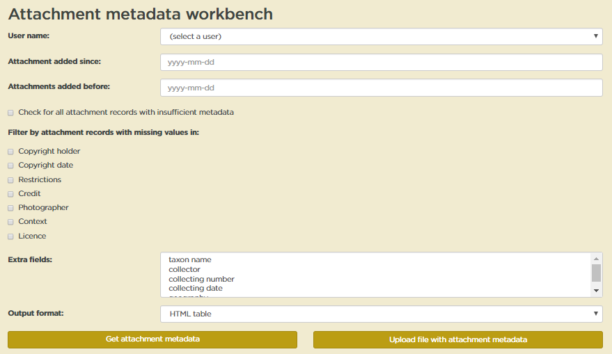
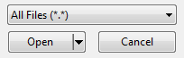

# Attachment metadata workbench

The **Attachment metadata workbench** allows you to easily add and edit metadata for attachments without opening each attachment in Specify. You can download a metadata spreadsheet for a batch of attachments, add missing metadata and/or edit existing metadata, then upload the metadata into MELISR. Note that you cannot use the **Attachment metadata workbench** to add new attachments to MELISR; they must have already been uploaded.

The URL for the **Attachment metadata workbench** is http://melisr.rbg.vic.gov.au/imagemetadata.

## Downloading attachment metadata

To download metadata for a batch of attachments:

1.  Select your Specify user name from the drop-down list

2.  In the **Attachments added since** and **Attachments added before** fields, enter the date span in which the attachments requiring metadata were added to MELISR

    -   You can limit your attachment records to those with insufficient metadata to be used for anything other than viewing in MELISR by ticking the **Check for all attachment records with insufficient metadata** box
    
    -   Alternatively, you can limit your records to those missing certain pieces of metadata using the **Filter by attachment records with missing values in** option (selecting multiple fields will include records with no data in one or more of the fields selected)
    
    -   You can include other fields from the specimen record in your metadata file for reference by selecting them in the **Extra fields** box. Hold the **Ctrl** key down to select more than one field. Note that these will all be ignored when the file is uploaded, so you can’t use the **Attachment metadata workbench** to edit data in these fields.

3.  Select the **Output format**. HTML table will provide a preview of the results in your browser.

4.  Click **Get attachment metadata** to download the metadata file.

## Editing attachment metadata

To edit the metadata file:

1.  Open the attachment metadata file from within Excel or another text editor; don’t open the file from the file manager. **If you open the file from the file manager, any special characters (umlauts, accents etc.) will be corrupted in Excel.**

    -   If the file doesn’t appear in the file browser, check that it is looking for all files, not just Excel files:
    
        
    
    -   In the **Text Import Wizard**, ensure that ‘Delimited’ is selected, and change the **File origin** to UTF-8 (this will preserve any special characters in the metadata):
    
        
    
2.  Add or edit the metadata fields. Refer to the instructions for entering metadata in the **Attachment** (p. 102) and **Additional metadata** (p. 103) tables, and take careful note of the following:

    -   You can change an attachment from a **Collection object attachment** to a **Collecting event attachment** (and vice versa) by changing the table name in the **Table** column. Make sure you spell the table name correctly, and use maximal capitals, i.e. ‘Collection Object’, ‘Collecting Event’.
    
    -   Do not edit the **GUID** column as it is used to match the rows in the spreadsheet to records in the database
    
    -   Data in the **CatalogNumber**, **MimeType**, **AttachmentLocation**, **Title**, **Created** and **CreatedBy** columns will be ignored when the file is uploaded, so those columns should not be edited
    
    -   The **Modified** and **ModifiedBy** values will be automatically updated when the metadata is uploaded, so there’s no need to edit those columns
    
    -   If you delete data from a field for an individual record, the value of that field will be cleared when the metadata file is uploaded.

3.  Save the file once you’ve finished editing the metadata.

## Uploading attachment metadata

To upload the edited metadata into MELISR:

1.  On the **Attachment metadata workbench** page, click on **Upload file with attachment metadata**. This will open the **Upload attachment metadata** page.

2.  Select your Specify user name from the drop-down list

3.  Click on **Choose file** and navigate to the metadata file you wish to upload

4.  Click **Submit** to load the file

    -   A record set will be created for the records in the upload file (if you’re already logged in to Specify when you upload the file, you’ll need to log out and back in before you can see the record set).
