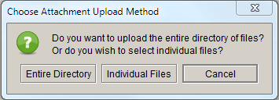
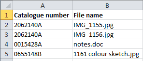
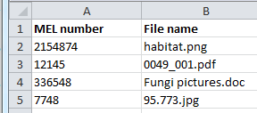
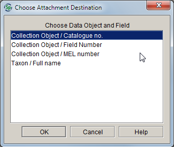

# Attachment tools

The **Attachment tools** in Specify allow you to view all attachments in the workspace, open associated specimen records in form view, and import either single attachments or multiple attachments in a single action.

Open the **Attachment tools** by clicking the **Attachment** button on the task bar.

Four functions appear on the side bar:

-   Show all attachments

-   Show all images

-   Import attachments

-   Import attachment mapping file.

## Show all attachments/Show all images

Click **Show all attachments** (or **Show all images**) in the side bar to browse thumbnail representations of all attachments (or just the image attachments) relevant to the current collection.

*Note:* Thumbnails are created for JPEG and PNG files and most PDFs. Other file types are represented by a default thumbnail based on their file type.

### Image viewing controls

The following controls are available in the **Attachments** results view:

| Symbol | Location | Action |
|------------|--------------|------------| 
|  | next to thumbnail | Displays information about the associated record, and allows the record to be opened in form view |
|  |  next to thumbnail | Opens the associated record in form view. Also indicates the table to which the attachment is linked. |
|  |  bottom of workspace | Displays some of the associated record information and displays the latitude and longitude from the associated **Locality** record on a map |
|  | bottom of workspace | Displays attachment metadata from the original file when available. *Note:* Metadata captured at the time a digital photo is taken may include the date, and latitude/longitude. The metadata information may be stripped from the file when the image is loaded into an outside program such as a web-based image storage facility. Some file types such as PNG, BMP and GIF contain little or no metadata. |
|  | bottom of workspace | Opens the Specify Help page for the **Attachment tools** |

### Viewing attachments

To display a larger version of the image within Specify:

-   Double-click an individual image thumbnail to display it in a new tab in the workspace

To open an image in an image viewer :

1.  Double-click an individual image thumbnail to display it in a new tab in the workspace

2.  Right-click on the image and click **Open in external viewer**. The image will either open in your default image-viewing program, or you will have the option of selecting an external viewer from the file manager.

To open a non-image file in its native program:

-   Double-click a non-image file to open it in its native program.

### Exporting attachments

To export an attachment:

1.  Right-click on the thumbnail and click **Export attachment**

2.  Navigate to the folder you want to export the attachment to, and click **Save**.

## Import attachments

The **Import attachments** tool allows multiple attachments to be associated to records by matching attachment names within a directory to a unique field within an existing record. For example, attachments can be linked to records within the **Collection object** table by giving the attachment files names that correspond to the **Catalogue number** or the **MEL number**. The **Import attachment** tool also gives you the option of linking files to records by ‘Field number’ (**Collecting number**), but these are not unique within MELISR, so cannot be used for this purpose. You can also link attachments to **Taxon** records by using the taxon **Full name**.

| **Table **          | **Unique field value**   | **File name example**                |
|---------------------|--------------------------|--------------------------------------|
| Collection object   | Catalogue number         | 2374514A.jpg                         |
| Collection object   | MEL number               | 5142.jpg                             |
| Taxon               | Full name                | Crowea exalata subsp. magnifolia.png |

Multiple attachments can be associated to the same record by adding a number to the end of the **Catalogue number** in the file name. Note that you can’t add multiple attachments to the same record if you are using **MEL number** as the unique field value.

| **Unique field value** | **Example of file names for multiple attachments** |
|------------------------|----------------------------------------------------|
| Catalogue number       | 2374514A1.jpg, 2374514A2.jpg, 2374514A3.jpg        |

### Importing attachments

To import attachments:

1.  Click **Import attachments** in the side bar

2.  Select the table that you want to link attachments to, and the unique field value that you’ve used for the file name, in the **Choose attachment destination** window:

    

3.  Click **OK**

4.  In the **Choose attachment upload method** window, choose whether you want to upload an entire directory of attachment files, or if you want to select individual files:

    

    Note that you can select more than one file if you choose ‘Individual files’.

5.  Navigate to the files or folder that you want to upload and click **Open**.

    Specify will display a message once the upload is complete, and details of any file upload issues will be reported in a browser window.

## Import attachment mapping file 

The **Import attachment mapping file** tool allows multiple files to be attached to **Collection object** records in Specify by associating the files with the **Catalogue number** or **MEL number**, or to **Taxon** records by associating the files with the taxon **Full name.** Unlike the **Import attachment** option described above, the file names don’t have to be meaningful, thus this method of importing of multiple attachments is the preferred option when the attachment files have not been pre-named with the **Catalogue number** or **MEL number**. The **Import attachment mapping file** tool also gives you the option of linking files to records by ‘Field number’ (**Collecting number**), but these are not unique within MELISR, so cannot be used for this purpose.

An image mapping file is used to create the association between the attachment file and the unique field value. Note that you can only map to one field in each mapping file (i.e. either **Catalogue number**, **MEL number** or taxon **Full name**), and not to a combination of fields. The file must first be created in a spreadsheet program, then saved as either a tab-delimited or CSV file.

The mapping file must contain two columns: the first column records the unique field value within a record (i.e. **Catalogue number** or **MEL number**), and the second column includes the name of the attachment file:

The unique field value and file names must match the respective field values and file names exactly, and the mapping file must be located in the same directory as the attachment files. More than one attachment can be associated with the same unique identifier, and the same attachment can be added to more than one record.

### Importing attachments via a mapping file

To import an attachment mapping file:

1.  Click **Import attachment mapping file** in the side bar

2.  Select the table that you want to link attachments to, and the unique field value that you’ve used for the file name, in the **Choose attachment destination** window:

    

3.  Click **OK**

4.  Navigate to the attachment mapping file in the file manager and click **Open** (remember that the attachment files must be in the same directory as the mapping file). Specify will display a message once the upload is complete, and details of any file upload issues will be reported in a browser window.
