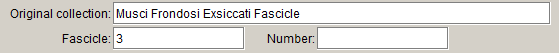

# Collection object attributes form

The **Collection object attributes** table records additional information that is specific to the **Collection object**, including phenology, label data, curation notes and other information.

## Phenology

If the specimen has flowers, fruits, buds, or is leafless, fertile or sterile, enter a ‘1’ in the appropriate boxes. Note that the ‘1’ is only used to indicate the presence of features; it is not used to indicate how many flowers, fruit etc. there are on the sheet. Only enter a ‘1’ if you are absolutely sure of the presence or absence of these features.

## Label data

### Ethnobotanical info.

Notes about the ethnobotanical usage of the plant, alga or fungus, if provided by the collector. For example:

-   ‘Bark and roots used as fish poison’

-   ‘Incolis medicamentum \[?=used as medicine\]’

-   ‘Before the introduction of cats natives used a piece of the root – squeezing sap into food & placing it near their feet to be eaten by rats & mice & in the morning these would be found dead. The mice have a particular liking for the soles of the feet – hence their placing the poison near their feet’.

Data entered in this field will be printed on MEL labels, so do not repeat any ethnobotanical information in other fields.

### Toxicity

Information about the toxicity of the specimen, if provided by the collector. For example:

-   ‘When fed to horses, produces fatal results’

-   ‘Poisonous to cattle’.

Longer descriptions about a poisoning case should also be entered here, rather than in **Collecting notes**. For example:

-   ‘Dog from this locality very sick and thought to have ingested this fungus. Dog from same locality died same time last year. Severe gastro-intestinal irritation, damage to wall of bowel. Specimen of fungus brought in by vet.’

Data entered in this field will be printed on MEL labels, so do not repeat any toxicity information in other fields.

### Common name

Any vernacular name for the plant, alga or fungus, if provided by the collector. For example:

-   ‘Common Broom’

-   ‘Kodhiro’

-   ‘Sikat’.

This field has a limit of 50 characters (including spaces).

### Usage

Any remarks about the usage of the common name, such as the language in which the common name is given, or the ethnic group who uses the name. This field can also be used to record information about the appearance of the common name on the collecting label. For example:

-   ‘Enga language’

-   ‘This is called the Cardwell plum here’

-   ‘Name followed by a word in non-Latin script’

-   ‘Local name’.

In the second example, ‘Cardwell plum’ would also be entered in the **Common name** field. This field has a limit of 64 characters (including spaces).

### Label language

This field is used to record the language(s) that the original specimen data is written in. Recording this information allows records to be queried by label language for the purpose of translating collecting information. Separate multiple languages with a comma and a space, e.g. ‘Spanish, German, English’.

### Translation confidence

This field is used to indicate the level of confidence applied to the translation of collecting information into English. The following values can be selected from the pick list:

-   Native or bilingual proficiency – translated by someone whose speaks, reads and writes the language with a proficiency equivalent to that of an educated native speaker

-   Full proficiency – translated by someone who is able to use the language fluently for most purposes

-   Limited proficiency – translated by someone who has enough knowledge of the language to translate collecting information without the aid of a dictionary or translation service

-   Bilingual dictionary – translated with the aid of a bilingual dictionary (printed or electronic)

-   Online translation service – translated using an online translation service (such as Google Translate).

### Translated by

The person who provided the translation and the date provided, if known. Enter names and dates in the following format:

\[initials\] \[preposition\] \[last name\] \[suffix\], \[dd\] \[mmm\] \[yyyy\]

For example:

-   ‘D. Sinkora, 12 Dec 1977’

-   ‘B. Meurer-Grimes, Feb 2001’.

## Data entry notes

### Curation notes

Notes about the specimen that are only of relevance for internal curation purposes, e.g. missing specimens, notes about MEL numbers being reassigned. Data in this field will not be delivered to the Australasian Virtual Herbarium (AVH).

-   ‘Specimen could not be located, April 2014.’

-   ‘Extracted from Victorian Reference Set and returned to the main collection, 12/11/2013.’

Annotations made by people other than the collector or data entry staff, such as Nancy Burbidge or Jim Willis, should be entered in the **Miscellaneous** **notes** (unless they relate to the collecting locality, in which case they should be entered in **Georeferencing notes**). For example:

-   ‘Field label removed to handwriting file J.H. Willis 15/5/1961.’ should be entered in **Curation notes**

-   ‘No. 88 from J.H. Willis to G.O.K. Sainsbury.’ should be entered in **Miscellaneous notes**

-   A comment about the collecting locality by J.H. Willis, e.g. ‘Not Kallista, but could be Monbulk’, should be entered in **Georeferencing notes**

-   ‘Common in lawns of Melbourne Botanic Gardens. J.H. Willis.’ should be entered in **Miscellaneous notes**.

### Curation sponsor

The organisation or individual who sponsored the curation of the specimen, e.g. CASS Foundation. Only the sponsor’s name should be entered in this field; a script will prefix the sponsor’s name with ‘The curation of this specimen was generously sponsored by’ when printed on the specimen label.

## Other

### Original collection

Information about the personal herbarium, exsiccata series or other collection from which the specimen originates. For example:

-   ‘Herbarium O.W. Sonder (1812–1881)’

-   ‘Lichenes Rariores et Critici Exsiccati’

-   ‘Plantes des Tunisie’

-   ‘Plantae Mexicanae’

-   ‘Plantes d’Espagne’.

If the specimen has come from more than one collection (e.g. via both Steetz’s and Sonder’s personal herbaria), enter all the information in this field, and use a pipe (‘|’) to separate the different collection names. If it does not all fit, it can be abbreviated to ‘Ex Herbarium Steetz, Ex Herbarium Sonder’, etc.

If there is more than one original collection, and one or more of them has a number, enter the number next to the collection name in the **Original collection** field instead of the **Number** field, to avoid confusion:

### Fascicle

The fascicle number in an exsiccata series.

### Number

The specimen number in an exsiccata series or a number within a personal herbarium. For example:

If there is more than one original collection, and one or more of them has a number, enter the number next to the collection name in the **Original collection** field instead of the **Number** field, to avoid confusion:

### Illustration

This field is used to indicate that there is an illustration associated with the specimen.

### Photograph

This field is used to indicate that there is a printed photograph accompanying a specimen, such as a habitat photo. If the specimen is a photograph of a specimen held at another institution, it should be databased as a ‘Photograph of specimen’ preparation in the *Photographs of specimens* collection, and not in the *National Herbarium of Victoria* collection.

The existence of high-resolution digital images created for the GPI project will be flagged in the **GPI** field, and does not need to be recorded here; high-res digital images (of GPI quality) that are taken for other purposes will be flagged in the **Imaged** field. Other digital images relating to the specimen should be attached the relevant table (see **Attachments**, p. 98).

### Spore print

This field is used to indicate that there is a spore print with a fungi specimen.
