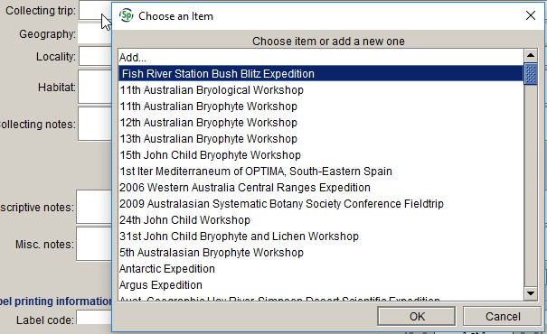

# Collection object form

A collection object refers to an individual item collected during a collecting event. At MEL, a collection object either comprises an entire sheet, packet etc. for non-mixed collections, or the individual component of the sheet, packet etc. for mixed collections. The **Collection object** form contains (or links to) all the collecting and curatorial information known about the herbarium specimen.

## Catalogue number

The **Catalogue number** is made up of the MEL number and part (see details below):

In order for the transactions to work in Specify, each record needs to have a **Catalogue** number in a standard format consisting of seven digits and one letter. Because not all MEL numbers contain seven digits, MEL numbers less than 1 000 000 need to be padded with leading zeroes. For example, the **Catalogue number** for MEL 1234 A would be 0001234A:

## MEL number

All specimens at the National Herbarium of Victoria should be assigned a unique identification number of up to seven digits. Older specimens often have a MEL number stamped on the sheet. If there is no MEL number assigned to the specimen, assign the next number from your batch of MEL numbers (see the **Numbers** section (p. 197) for details of how to get a new batch of MEL numbers).

MEL numbers are assigned to spirit collections as well as to dry material in sheets or packets. If you come across a spirit collection that has the same MEL number as its corresponding sheet or packet, allocate a new MEL number to the spirit collection (note that only one MEL number should be assigned to the spirit collection, regardless of how many spirit jars there are). Carpological collections, fungal cultures and photographs of specimens held at other institutions all receive a separate MEL number to any corresponding sheet, packet or spirit material.

Microscope slides only receive a unique MEL number if there is no corresponding dry material or spirit collection. Silica gel samples and photographic slides do not receive a MEL number, but are listed as additional preparations of the corresponding sheet, packet or spirit (see **Preparations**, p. 39).

**Note**
Do not reassign MEL numbers from deaccessioned specimens or from specimens that originally had more than one MEL number stamped on the sheet, just in case the specimen (or data associated with it) has been referenced in a publication or in someone's research notes. The only time we should re-use MEL numbers is if the specimen is still in the process of being accessioned into the collection when we decide to discard it, and the number hasn’t been published online or elsewhere.

## Part

MEL accession numbers are appended by a letter, which is used to differentiate between different parts of mixed collections. The default for **Part** is ‘A’. The only instance where anything other than A is entered in this field is where there is more than one component on a herbarium sheet (or in a packet or spirit jar), such as more than one taxon on the sheet, or more than one set of collecting information (note that the host of a parasitic plant should not be entered as a separate record unless there is value in doing so, e.g. if it’s a rare taxon or a new record for an area). Thus, the MEL number always refers to the entire sheet, packet or spirit jar, and the part refers to the individual component.

Only one label is printed for a mixed collection. The MEL number, part and taxon name for parts B, C etc. will automatically be printed at the bottom of the label for part A. Where there is more than one set of collecting information on the sheet, the **Mixed collection notes** can be used to provide a brief indication of how parts B, C etc. differ from part A. If there is more than one taxon on the sheet, but the separate components share the one set of collecting information, there is no need to enter anything in the **Mixed collection notes** field.

When you have databased all components of a mixed collection, indicate in pencil on the specimen which component corresponds to part A, B, C etc. If it is unclear which parts of the specimen belong to which set of collecting information, only label the collecting information.

## Type

This is a read-only field. If the collection object is a type, the **Type** box will automatically be ticked.

## Imaged

This read-only field is used to indicate that a high-quality image of the specimen has been generated at MEL, in accordance with the standards of the GPI project. This field will be populated as soon as practicable after the specimen has been imaged.

## GPI

This read-only field is used to indicate that a high-resolution image of the specimen has been delivered to JSTOR and is available to be viewed on the [Global Plants](https://plants.jstor.org/) website.

## Multisheet

This is a read-only field. If the collection object is part of a multisheet relationship, the **Multisheet** box will automatically be ticked.

## Parts

This is a read-only field. If the collection object is part of a mixed collection, the total number of parts in the mixed collection will be displayed in the **Parts** field.

## Other identifier

The **Other identifier** table is used to record the institution from which incoming exchange specimens were received, and the accession or catalogue number applied to the specimen at the source institution, if known. This table is also used to record the catalogue numbers of duplicates held at other herbaria, where known, and the original herbarium and catalogue number in situations where we have received a duplicate from one herbarium, but they received the original specimen (and duplicate material) from another herbarium.

### Type

The type of other identifier that is being recorded. The options are:

-   Ex herbarium – where the specimen is known to have been received as a duplicate or donation from another herbarium

-   Duplicate – where the specimen Is known (or has been inferred) to be a duplicate held at another herbarium based on collector, collecting number and collecting date.

-   Original herbarium – the original herbarium and catalogue number where we have received a duplicate from one herbarium, but they received the original specimen (and duplicate material) from another herbarium. If no catalogue number is provided – or if the herbarium is not registered on Index Herbariorum – the original herbarium should be recorded in the **Original collection** field in the **Collection object attribute** table.

### Institution 

The Index Herbariorum code of the institution from which the specimen was received, for contemporary exchange and donations. If the institution’s accession number is provided, enter it in the **Catalogue no.** field in the **Other identifier** table. If the specimen has come from the private herbarium of an individual collector, or if it is an older specimen that has been purchased or donated rather than received via contemporary exchange, enter that information in the **Original collection** field in the **Collection object attributes** table. Please use the code that the issuing herbarium is using on the specimen. For example, for a specimen from CANB that has the barcode ‘CBG 025665’, enter ‘CBG’ in the **Institution** field and ‘025665’ in the **Catalogue no.** field (or scan the entire barcode in the **Institution** field – see below).

### Catalogue no.

The catalogue or accession number that was assigned to a specimen (or its duplicate) at the herbarium from which it was received. For example, a duplicate of ‘BRI AQ 814849' would have ‘BRI’ entered in the **Institution** field, and ‘AQ 814849’ entered in the **Catalogue no.** field.

**Barcodes on exchange specimen labels**

You can populate the **Institution** and **Catalogue no.** fields by scanning the barcode on most exchange specimen labels into the **Institution** field:

When you save the **Collection object** record, the herbarium code will be saved in the **Institution** field and the accession or catalogue number will be saved in the **Catalogue no.** field:

Note that DNA barcodes do not include the herbarium code, so you need to scan the barcode directly into the **Catalogue no.** field and type the herbarium code into the **Institution** field. Also, the MEL barcode scanners don’t read the older NT barcodes, so these have to be entered by hand.

## Determinations

Specify supports multiple determinations, which allows the determination history of a specimen to be accurately recorded. The same set of fields is used for all determination types, and the **Det. type** field is used to indicate what type of determination is being recorded.

Records that have a Conf. should always have a Det., even if the original determiner is unknown. For specimens that have a single determination covering both the type status and the current name, the information should be entered as a ‘Det.’ as well as a ‘Type status’ determination.

Older specimens often have handwritten labels bearing more than one name. These should all be treated as determinations, regardless of whether or not the determiner or date of determination is known. If there is more than one name on a single label, and the names are written in the same handwriting, they can be treated as a single determination. Unless there is reason to think otherwise, treat the first or most prominent name on the label as the name the specimen was determined to, and enter all the names that appear on the label in the **Det. notes** field.

Where a specimen of a parasitic plant or fungus bears a separate identification for the host taxon, you can just record the determination in the **Miscellaneous notes** field, instead of creating a separate collection object record.

See **Appendix** **2. Examples of determination records** for specific examples.

### Det. type

The type of determination. The following values can be selected from the pick list:

-   Acc. name change – Accepted name change

-   AVH annot. – AVH annotation

-   Annot. ­– annotation

-   Conf. – confirmavit

-   Det. – determinavit

-   Type status – type status determination.

If there is an annotation on the specimen that is only there for curation purposes, or is only there to correct the spelling of a taxon name on a previous det. slip, there is no need to enter the annotation in the database. See **Taxon name** (p. 32) for instructions on how to deal with misspelt taxon names in determinations.

### Determiner

The name of the person who made the determination. Enter the determiner’s name from the **Agent** drop-down list. If the determiner is not in the list, press the **Add** symbol to open the **Agent** form.

Where there is more than one determiner, the agent names will be separated by a semicolon, e.g. ‘Stajsic, V.; Klazenga, N.’. If the combination of determiners is not listed in the drop-down list, it will need to be added to the **Agent** table as a ‘Group agent’.

If the determiner is given as an institution code, e.g. BRI, select the relevant organisation agent from the list (e.g. ‘BRI -- Queensland Herbarium’).

If the determiner’s name is difficult to read and has been interpreted, you can enter details about how it has been interpreted in square brackets in the **Det. notes** field. For example, if the determiner is given as ‘Paul Wilson’, but you have inferred that it is ‘Paul G. Wilson’, select ‘Wilson, Paul G.’ from the **Determiner** drop-down list, and record in Det. notes that ‘\[The determiner is given as ‘Paul Wilson’.\]’:

If you are certain of the identity of the determiner, there is no need to enter a message in the **Det. notes** field.

### Date

The date of the determination. The determination date can be a full date, a month and year, or just a year. Select the appropriate date type from the **Date** pick list, and then enter the date using the number keys. Note that if you enter a full date, then change the date type to ‘Mon/Year’ or ‘Year’, the month and/or date will revert to ‘01’ if you then change the date type back to ‘Full date’.

### Current

This field is used to indicate which of the determinations is current, for records that have more than one determination. Tick the **Current** box in the current determination. If there is no current determination, a warning will appear when you try to save the record:

The current determination should never be a ‘Type status’ determination; where a single determination covers both the type status and the current name, the information should be entered as a ‘Det.’ as well as a ‘Type status’ determination. If a specimen has a ‘Conf.’ that is more recent than a ‘Det.’ of the same name, the ‘Conf.’ is the current determination.

The **Current** check box is automatically ticked when you add a new determination. For this reason, it makes most sense to enter determinations in chronological order. If the determination you are adding is not the current determination, uncheck the **Current** box and use the navigation bar to scroll through the other determinations to find the current one:

### Taxon name

The name of the taxon that the specimen has been determined to. This field links to the **Taxon** table. To look up a name, start typing the taxon name and then press the down-arrow or the **Tab** key to see a list of names that start with the letters you just typed in. It may take several seconds to populate the list if there are a lot of matching names. If the name is not in the list, it will need to be added to the **Taxon** table using the **Taxon** form.

If the name on the label is an orthographic variant of a name already in the **Taxon** table (or is just misspelt), select the correctly spelt name from the **Taxon name** drop-down list, and enter the name as it appears on the sheet in the **Det. notes** field.

If an incorrect author is given, but it’s not clear whether the name is a homonym, an isonym or an error, select the valid name from the **Taxon name** list and enter the name and author combination given on the label in the **Det. notes** field.

### Alternative name

The **Alternative name** field is used to record unpublished or unofficial names that have previously been applied to the specimen. This field should never be used for current determinations.

Before entering a name in this field, check to see if the name (or a variation of the name) is in the **Taxon** table. If the name is in the **Taxon** table, it should be entered in the **Taxon name** field (even if it is an unofficial or unpublished name). If the name is not in the **Taxon** table, check to see if it is listed in IPNI or Tropicos. If it is listed in either IPNI or Tropicos, add the name to the **Taxon** table. If you cannot find the name in IPNI or Tropicos, or if the name on the sheet has a different author, enter it in this field exactly as it appears on the label.

### Qualifier

The determination qualifier, for uncertain determinations. The following values can be selected from the pick list:

-   ?
-   aff.
-   cf.

In the past ‘sp. aff.’ has often been used in this field. ‘sp. aff.’ is not a determination qualifier, but indicates a different entity. If a specimen has been determined to ‘*Somegenus* sp. aff. *someepithet*’, then ‘sp. aff. *someepithet*’ needs to be added as a species to the **Taxon** table. 

### Qualifier rank

The rank at which the determination qualifier applies. Select the appropriate rank from the pick list. By default, the **Qualifier rank** will be set to the lowest rank to which the specimen has been determined. This happens in the background after the record is saved, so you will not be able to see it immediately. You only need to fill in the **Qualifier rank** field if the qualifier is applied to a rank higher than the lowest rank to which the specimen has been determined. For example:

-   ‘?*Eucalyptus camaldulensis*’ – the **Qualifier rank** should be set to ‘genus’

-   ‘*Chamaecrista nomame* var. ?*nomame*’ – the **Qualifier rank** will automatically be set to the lowest rank, so you don’t need to enter anything in this field.

### Addendum

A suffix added after the name to indicate a concept for that name. The following values can be selected from the pick list:

-   s.l. – *sensu lato*: in a broad sense
-   s.str. – *sensu stricto*: in a narrow sense
-   group
-   intergrade
-   intermediate
-   complex
-   vel aff.

### Type status

The type status of the specimen, as recorded in the determination. The following type statuses are recognised at MEL:

-   Holotype – the one specimen or illustration used by the author or designated by the author as the nomenclatural type
-   Isotype – a duplicate specimen of the holotype
-   Syntype – any specimen cited in the protologue when there is no holotype, or any of two or more specimens simultaneously designated as types
-   Isosyntype – a duplicate of a syntype
-   Lectotype – a specimen or illustration designated from the original material as the nomenclatural type if no holotype was indicated at the time of publication, or if it is missing
-   Isolectotype – a duplicate specimen of the lectotype, if the lectotype has been chosen from among syntypes (if a lectotype has been chosen from among isotypes, the other isotypes just remain isotypes)
-   Neotype – a specimen or illustration selected to serve as the nomenclatural type if no original material is extant or as long as it is missing
-   Isoneotype – a duplicate specimen of the neotype (again only when the neotype was chosen from among syntypes; isotypes remain isotypes)
-   Paratype – a specimen cited in the protologue that is neither the holotype nor an isotype, nor one of the syntypes if two or more specimens were simultaneously designated as types (*Note:* paratypes need to be cited as paratypes in the protologue; not every specimen cited in a protologue that is not an isotype or a syntype is a paratype)
-   Residual syntype – used for the remaining syntypes when a lectotype has been selected from among syntypes (*Note:* in HISPID the term ‘Paralectotype’ is used for this and that is what goes into the database when ‘Residual syntype’ is selected from the pick list)
-   Paraneotype – used for the remaining syntypes when a neotype has been selected from among syntypes
-   Epitype – a specimen or illustration selected to serve as an interpretative type when the holotype, lectotype, or previously designated neotype, or all original material associated with a validly published name, cannot be identified for the purpose of precise application of the name of a taxon
-   Authentic specimen – the original specimen of an invalid name, i.e. any specimen cited in the protologue of an invalid name
-   Type – used when we know it is a type, but are uncertain of the type status.

### Type qualifier

The uncertainty of the type status determination, if recorded by the determiner. The options for type status qualifier are ‘probable’, ‘possible’ and ‘?’. If the determiner has included an explanation of why the type status is uncertain, include this in the **Det. notes** field.

### Stored under this name

For type specimens, this field is used to indicate that the specimen is stored under the basionym. It does not need to be checked for non-type specimens. **Note that, contrary to prior herbarium procedure, if the specimen is a type of more than one name, it should be stored under the most recent basionym (the date of publication can be checked in the** Taxon **table).**

**Stored under this name** must only be ticked in one determination record; if there is more than one type status determination for the name that the specimen is stored under, only tick **Stored under this name** in the most recent (or the most authoritative) determination.

### Basis

If the determination of a specimen is not based on examination of the actual specimen, but on a duplicate or an image, the basis of determination should be recorded here. The following values are currently in the pick list:

-   Duplicate – we either have the catalogue number of the specimen at the original herbarium in MELISR, or the catalogue number is not available, but the collector, collecting number and collecting date match
-   Image.

If additional values need to be added to the pick list, see the Digital Collections Advisor.

### Extra information

The **Extra information** field should be used to record recognised form and variant names, or any other information that tells you something about the taxon or group concept, but is not part of the taxon name. For example:

-   ‘alpine form’
-   ‘broad phyllode variant’
-   ‘var. indet.’.

Information entered in the **Extra information** field will be printed on the label directly below the taxon name. Any nomenclatural notes relating to the taxon name (e.g. ‘nom. nud’, ‘nom. inval.’) should be entered in the **Nom. note** field in the taxon name record.

### Flora

If the det. slip indicates that the specimen was viewed for a flora project, select the flora from the pick list. Do not enter any flora notes from the det. slip (e.g. ‘Seen for Flora of Australia’ or ‘Flora of Australia Project’) in the **Det. notes** field. The **Flora** pick list currently lists ‘Algae of Australia’, ‘Flora of Australia’ and ‘Flora Malesiana’. Additional flora projects can be added if needed. Make sure you only use this field in the determination record that corresponds to the relevant det. slip.

### Det. notes

**Det. notes** should be used to record additional notes that relate to the determination or the particular specimen, and not to a taxon or group concept. For example:

-   ‘glabrous variant with atypically short phyllodes’
-   ‘form with more or less petalous flowers’
-   ‘primocane’
-   ‘fruit needed for identification to species level’
-   'Determination taken from NSW 574242, Australia's Virtual Herbarium, 30/10/14'.

Lichen chemistry should be recorded in the **Det. notes** field if it is part of a determination. If it was provided by the collector, it should be recorded in **Collecting notes**. For example:

-   ‘TLC in C: salazinic (major), consalazinic, norstictic (faint trace), protocetraric (trace) and usnic acids’
-   ‘P-, K+, yellow, C-, KC-’.

::: tip
## Taxon names – what goes where?

### Name usage

Where an observation about the use of a name has been made by data entry staff, it should be recorded as an annotation in the **Determinations** table (i.e. a separate **Determination** record with the **Det. type** set as ‘Annot.’). Examples of observations about the use of a name include:

-   ‘Incorrectly reported from Australia, Checklist of Australian Lichens, Aug 2003’

-   ‘Listed under doubtful and excluded names, Checklist of Australian Lichens, August 2003’

-   ‘Listed under excluded names, Fl. Aust. 55: 162 (1994)’.

But, if an observation about the use of a name is written on a det. slip, then it should be recorded in the **Det. notes** field for that determination.

### Source of name

An indication of where the name comes from should be entered in the **Det. notes** field. For example:

-   ‘species name taken from I.G. Stone’s red collecting book’.

### Variants and forms

Short, informal variant or form names should be entered in the **Extra information** field. For example:

-   ‘Brisbane Range variant’
-   ‘Daylesford form’
-   ‘sessile-head variant’.

But, if the variant or form has been listed in VicFlora or APNI, it should be entered in the **Taxon** tree. For example:

-   ‘*Grevillea* aff. *oxyantha* (Mt Burrowa)’
-   ‘*Betula* aff. *pubescens* (Mt Macedon)’.

If the variant or form information is a short description, rather than a short, informal name, it should be entered in the **Det. notes** field. For example:

-   ‘variant with pubescent calyces’
-   ‘variant with short, ovate-obovate leaves’
-   ‘small, dark and short-headed form’.

If you are unsure whether something belongs in **Extra information** or **Det. notes**, enter the information in **Det. notes**.

### Field names

Field names for fungi that have not been identified to species level should be entered in **Extra information**. For example:

-   *Elaphomyces* ‘yellow crusty’ – only enter ‘yellow crusty’ in the **Extra information** field.

The formal part of the identification (in this example, ‘*Elaphomyces*’) should be entered in the **Taxon name** field as per usual.

### Informal names

Informal names for current determinations should be entered in the **Taxon** table. There is a CHAH-endorsed format for informal names, but any informal name that is used in a determination may be added to the **Taxon** table. There are many informal names already in the **Taxon** tree, VicFlora, FloraBase and APNI, so please check for variations of the same informal name in the **Taxon** tree and consult the nomenclatural sources before adding a new informal name to the **Taxon** table. If in doubt, enter the informal part of the name in the **Extra information** field.

### Redeterminations of duplicates

If the determination of a specimen is based on the redetermination of a duplicate specimen held at another herbarium, enter the name of the person who redetermined the duplicate in the **Determiner** field, and select ‘Duplicate’ in the **Basis** field.

If the determination was taken from a duplicate, record an appropriate message in **Det. notes** to make it clear that the determiner hasn’t redetermined our specimen in person, e.g. ‘Determination taken from NSW 574242, Australia's Virtual Herbarium, 30/10/14’. Enter the herbarium code and catalogue number of the inferred duplicate in the **Other identifier** table, recording ‘Duplicate’ in the **Type** field.

### Nomenclatural notes

Any nomenclatural notes that need to be printed with the taxon name, such as ‘non. R.Br.’, ‘nom. nud.’, ‘nom. inval.’ etc. should be entered in the **Nom. note** field in the taxon name record, not in the determination record.
:::

::: tip
### Batch identify

The **Batch identify** tool in Specify can be used to add new determination records to multiple collection objects at the same time. The newly added determination becomes the current determination, and the previous determinations are retained in the database.

To add a new determination to a batch of records:

1.  Create a record set of the collection objects that you want to redetermine. Make sure that the record set only contains collection objects for which the new determination details are identical, as all the records in the set will get the same details added for the new det.

2.  Select **Batch identity** from the **Data** menu:

    

1.  Select **Record Sets** from the **Choose** window

2.  Select the appropriate record set from the list and click **OK**

    A window with all the determination fields and a summary of the collection objects in the record set will appear. Before redetermining your record set, scroll through the list of records to check for any collection objects that shouldn’t be there.

    

3.  Enter the details of the new determination and click **Identify**. All records will be redetermined, unless you select specific records from the list.
:::

## Preparations

The **Preparations** form is a subform of the **Collection object** form. It is used to store information about what type of specimen the collection object relates to (sheet, packet, spirit etc.), where it is stored, and where duplicates are held.

### Preparation type

The type of preparations belonging to the collection object. The following preparation types are used at MEL:

-   Sheet – a pressed and dried specimen mounted on archival paper and stored in a manila folder

-   Packet – a dried specimen stored in a packet. The majority of fungi, lichen and bryophyte specimens are packet preparations.

-   Spirit – material preserved in ethanol and stored in the Spirit Room

-   Carpological – dried fruiting material that is too bulky to be pressed and mounted as a sheet

-   Microscope slide – a glass slide prepared for microscopic examination of all or part of the specimen

-   Photographic slide – a photographic slide that accompanies the specimen. Photographic slides of entire specimens, with no accompanying herbarium material, should be treated as ‘Photograph of specimen’ preparations and entered in the *Photographs of specimens* collection.

-   Silica gel sample – plant material stored in silica gel to be used for molecular analysis

-   Fungal culture – a dried fungal culture. All fungal cultures are stored in packets within the fungi collection.

-   Display Set – a specimen that is stored in the Display Set on the first floor of the herbarium extension

-   Seed collection – a seed sample, which is stored in the basement and may be used for germination trials or revegetation work

-   Duplicate – duplicate material that is sent to another herbarium

-   Seed duplicate – a duplicate seed collection that is sent to another herbarium

-   Shipping material – a fragment of a specimen that is sent to another herbarium for analysis

-   Vic. Ref. Set – a duplicate specimen that is held in the Victorian Reference Set, and has been curated as part of the separate *Victorian Reference Set* collection

-   Vic. Ref. Set (old) – a duplicate specimen that is held in the Victorian Reference Set, but has not yet been curated in line with the new Vic. Ref. Set procedures

-   Photograph of specimen – a photograph of a specimen held at another institution. Within Specify, all ‘Photograph of specimen’ and ‘Cibachrome’ preparations are recorded in a separate *Photographs of specimens* collection, and not in the main *National Herbarium of Victoria* collection. If a printed photograph accompanies a pressed plant specimen (i.e. a habitat photo), this should be flagged in the **Photograph** field in the **Collection object attributes** table instead.

-   Cibachrome – an image of a specimen from a colour slide that has been reproduced on photographic paper. Within Specify, all ‘Cibachrome’ and ‘Photograph of specimen’ preparations are recorded in a separate *Photographs of specimens* collection, and not in the main *National Herbarium of Victoria* collection.

A single collection object cannot have more than one of the following preparation types: ‘Sheet’, ‘Packet’, ‘Spirit’, ‘Carpological’, ‘Cibachrome’, ‘Photograph of specimen’, ‘Fungal culture’ or ‘Display Set’. The only preparation types that can occur with other preparation types in the one collection object record are ‘Microscope slide’, ‘Photographic slide’, ‘Silica gel sample’, ‘Vic. Ref. Set’, ‘Vic. Ref. Set (old)’, ‘Seed collection’, ‘Duplicate’, ‘Seed duplicate’ and ‘Shipping material’.

### Quantity

The number of objects of a particular **Preparation type**. The default quantity is ‘1’. The value of this field should only ever be greater than one for those preparation types that do not receive individual numbers for each object (i.e. microscope slides and spirit jars).

For ‘Duplicate’ and ‘Seed duplicate’ preparations, the number in the **Quantity** field should match the number of institutions listed in the **MEL duplicates at** field.

For ‘Vic. Ref. Set’ specimens, the **Quantity** should always be ‘1’.

### Number

The number assigned to the spirit jar, microscope slide, silica gel sample or Vic. Ref. Set specimen, or the library reference number for a photographic slide.

We have previously used the same numbering scheme for spirit and slide material. From now on, we will use a separate series of numbers for each type of preparation. The next available storage number for a preparation type is automatically generated when you save the record.

If there are multiple photographic slides with a specimen and they have each been assigned a Library reference number, they should be entered as separate preparations with the relevant Library reference number entered in the **Number** field for each preparation record.

Note that only one number is assigned for each spirit collection, regardless of whether or not there is more than one spirit jar in the collection. Likewise, only one number is assigned to microscope slides that belong to the same collection. Where there is more than one spirit jar or microscope slide for the one collection, use the **Quantity** field to indicate how many items there are.

For Vic. Ref. Set specimens, a six-digit number will be assigned when the record is saved. This number will become the **Catalogue number** in the corresponding **Collection object** record in the *Victorian Reference Set* collection.

### Jar size

The size of the spirit jar (A, B, C or D). A is the smallest jar size, B is the medium jar size and C is the largest jar size. D is used to indicate that the specimen is an algal collection, irrespective of the jar size.

### On loan

The **On loan** check box will automatically be ticked if a preparation is on loan.

### Loans

The **Loans** button is a link to the entry in the **Loan** table that relates to the preparation. If a preparation is currently on loan, clicking on the **Loans** button will open the details of the **Loan** in a new tab.

### Multisheets

Information about multisheet relationships between different specimens. The multisheet message must include the part (A, B, C etc.) after the MEL number to indicate which parts of a mixed collection are involved in the multisheet relationship. All numbers should be spelt out in full, and there should not be a space between the number and the part. For example:

-   ‘Sheet 1 of 3 (MEL 12345A, MEL 12346A)’.

For non-sheet collections or non-packet collections, include the preparation type before the MEL number, followed by a colon. For example:

-   ‘Sheet 1 of 2 (MEL 2142735A, Carpological: MEL 269770A)’

-   ‘Sheet 1 of 3 (MEL 691579A, Spirit: MEL 2040692A)’.

### MEL duplicates at

The Index Herbariorum codes of the herbaria that duplicates of a MEL specimen were sent to. Institution codes should be separated by a comma and a space, e.g. ‘AD, CANB, HO’; do not enter a full stop at the end of the string.

This field should only be completed for ‘Duplicate’ or ‘Seed duplicate’ preparations. Institutions that hold duplicates of specimens sent to MEL as exchange or donations should be listed in the **Other duplicates at** field in the record for the primary MEL preparation (i.e. ‘Sheet’, ‘Spirit’, ‘Carpological’, ‘Fungal culture’ or ‘Display Set’).

### Other duplicates at

The Index Herbariorum codes of the herbaria (or the name of other institutions) that also hold duplicates of specimens sent to MEL as exchange or donations. The **Other dupl. at** field should never be filled in for ‘Duplicate’ or ‘Seed duplicate’ preparations. Herbaria that hold duplicates of specimens sent by MEL should be listed in the **MEL duplicates sent to** field for the ‘Duplicate’ preparation type.

### Orig. herb. (Photographs of specimens collection)

The Index Herbariorum code of the institution where the actual specimen is held, where we have received a photograph or cibachrome of the specimen from a different herbarium. For example, if we receive an image of a type specimen from CANB, but the image is of a specimen held at K, ‘CANB’ would be entered in the **Ex herbarium** field, and ‘K’ would be entered here.

::: tip
### Databasing MEL duplicates

#### Duplicate preparations

In Specify, ‘gifts’ (outgoing exchange and donations) are linked to preparations. When a new gift transaction is created, preparations are added to the **Gift** record, creating a register of what duplicates have been sent where. To distinguish between preparations that are held at MEL and those that have been sent to other institutions, any specimen that has duplicates must have a ‘Duplicate’ preparation entry in the **Preparations** table, in addition to the preparation type(s) held at MEL (‘Sheet’, ‘Spirit’ etc.).

A single **Collection object** record should only ever have one ‘Duplicate’ preparation record in the **Preparations** table, regardless of the number of duplicate specimens that have been sent out. The **Quantity** field should be used to indicate the number of herbaria to which a duplicate has been sent. (There is no need to record that more than one ‘sheet’ has been sent to a single herbarium, as we have no guarantee that they will retain all the material.)

The **MEL duplicates at** field is used to list the herbaria that duplicate material has been sent to, and should only be populated for ‘Duplicate’ or ‘Seed duplicate’ (see below) preparation types. Institution codes should be separated by a comma and a space, and full stops should not be used. Do not enter anything in the **MEL duplicates at** field for preparations that are retained at MEL.

#### Duplicates of multisheet collections

Where a duplicate of a multisheet collection has been sent to one or more herbaria, a ‘Duplicate’ preparation should only be added to the **Collection object** record for one component of the multisheet. This will generally be Sheet 1, but in rare cases, it may be Sheet 2 (e.g. if duplicate spirit material is sent of a multisheet collection comprising dry material and a spirit collection).

#### Victorian Conservation Seedbank duplicates

Victorian Conservation Seedbank specimens generally have duplicate herbarium material as well as a duplicate seed collection, which need to be entered as separate ‘Duplicate’ and ‘Seed duplicate’ preparations. Because the duplicate seed sample and duplicate herbarium material are not always sent to the same institutions, the information in the **MEL duplicates at** field for the ‘Duplicate’ and ‘Seed duplicate’ will usually be different.

#### Printing duplicate labels

The number of duplicate labels that need to be printed will be calculated from the **Quantity** fields for preparation types that require duplicate labels.

#### Victorian Reference Set specimens

Specimens in the Vic. Ref. Set are databased in their own collection and also recorded as a ‘Vic. Ref. Set’ preparation in the corresponding MEL specimen record. Each Vic. Ref. Set specimen will be assigned a six-digit VRS catalogue number, which will be stored in the **Number** field when the record is saved. The Vic. Ref. Set specimens all need to have unique VRS catalogue numbers so, if there is more than one Vic. Ref. Set duplicate of a MEL specimen, the MEL record will need to have a separate ‘Vic. Ref. Set’ preparation for each Vic. Ref. Set sheet; the value of the **Quantity** field in a ‘Vic. Ref. Set’ preparation must always be ‘1’.

Once the ‘Vic. Ref. Set’ preparation has been saved in the *National Herbarium of Victoria* collection, a collection object record will be automatically created in the *Victorian Reference Set* collection, with the VRS number as the **Catalogue number**. The *Victorian Reference Set* record will include the most recent determination and all other data (except the preparation records and links to transactions) from the corresponding *National Herbarium of Victoria* record. The *Victorian Reference Set* record should be edited to include any annotations on the Vic. Ref. Set sheet, or to delete any annotations from the *National Herbarium of Victoria* record that don’t relate to the Vic. Ref. Set specimen.

Given that all Vic. Ref. Set specimens are duplicates of specimens in the main collection, they should always be databased via the *National Herbarium of Victoria* collection; records can be edited in, but should not be directly added to, the *Victorian Reference Set* collection.

Vic. Ref. Set specimens will be labelled with distinct labels, and ‘Vic. Ref. Set’ will still appear in the ‘Dupl:’ string on the corresponding MEL label.
:::

#### Storage

The storage system at MEL is quite outdated, and doesn’t reflect current taxonomic knowledge. In Specify, taxon names have been decoupled from the storage system, which allows us to query MELISR by up-to-date higher level taxonomy.

The **Storage** field provides a link to the **Storage** tree, so that changes in taxonomic classification in the **Taxon** tree do not necessarily have to lead to changes in storage. When you add a new taxon record for ranks above species, you also need to define its storage location; see **Adding new genus and higher taxon names** (p. 87) for instructions.

The **Storage** field will be populated when the record is saved. The storage location will be automatically printed on labels, regardless of whether or not the script that populates the **Storage** field has run.

#### Hort. Ref. Set

This field is used to indicate that the specimen is in the Horticultural Reference Set. It is legacy data from MELISR, and probably won’t be used in future. When the rest of the Hort. Ref. Set is databased, it will probably be entered as a separate collection in Specify.

## Collecting event

The **Collecting event** table stores information about when and where the specimen was collected, and who it was collected by.

### Collectors

All collectors associated with the collecting event should be entered here. Click on the **Add** symbol to open the **Collectors** subform.

If there is no collector’s name on the specimen, do not enter anything in the **Collectors** field. Instead, tick the **Colector unknown** check box in the **Collecting event attributes** form. If the label actually states that the collector is unknown, enter ‘Unknown’ (i.e. without brackets) in the **Verbatim collectors** field. If the collector(s) name is illegible, tick the **Collector illegible** check box in the **Collecting event attributes** form and, if the collector’s name is not on the label but has been inferred from their handwriting or the collecting information, tick the **Collector inferred** check box.

#### Agent

To look up a name, start typing the collector’s last name and then press the down-arrow or the **Tab** key to see a list of matching names. What you type in the field is only matched against the **Last name** field, so don’t type a comma or any initials when you are looking up a collector’s name. Scroll the list of matching names, then press **Enter** or click **OK** when you have found the right agent.

When adding multiple collectors, make sure that the primary collector is listed first (although the order of the collectors doesn’t really matter from a database point of view, entering them in a consistent way will help us detect potential errors in the database). If you need to change the order of collectors, click on the collector’s name that you want to move, then use the up and down arrows at the right-hand side of the **Collectors** grid:

If you have selected the wrong name, press **Esc** to clear the field, then search again.

If the collector’s name does not appear in the list, select ‘Add’ from the drop-down list, or click the **Add** symbol next to the field to add a new agent record.

#### Comments

The **Comments** field can either be used to record collecting numbers assigned by one of the additional collectors, or uncertainty about the interpretation of the collector’s name.

The collecting number for the primary collector(s) (see **Is primary** below) should be entered in the **Collecting no.** field. For example:

-   ‘A.C. Beauglehole 58278 & E.G. Errey 1978’ – ‘1978’ should be entered in **Comments** for E.G. Errey. **Comments** should be left blank for A.C. Beauglehole, and ‘58278’ should be entered in the **Collecting no.** field.

If you are unsure that the collector is the person you have selected from the drop-down list, enter a question mark in this field.

#### Is primary

Where there is more than one collector, the **Is primary** check box is used to indicate which of the collectors are the primary collectors. The **Is primary** check box is ticked by default, so it only needs to be un-ticked for collectors who are not considered to be primary collectors.

The primary collector is the collector whose name appears before the collecting number or ‘s.n.’ (if ‘s.n.’ is recorded in the collecting information). If more than one collector’s name appears before the collecting number (or ‘s.n.’), they can all be considered as primary collectors. If there is more than one collector, but no collecting number or ‘s.n.’, all collectors should all be considered as primary collectors. For example:

-   ‘N.G. Walsh 4901 & F. Anderson’ – N.G. Walsh is the primary collector

-   ‘L.A. Craven & C.R. Dunlop 6663’ – both collectors are primary collectors

-   ‘J.G. & M.H. Simmons s.n. & K.C. Rogers’ – J.G. Simmons and M.H. Simmons are the primary collectors

-   ‘D. Rouse \[JAJ 1301\] & M. Duncan’ – D. Rouse is the primary collector.

Note that these examples are only a guide; feel free to apply your own knowledge of the collectors when assessing which are the primary collectors and which are the additional collectors. For example, Nigel Sinnott labels are sometimes formatted with two collectors listed before the collecting number (e.g. ‘A.E.M. & N.H. Sinnott 2989’), even though the collecting number is from his sequence and he should be considered the only primary collector.

### Collecting no.

The collecting number of the primary collector(s). If there is no collecting number, type ‘s.n.’ (*sine numero*) in the **Collecting no.** field. The **Collection object** form cannot be saved if this field is left blank.

If the collecting number is prefixed with the collector’s initials, there is no need to enter their initials in the **Collecting no.** field.

If someone other than the listed collectors has assigned a collecting number to an unnumbered collection, enter the number in square brackets in the **Collecting no.** field, preceded by the initials of the person assigning the number. A note explaining who assigned the number should also be entered in **Miscellaneous notes**. For example:

-   ‘D. Rouse \[JAJ 1301\] & M. Duncan’ – ‘\[JAJ 1301\]’ would be entered in the **Collecting no.** field and ‘\[Collecting number assigned by J.A. Jeanes\]’ should be entered in **Miscellaneous notes**.

If someone other than the listed collectors has assigned a collecting number to a specimen that already has a number, enter the primary collector’s number in **Collecting no.**, and record the additional number in **Miscellaneous notes**. For example:

-   ‘F. Robbins 106 (ACB 17097)’ – ‘106’ would be entered in the **Collecting no.** field, and ‘\[A.C. Beauglehole assigned collecting number 17097 to this specimen.\]’ would be entered in **Miscellaneous notes**.

### Start date

The collecting date, or the earliest date if the collecting date is given as a range. The collecting date can be entered as a full date (day, month and year), a month and year, or a year only. Select the date type from the date drop-down list, then enter the date using the number keys.

If the collecting date is unknown but the collector is known, check that there are biographical notes indicating the collector’s lifespan or period of activity in the **Agent** table.

### End date

The end date of collection, if the collecting date is given as a range. The collecting date can be entered as a full date (day, month and year), a month and year, or a year only. Select the date type from the date drop-down list, then enter the date using the number keys.

::: tip
#### Flowering and fruiting dates

##### Specimens with a flowering date OR a fruiting date 

If the collecting notes mention a flowering (or fruiting) date, and the specimen is in flower (or fruit), it is safe to assume that the date corresponds to the date of collection. If the specimen is not in flower (or fruit), enter the flowering (or fruiting) date in the **Collecting notes** field.

##### Specimens with a flowering date AND a fruiting date

If the specimen is in flower, but not in fruit, enter the flowering date as the date of collection, and the fruiting date in **Collecting notes** (or vice versa). You can also add a note in the **Miscellaneous notes** field to explain that a fruiting date is given, but the specimen only bears flowers.

If the sheet contains separate plant specimens, one of which is bearing flowers and one of which is bearing fruit, assume that the flowering and fruiting dates represent the collecting dates of the separate plant specimens, and treat them as a mixed collection.

If the specimen has both flowers and fruits, but it doesn’t appear to be a mixed collection, enter the flowering and fruiting dates in **Collecting notes**.

##### Flowering and fruiting dates without years

If the flowering and/or fruiting dates have been interpreted as collecting dates but do not include the year, enter them in the **Verbatim collecting date** field.
:::

### Collecting trip

The collecting trip or expedition on which the specimen was collected, e.g. ‘Victorian Exploring Expedition’, ‘Mueller Commemorative Expedition’. Select the relevant collecting trip from the drop-down list. To see a list of all the collecting trips in the **Collecting trip** table, enter a wildcard (\*) in the query combo box and press the down-arrow:

If the collecting trip is not there, add it in the **Collecting trip** form.

### Geography

This is a read-only field that displays the **Geography** full name string, if it has been entered in the **Locality** form. The geography details will not display in this field until the record has been saved.

### Locality

The locality description, as provided by the collector. Click on the **Add** icon to open the **Locality** form.

You will see that the locality field has a drop-down list that allows you to select a locality that has already been entered, but this must be used with great caution. Only use an existing locality record if ALL of the details in the **Locality** form (and the associated **Locality details** and **Geocoordinate details**) are EXACTLY the same. If a **Locality** record is shared between two or more **Collection object** records then subsequently edited, the locality will be edited in *all* the **Collection object** records that share that locality, not just in the **Collection object** record that is open when the **Locality** record is edited. If the locality is similar to a previous record, use the **Clone** feature outlined below.

If there are no locality details provided, DO NOT select ‘No details given’ from the drop-down list, as many of the records with ‘No details given’ in the **Locality** field have data in other fields in the **Locality** and **Geography** tables that will not correspond to the specimen you are databasing.

If you use **Carry forward** for the **Collecting event** information, the **Locality** query box in the new record will contain the locality of the previous record. Do not **Edit** this **Locality** record unless to correct an error, as it will change the locality for all records you entered before that use the same **Locality** record. If the specimen you are databasing was collected in the exact same spot (including at the same altitude) as the specimen you databased previously, you can use the same **Locality** record and don’t have to do anything. If some, but not all, of the locality information is the same as in the previous record, you can use the **Clone** button – the stamp symbol just to the right of the **Add** icon. This will create a new **Locality** record with all the locality information from the previous record, so you can just change in the **Locality** form what needs to be changed. It will almost always be safer to **Clone** an existing **Locality** record than to **Edit** it.

### Habitat

A general description of the habitat that the plant, alga or fungus was growing in. Lists of associated taxa should be entered in the **Associated taxa** field in the **Collecting event attributes** table if they are given as a distinct list prefixed by ‘associated species’, ‘in association with’, or similar text.

### Collecting notes

Any notes provided by the collector that do not belong in other fields (e.g. information about distribution or abundance). Annotations made by someone other than the collector and notes made by data entry staff should be entered in either the **Miscellaneous notes** or **Curation notes** fields.

Annotations made by people other than the collector, such as Nancy Burbidge or Jim Willis, should be entered in the **Curation notes**, **Miscellaneous notes** or the **Georeferencing notes** field. For example:

-   ‘Field label removed to handwriting file J.H. Willis 15/5/1961.’ should be entered in **Curation notes**

-   ‘No. 88 from J.H. Willis to G.O.K. Sainsbury.’ should be entered in **Miscellaneous notes**

-   A comment about the collecting locality by J.H. Willis, e.g. ‘Not Kallista, but could be Monbulk’, should be entered in **Georeferencing notes**

-   ‘Common in lawns of Melbourne Botanic Gardens. J.H. Willis.’ should be entered in **Miscellaneous notes**.

Notes on the sheet by curators of personal herbaria (such as Steetz or Sonder) should be entered in the **Miscellaneous notes** field.

::: tip
### Habitat or Associated taxa?

| **Collecting information** | **Data entry** | **Comments** |
|----------------------------|----------------|--------------|
|Growing in a dry creek bed in dry sclerophyll forest on the property of Bush Hide-a-way Log Cabins, in association with *Poa sieberiana* var. *sieberiana*. | **Habitat:** Growing in a dry creek bed in dry sclerophyll forest on the property of Bush Hide-a-way Log Cabins.   **Associated taxa:** *Poa sieberiana* var. *sieberiana*. | |
|Growing in creek bed with rather coarse sand and broken shells on surface. In association with *Asphodelus fistulosus, etc. | **Habitat:** Growing in creek bed with rather coarse sand and broken shells on surface.  **Associated taxa:** *Asphodelus fistulosus*.||
| Growing on sand in association with Ecdeiocolea monostachya, amongst mallee eucalypts of a yellow sand-plain. |  **Habitat:** Growing on sand in association with Ecdeiocolea monostachya, amongst mallee eucalypts of a yellow sand-plain.  **Associated taxa**: *Ecdeiocolea monostachya* | *Ecdeiocolea monostachya* can be entered in Associated taxa, but should also be left in the habitat description so the original description is not corrupted. |
| Interdunal low-reddish, loamy, non-calcareous sands with *Eucalyptus oleosa*, mallee, *Casuarina*, *Heterodendrum* open woodland and sparse shrubs and *Spinifex*. | **Habitat:** Interdunal low-reddish, loamy, non-calcareous sands with *Eucalyptus oleosa*, mallee, *Casuarina*, *Heterodendrum* open woodland and sparse shrubs and *Spinifex*.  **Associated taxa:** | In this description ‘*Eucalyptus oleosa*, mallee, *Casuarina*, *Heterodendrum*’ is describing the woodland, rather than associated taxa. |
| Button grass plain, head of Melaleuca Inlet. Grows on recently burnt areas of plain. In Jungle thicket in Horizontal Scrub areas. Usually in association with Bauera. | **Habitat:** Button grass plain, head of Melaleuca Inlet.  **Collecting notes:** Grows on recently burnt areas of plain. In Jungle thicket in Horizontal Scrub areas. Usually in association with Bauera. | It’s not clear whether the three sentences that follow the habitat description apply only to the specimen in question or if they are a general description of where the taxon grows, so it’s better to enter that information in the **Collecting notes** field, rather than in **Habitat** and **Associated taxa**. |
| In deep sand in association with *Casuarina paludosa*. | **Habitat:** In deep sand.  **Associated taxa:** *Casuarina paludosa*. | |
| Located in dry sclerophyll forest, by the roadside. In association with Eucalyptus sieberi and other eucalypts which are dominant. | **Habitat:** Dry sclerophyll forest, by the roadside. In association with Eucalyptus sieberi and other eucalypts which are dominant.  **Associated taxa:** *Eucalyptus sieberi*. |	Only taxon names should be entered in the **Associated taxa** field.
| Below the south facing cliffs of the wall of a large gully on the west side of a large hill. Soil: red-brown pebbly-rocky loam amongst boulders. *Eucalyptus leucophloia*, *Acacia rhodophloia*, *A. aneura* low woodland over *Eremophila* sp. high open shrubland over *Ptilotus obovatus* low shrubland over *Polectrachne* sp. Mt Ella, *Triodia pungens* open hummock grassland. Associated species: *Rhodanthe margarethae*, *Taplinia saxatilis*, *Sida* aff. *filiformis*, *Chenopodium saxatile*, *Oxalis* aff. *corniculata*, *Canthium latifolium*, *Astrotricha hamptonii* (on the cliffs), *Lobelia* sp., *Eriachne mucronata*, *Cheilanthes humilus*?. | **Habitat:** Below the south facing cliffs of the wall of a large gully on the west side of a large hill. Soil: red-brown pebbly-rocky loam amongst boulders. *Eucalyptus leucophloia*, *Acacia rhodophloia*, *A. aneura* low woodland over *Eremophila* sp. high open shrubland over *Ptilotus obovatus* low shrubland over *Polectrachne* sp. Mt Ella, *Triodia pungens* open hummock grassland.  **Associated taxa:** *Rhodanthe margarethae*, *Taplinia saxatilis*, *Sida* aff. *filiformis*, *Chenopodium saxatile*, *Oxalis* aff. *corniculata*, *Canthium latifolium*, *Astrotricha hamptonii* (on the cliffs), *Lobelia *sp., *Eriachne mucronata*, *Cheilanthes humilus*?. | Taxa that are describing the habitat should not be entered in the Associated taxa field. |
:::

### Collecting event attributes

The **Collecting event attributes** subform is used to enter additional information about the collecting event, including plant origin, host and substrate.

### Collecting event attachments

Any attachments that relate to the collecting event, such as habitat photos or a photo of the plant at the collecting site.

## Descriptive notes

A description of the specimen provided by the collector. **Descriptive notes** includes information about the habit of the specimen, as well as information such as flower colour, the shape and size of leaves, and other features.

Descriptive notes that were written by someone other than the collector should generally be entered in the **Det. notes** field in the **Determination** form. As an exception, if the descriptive notes have been written by an Identifications Botanist, who has seen the fresh material and clearly indicates that this should be databased as a descriptive note, not a det. note, it can be added in this field, but the author and date of the descriptive notes should be provided in brackets. For example:

-   ‘Skin very thin, egg very soft, gleba jelly-like, phallus firmer textured. Eggs to 35 x 20 mm, mature phalli to 70 x 24 mm, generally cylindrical, straight or often curved to some degree. White rhizomorphs. Smell is similar to rotting bananas. \[Description by V. Stajsic, 15/6/2012.\]’.

## Miscellaneous notes

Any notes relating to the specimen or collecting event that are not provided by the collector. Notes provided by the collector should not be entered here, but should go in **Collecting notes**. This field can be used for any annotations or curatorial comments about the specimen that may be of interest to anyone using the specimen data. This includes comments about how specimen information has been interpreted, and notes authored by curators of personal herbaria (such as Steetz or Sonder). If the annotation appears on the specimen, it doesn’t need to be enclosed in brackets, but if it’s entered at the time of data entry, it should be enclosed in brackets (this will help us distinguish one annotation from the next). For example:

-   ‘\[There are two labels on the sheet but only one specimen.\]’

-   ‘\[Extract from letter from H.I. Ashton to R.O. Belcher, 6 July 1981 which explains collecting information is attached to sheet.\]’

-   ‘Donated by Miss Lecky, May 1931. ‘

-   ‘misit amicus Dr. Short, 1843’.

-   ‘\[Collecting no. above represents Whinray's despatch no. to MEL. Duplicates of this collection sent to other herbaria may have different despatch nos.\]’

-   ‘\[The original label says 'Portland V. May 1931 (Miss Lecky) ... Miss M. Wise Sept. 1895'. Miss May Wise collected in 1895, but not at Portland. Miss Lecky did collect at Portland. It's probable that either Miss Wise did not collect the specimen, or the specimen is not from Portland. It's also possible that there are two separate collections represented on the sheet. -- A.C. Vaughan, Oct. 2013\]’.

-   ‘Collected under the auspices of the Maude Gibson Trust of the Melbourne Botanic Gardens and National Herbarium’.

-   ‘\[Collecting number assigned by A.C. Beauglehole.\]’.

Where annotations involve matters of interpretation, they should always include the author of the annotation and the date, and any relevant sources. Preface the name of the person who authored the annotation with a double hyphen and space (as in the last example above).

Information about projects that the specimen has been used or collected for should also be entered in **Miscellaneous notes**. For example:

-   ‘Sampled for the Victorian Conservation Seedbank’

-   ‘Seen by Bentham’.

Note that information on exchange labels that relates to the curation or use of a duplicate specimen held at another herbarium (e.g. ‘Spirit material at BRI’; ‘Voucher for DNA sample’, ‘Voucher for essential oils analysis…’) should not be entered in the MEL collections database.

In future, details of projects for which the MEL specimen is a voucher will be recorded in a separate table. In the meantime, information about projects should be entered in the **Miscellaneous notes** field (and never in **Collecting notes**). Note that information about destructive sampling should be entered in the **Conservator description** table.

## Collection object attributes

The **Collection object attributes** table records additional information that is specific to the **Collection object**, including phenology, label data, curation notes and other information.

## Conservator description

The **Conservator description** table is used to record information about damage to specimens.

## Collection object attachments

Any attachments that relate to the collection object, such as images of letters or illustrations associated with the specimen, or a digital image of the specimen.

## Label printing information

### Label code

This field can be used to flag records that you want to print labels for, in order to make it easier to query for them when making record sets for label printing (but the field does not need to be populated in order to print labels for that record). It is purely an administrative field, and there are no restrictions on what can be entered.

### Mixed collection notes

The **Mixed collection notes** field allows you to enter brief details of the different parts of a mixed collection, so that they appear on the printed MEL label. You only need to use this field for new collections that don’t have original collecting labels.

Only one label is printed for a mixed collection. The **MEL number**, **Part** and **Taxon name** for parts B, C etc. will automatically be printed at the bottom of the label for part A. If there is more than one taxon on the sheet, but the separate components share the one set of collecting information, there is no need to enter anything in the **Mixed collection notes** field. Where there is more than one set of collecting information on the sheet, the **Mixed collection notes** can be used to provide a brief indication of how parts B, C etc. differ from part A, as follows:

-   If there is more than one collector on the sheet, enter the collector’s name (initials and last name), preceded by ‘Leg.’, e.g. ‘Leg. C. Stuart’

-   If there is more than one collecting locality, enter a very brief description of the locality, e.g. ‘Mt Buffalo’, ‘near Halls Gap’

-   If there is more than one collecting date on the sheet, enter the date

-   If there is more than one collecting number on the sheet, enter the collecting number preceded by the collector’s name or initials. Never enter a collecting number in this field without including the collector’s name or initials.

Only enter locality or date information if there is more than one specimen from the same collector on the sheet:

