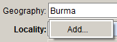
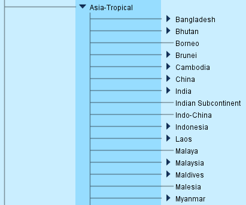
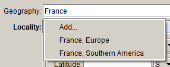

# Locality form

## Locality

The **Locality** form contains all the details of the collecting locality. It contains two subforms: **Locality details** and **Geocoordinate details**.

#### Geography

The higher level geography for the collecting locality. If the geography is unknown, enter ‘Earth’ in this field (this will allow us to tell the difference between records where the geography is unknown, and where it has been accidentally omitted). There are four levels of geography in the **Geography** table: **Continent**, **Country**, **State** and **County**.

Start typing the country, state or county name, then press the down-arrow to see a list of corresponding entries. Note that there are no county names for Australia in the **Geography** tree.

If any of the four levels is selected from the list, the parent geography will be automatically filled in, so enter the most specific information possible. For example, if you look up the state ‘Victoria’ in the query combo box, the full name will include the country (‘Australia’) and continent (‘Australasia’):

The continent number and name come from the *World Geographic System for Recording Plant Distributions* (WGS). The continent names and numbers are used in the storage system for specimens collected outside Australia

The country, state and county names in the **Geography** tree come from the International Organization for Standardization (ISO 3166 standard), and many may have unfamiliar spellings. If you can’t find the place name you are looking for in the drop-down menu, browse the **Geography** tree to see if you can find it. For example, Burma is listed by its official name, Myanmar, so a search for ‘Burma’ in the **Geography** drop-down list won’t return any results:

If you browse the **Geography** tree, you will see that it is listed as Myanmar:

Specify allows for entries in the **Geography** tree to be synonymised, which means that a query on either name in a **Collection object** query will return the same results. See **Search synonyms** (p. 158) for more information. If you would like a synonym of a place name to be added to the **Geography** tree, please see the Digital Collections Advisor.

Note that, in WGS, Russia occurs in Europe as well as in Asia – Temperate. If the collecting locality only gives ‘Russia’ as the collecting locality, select ‘Russia, Europe’ from the **Geography** drop-down list.

Be aware that countries that have dependencies in other continents will also be listed under more than one continent. For example, France is in Europe, but it also has a dependency in Southern America (Clipperton Island):

The option ‘France, Southern America’ should never need to be selected, because if the label has enough information for you to know that the specimen was collected in a French dependency in Southern America, then it probably also gives you enough information to select the relevant entry from the **State** level in the **Geography** tree.

Note that it is not possible to enter a combination of geographic place names. If the collecting locality traverses two or more regions, enter the next region in the hierarchy. For example, if the collecting locality is given as ‘Murray River’ (which borders New South Wales and Victoria, and flows through South Australia), ‘Australia, Australasia’ should be selected from the **Geography** drop-down list.

::: warning
**Cultivated plant records**

Cultivated plant specimens were previously databased with ‘Cultivated’ in the geography fields instead of the geographic place names. This practice is no longer used at MEL. Cultivated plant records should be databased with the geographic hierarchy entered in the **Geography** field, and other relevant details entered in the **Locality** form. The **Collecting event attributes** subform contains fields to record the **Cultivated status** and the **Source** of the cultivated status.
:::

#### Locality 

The description of where the specimen was collected, as provided by the collector. No punctuation is added to labels, so include a full stop after the locality, even if it is not a proper sentence.

If there are absolutely no locality details provided (and thus ‘Earth’ has been entered in the **Geography** field), enter ‘\[No details given\]’ in the **Locality** field. If the there is no description of the locality other than what has already been entered in the **Geography** field, repeat the lowest ranked place name in the **Geography** name in the **Locality** field. For example, if the collecting locality is only given as ‘Victoria’, ‘Victoria’ should be entered in the **Locality** field as well as in the **Geography** field:

If the only description of the collecting locality is UTM coordinates, a map reference, a botanical region or a Victorian grid reference, enter it in the **Locality** field, as well as in the field where it belongs:

If only altitude or latitude and longitude have been provided, enter them in the relevant fields, and enter ‘\[No details given.\]’ in the **Locality** field:

Minor corrections to, or interpretations of, the locality description should be entered in brackets in this field. For example:

-   ‘Balarrat \[=Ballarat\].’

-   ‘6 m\[iles\] west of Horsham’.

Any comments about the locality description or an explanation of why the locality could not be georeferenced should be entered in the **Not geocoded because** and **Georeferencing notes** fields in the **Geocordinate details** form.

Locality information should be entered exactly as it appears on labels (unless the description exceeds the field size – see below). Do not convert miles to kilometres. If the unit of distance has been given as ‘m’ and you suspect that it refers to miles rather than metres, append the m with ‘\[iles\]’ to make it clear that only ‘m’ has been given on the label; do not write ‘miles’.

The **Locality** field has a limit of 255 characters (including spaces). If the locality description exceeds the field length, first check if there is information in the locality description that belongs in other fields, such as map references or original uncertainty values. If necessary, the locality description can be shortened by using standard abbreviations in place of whole words. Refer to the list of abbreviations in **Appendix** **1. Abbreviations** (p. 210) for the correct formatting.

If the locality description still exceeds 255 characters, if possible, ask the collector to shorten the description, or shorten it at your own discretion. Locality descriptions that are particularly long may need to be split between the **Locality** field and the **Collecting notes**. In this case, ensure that the most important locality information is in the **Locality** field.

#### Latitude and longitude

Geocodes can be entered in one of the following formats:

-   Decimal degrees – e.g. 37.8272°

-   Degrees and decimal minutes – e.g. 37° 49.629′

-   Degrees, minutes and decimal seconds – e.g. 37° 49′ 37.74″

Select the lat/long type from the drop-down list, and enter the latitude and longitude in the fields provided.

The lat/long type is set to default to ‘Degrees, minutes and decimal seconds’, and the hemisphere fields are set to default to ‘S’ and ‘E’. The default preferences can be changed by clicking on the **Information** symbol at the right of the lat/long form. Note that the changes will only come into effect after the current **Collection object** record has been saved. Changing the default preferences will only affect your own user account.

Once the geocode has been entered, you can convert it to the different lat/long types using the drop-down list. The original geocode format is recorded in the database (and is visible on the form), and is used as the source for conversions between geocode formats. Note that editing the geocode will overwrite the source geocode.

Geocode information can be entered as a point, line or polygon. For botanical specimens, latitude and longitude are generally provided for a single point, but if the collector has provided line data (i.e. two sets of latitude and longitude that define a line between two places), or polygon data (i.e. three or more points that define a polygon around a certain area), these can be entered by selecting the line or polygon button.

If the collector has only provided UTM coordinates, you can choose to leave the **Latitude and longitude** fields blank (but note that the record cannot be mapped unless the latitude and longitude are provided).

#### Datum

The geodetic datum of the geocode.

The datum refers to how the earth is modelled and affects where exactly lines of latitude and longitude occur on the ground. There are a number of different datums in use and each results in a slightly different latitude and longitude grid. **Datum** should be recorded where the geocode was determined by the data entry person, if the geocode was determined by GPS, or if the collector has indicated which datum was used. Note that MGA94 is a UTM projection of GDA94 coordinates; if the collecting label states ‘MGA94’, select ‘GDA94’ from the pick list.

Where the **Protocol** is ‘GEOLocate’, ‘GeoNames’ or ‘Google Earth’, the **Datum** will be automatically set to ‘WGS84’ when the record is saved. Where the **Protocol** is ‘GA gazetteer’, the **Datum** will be set to ‘GDA94’.

A guide to determining which datum was used is provided below.

-   **GPS readings**
    Most GPS units are set to use the WGS84 datum by default but, if the datum has not been recorded, check with the collector if possible.

-   **Google Earth and Google Maps**
    Google map products use the WGS84 datum.

-   **Australian map references**
    Maps could be based on any datum. Newer maps will probably be based on GDA94 and older maps will be AGD66 or AGD84. Check near the title of the map for the datum and/or coordinate system used. If the coordinate system is AMG66, then the datum is AGD66. If it is a newer map the coordinate system might be MGA94, in which case it the datum is GDA94. Most of the maps in the Royal Botanic Gardens Library use AGD66.

-   **Reader’s Digest Atlas of Australia**
    The Reader’s Digest *Atlas of Australia* (1994) is assumed to be in AGD66.

-   **Melway**
    *Melway* directories up to edition 30 use AGD66. From edition 31 (2004) onwards, the datum is GDA94.

-   **VicRoads State Directory**
    VicRoads used AGD66 up to edition 4. From edition 5 onwards, the datum is GDA94.

#### Source

The source of the geocode. The following values are available in the pick list:

-   Collector
-   Data entry person
-   Exchange data.

#### Protocol

The method by which the geocode was determined. The following values are available in the pick list:

-   AMG conversion – the geocode was converted from an AMG reference that was provided by the collector
-   GA gazetteer – the geocode was found on the Geoscience Australia place names of Australia gazetteer
-   GEOLocate – the geocode was determined using GEOLocate
-   GeoNames – the geocode was found on the GeoNames website
-   Google Earth – the geocode was determined using Google Earth
-   GPS – the geocode was determined by GPS
-   Map or atlas.

If the **Source** is ‘Exchange data’, you don’t need to fill in **Protocol** unless it’s provided in the exchange data. Where GeoLocate is used to georeference the locality, **Protocol** and **Source** will be automatically filled in.

Note that *Melway* references should not be converted to latitude and longitude due to the differences in *Melway* references between editions.

#### Uncertainty

The level of uncertainty in the geocode. The following categories of geocode uncertainty apply:

-   1\. 0 – 50 m
-   2\. 50 m – 1 km
-   3\. 1 – 10 km
-   4\. 10 – 25 km
-   5\. > 25 km.

#### Collector’s uncertainty

If the collector has provided an uncertainty value with the geocode, this should be entered here, along with the units in which the uncertainty is given.

#### Min. altitude

The altitude, if provided by the collector. If altitude is given as a range, enter the lower value here. If the altitude is provided in feet, enter it in feet, rather than converting it to metres.

If the altitude is given as a range, enter the lower value here. If the altitude is provided as less than a certain value, e.g. ‘&lt;1200 feet’, enter the measurement in **Max. altitude**, leave **Min. altitude** blank, and enter the verbatim text in **Verbatim altitude**.

#### Max. altitude

If the altitude is given as a range, enter the higher value here. If the altitude is provided as less than a certain value, e.g. ‘&lt;1200 feet’, enter the measurement here, leave **Min. altitude** blank, and enter the verbatim text in **Verbatim altitude**.

#### Unit

The units in which the altitude is provided (metres or feet).

#### Altitude method

The method by which the altitude was determined. The pick list contains the following values:

-   Altimeter
-   Altimeter (corrected)
-   DEM \[digital elevation model\]
-   Field estimate
-   Google Earth
-   GPS
-   Map
-   Unknown.

#### Verbatim altitude

If the altitude is provided in a format that can’t be unambiguously recorded in the other altitude fields, enter it here as it appears on the label (but record relevant parts of the altitude in other fields as well). For example:

-   ‘&lt;500 ft’ (also enter ‘500’ in **Max. altitude** and ‘feet’ in **Unit**)
-   ‘c. 5 m’ (also enter ‘5’ in **Min. altitude** and ‘metres’ in **Unit**)
-   ‘about sea level’ (also enter ‘0’ in **Min. altitude**).

#### GEOLocate

Clicking the **GEOLocate** button launches the GEOLocate georeferencing service. GEOLocate uses the **Locality** description and geographic location to find latitude and longitude coordinate data for specimen records. See the **Plugins** section (p. 200) for more information.

#### Display in World Wind

Clicking the **Display in World Wind** button will open the World Wind application. The link to World Wind is available in the **Locality** form at any time. See the **Plugins** section (p. 200) for more information. 

#### Display in Google Earth

Clicking the **Display in Google Earth** button will map the current record in Google Earth. The record must have a latitude and longitude for the **Display in Google Earth** button to become active.

#### Locality attachments

Any attachments that relate specifically to the collecting locality (and not to the specimen itself), such as a map of the locality.

## Locality details

#### Island group

The name of the island group where the specimen was collected. For example:

-   ‘Furneaux Group’
-   ‘Cocos (Keeling) Islands’.

See the **Island group, Island and Water body** usage notes below for more information.

#### Island

The name of the island where the specimen was collected. For example:

-   ‘New Guinea’
-   ‘Flinders Island’
-   ‘Tierra del Fuego, Isla Grande de’.

See the **Island group, Island and Water body** usage notes below for more information.

#### Water body

The name of the water body the collecting site is in. Use for things collected on islands (especially small ones) or in the water. For example:

-   ‘Port Phillip Bay’
-   ‘Bass Strait’
-   ‘Indian Ocean’.

See the **Island group, Island and Water body** usage notes below for more information.

::: tip
**Island group, Island and Water body**

Please note that **Island group**, **Island** and **Water body** are interpreted fields, and that the entire verbatim location should still be entered in the **Locality** field. These fields will not be printed on labels, but are delivered to the AVH, where they will (at some point in the future) be able to be queried on. Use these fields if you think it adds information to the record. Good examples are:

-   Specimens collected from Borneo or New Guinea where it is unknown in which part of the island (and in which country) the collection was made

-   Specimens collected from Macquarie Island. or Lord Howe Island. – these cannot be queried in the AVH and they are often missed when querying by coordinates, as small errors in the coordinates could land the collecting location in the sea.

When using these fields, please use names from a controlled vocabulary, such as the *Gazetteer of Australia* (<http://www.ga.gov.au/placename>) or *Getty Thesaurus of Geographic Names* (<http://www.getty.edu/research/tools/vocabularies/tgn/>). These fields can be quite easily populated retrospectively for places of interest from the **Locality** field, so don’t worry too much about filling in these fields if you are uncertain of what to fill in.
:::

#### Min. depth

The depth that the specimen was collected at. If depth is given as a range, enter the shallower value here. Enter the depth in the units it was provided; do not convert depth values to metres.

#### Max. depth

If depth is given as a range, enter the deeper value here. Enter the depth in the units it was provided; do not convert depth values to metres.

#### Depth unit

The units of measurement in which the depth is given. The values in the pick list are:

-   fathoms
-   feet
-   metres.

#### UTM Grid

The grid system used for the UTM coordinates, if known. The pick list currently includes the following values:

-   AMG – Australian Map Grid
-   MGA – Map Grid of Australia
-   UTM – Universal Transverse Mercator.

If other entries need to be added to the pick list, please see the Digital Collections Advisor.

#### UTM Zone

The zone for UTM coordinates. In the UTM system, the world is divided into 60 zones (numbered 1–60), each of which is six degrees of longitude wide. UTM zones are sometimes followed by a letter that indicates the Military Grid Reference System (MGRS) Zone, e.g. ‘55H’. If provided, MGRS Zones should also be entered here.

#### UTM Easting

The easting is a measure of how far east the location is within the zone. Easting values should be six digits long.

#### UTM Northing

The northing is a measure of how far north the location is within the zone. Northing values should be seven digits long.

#### Map reference

If a map reference has been provided, such as the mapsheet on which the easting and northing are based, or a reference from a street directory, enter it here. For example:

-   ‘Melway ref. 211 K8’
-   ‘Eltham mapsheet’
-   ‘AMG – (Lerderderg 7722-1-2 map, 1:25000) 726-248’
-   ‘Wimmera Study Area Sector: f, Sub-block: 37f’.

Exchange labels from BRI often include a numerical map reference after the AMG coordinates (e.g. ‘7867-764725’), which can also be entered in this field.

If the edition of a street directory or the date of publication of a map is provided, make sure it is recorded in the database.

#### Botanical region

The botanical region in which the specimen was collected, if provided by the collector or recorded on an exchange label. If the collector has recorded an IBRA region, there is no need to record it in this field.

#### Gazetteer

The place name in the gazetteer that is the source of the geocode. This information is useful when the locality provided on a label is quite detailed but, because the exact locality cannot be found on a map, the geocode assigned may be less precise than the locality description would lead you to think. Recording which gazetteer entry the geocode is based on will give an indication of the uncertainty of the geocode. For example:

-   ‘Sugarloaf Mountains, track from Tale River Valley, S of Wapenamanda’ – **Gazetteer**: Wapenamanda
-   ‘Cometville’ – **Gazetteer**: Comet
-   ‘King Leopold Range, Diamond Gorge Road, 15 km E of Fitzroy River, c. 170 km WNW of Halls Creek, c. 70 km NE of Fitzroy Crossing’– **Gazetteer**: Diamond Gorge.

In Texpress, this information was often entered as a note in the **Locality** field, for example, ‘Yandarlo via Wilcannia, Darling River. \[Lat/long is for Wilcannia.\]’.

## Geocoordinate details

The **Geocoordinate details** form provides additional information about the locality, and how (or why) the geocode was (or was not) determined.

#### Georeference date

The date the specimen was georeferenced. This field will be automatically filled in when the record is saved. Where the geocode **Source** is ‘Collector’, the **Georeference date** will be the same as the date of collection. Where the geocode **Source** is ‘Data entry person’, the **Georeference date** will be the date of record creation. Where the geocode **Source** is ‘Exchange data’, the **Georeference date** will be left blank.

#### Geocode source

The source of the geocode, if it has been taken from an obscure source. For example:

1.  ‘Western Australian Phytogeographic Regions map, 1980’
2.  ‘Ampol Road Map, Queensland’
3.  ‘Uncommon locality index’.

This field has a limit of 64 characters (including spaces).

#### Georeferencing notes

Any notes about how the locality information has been interpreted, why a particular geocode was assigned, or any extra information about why a geocode was not assigned. For example:

-   ‘Lat/long taken for Cobar, as collector was in this area on this date.’
-   ‘Collector was known to be in Western Australia at this time.’
-   ‘There are several Bluff Mountains. Coordinates are for the Bluff Mountain closest to Tenterfield, as Stuart was known to be in that area on this date.’
-   ‘There are three Herbert Creeks in Queensland. It is unclear which Bowman collected at.’
-   ‘Locality not found on any maps or gazetteers.’
-   ‘There are several Mount Mitchells in New South Wales.’

Annotations about the collecting locality made by people other than the collector or data entry staff should also be entered in the **Georeferencing notes** field. For example:

-   A comment about the collecting locality by J.H. Willis, e.g. ‘Not Kallista, but could be Monbulk, J.H. Willis.’.

Notes that only indicate which locality has been selected, and not why it has been selected, (e.g. ‘Lat/long is for Rockingham’) should not be entered here. Instead, ‘Rockingham’ should be entered in the **Gazetteer** field.

#### Verified status 

**Verified status** is used to indicate whether the geocode of a record has been verified, or if it is awaiting verification. The values in the pick list are:

-   Requires verification
-   Verified by collector
-   Verified by curator.

This field has been populated with ‘Requires verification’ for specimen records that have been identified as outliers in the AVH. If anyone from MEL verifies or corrects a georeference, the value should be changed to ‘Verified by collector’ or ‘Verified by curator’, depending on who verified the georeference.

#### Not geocoded because

If you have attempted to assign a geocode to the locality, but were not able to, select one of the following values from the pick list:

-   Locality ambiguous – e.g. there multiple localities with the same name and it is unclear which one the collector was at
-   Locality not found – the locality name could not be located on maps or in gazetteers.

Any additional explanation of why the collecting locality could not be geocoded should be entered in the **Georeferencing notes** field.

If the locality is obviously vague (e.g. ‘South-eastern Australia’, ‘China’), it is not necessary to explain why a geocode was not assigned to the record.

## Administrative fields

The following fields are automatically completed and cannot be edited.

#### Created by

The person who created the database record.

#### Created

The date the record was created.

#### Last edited by

The person who last edited the record.

#### Last edited

The date the record was last edited.