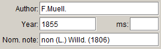
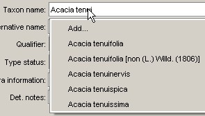
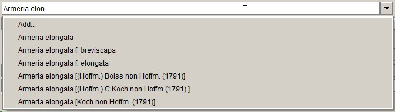
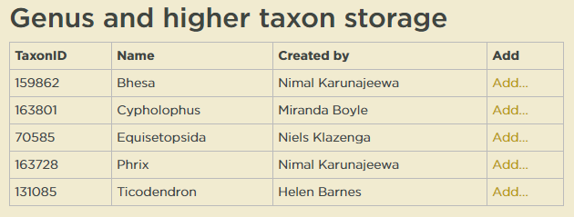
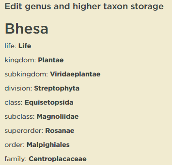
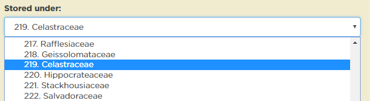
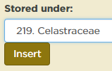
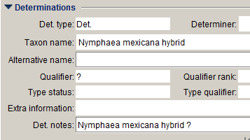
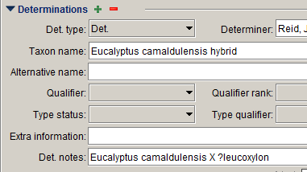
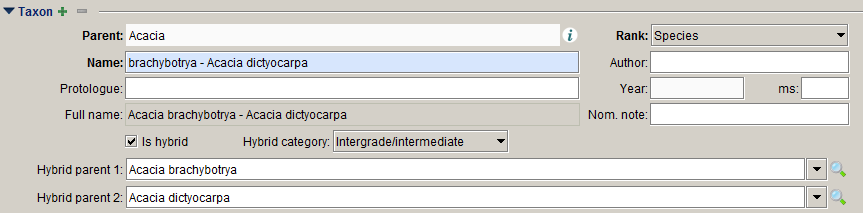

# Taxon form

The **Taxon** form is used to enter new taxon names. In Specify, taxa or taxon names are stored in a taxon tree (or classification) with the genus, species, subspecies, variety and forma parts of the taxon name stored as individual records, which are linked through parent–child relationships.

## Parent

The name of the parent taxon. For species names, this is a genus name; for genus names, a family name, etc. If a parent name is not in the drop-down list, it needs to be added using the **Taxon** form. If a parent of a family or higher rank is not in the drop-down list, it is probably easier to look up the lowest ranked ancestor in the **Taxon** tree and then open the **Taxon** form to enter the new names.

## Rank

The rank of the taxon: genus, species, etc. Select the appropriate name from the drop-down list. Only ranks below the rank of the parent taxon to the next mandatory rank are available in the list.

## Name

For names of taxa above the species level this is the taxon name; for species names it is the species epithet; and for names of infraspecific taxa, it is the infraspecific epithet. See **Formatting taxon** **names** (p. 88) for information on what to enter in this field for infraspecific names, hybrid names, cultivar names, and intergrades and intermediates.

## Author

The author of the name, formatted according to the standard abbreviations listed in [IPNI](http://www.ipni.org/ipni/authorsearchpage.do). The **Author** field should be completed for genus and higher taxon names, as well as for species and infraspecific taxa.

Where the author of the taxon is different to the author of the publication in which the name is published, the author of the publication may be included in the **Protologue** field (see below).

## Protologue

The original article the name was published in. This is compulsory for basionyms of which MEL holds a type, and is optional for other names.

The protologue string should include the following elements:

-   the standard abbreviation of the article or book in which the name was published
-   the volume of the book or journal, if relevant
-   the issue of the journal, in parentheses (note that the issue is only required if the page numbers are not contiguous between different issues in the same volume)
-   the page number separated by a colon and the year the name was published.

For publications whose author is different to that of the name, the author of the publication may be preceded by ‘in’. As this is the author of a publication rather than a name, author names should not be abbreviated here. The ‘in’ is important to make sure the protologue string prints correctly on labels.

## Year

The year of publication of the protologue. This must be entered for taxon names for which MEL holds a type specimen, but can also be entered for other taxon names.

## ms

If the taxon name has not yet been published, enter ‘ms’ in this field. Names flagged with ‘ms’ will be reported on periodically to check if the name has been published.

## Full name

The full taxon name. This is a read-only field, and is automatically filled once the record is saved.

## Nom. note

This field should be used to record nomenclatural notes that need to be printed with the taxon name, such as ‘non. R.Br.’, ‘nom. nud.’, ‘nom. inval.’ etc.

If the name is illegitimate, the preference is to indicate the correct authorship instead of using ‘nom. illeg.’, e.g. Acacia tenuifolia F.Muell. non (L.) Willd. (1806) would be entered as follows:

If the nomenclatural status has been filled in, it will be appended to the full name that appears in the **Taxon** name drop-down list, so that homonymous names can be distinguished.

If there are multiple homonyms for a name, include the author of the homonym in the **Nom. note** field so the different entities can be distinguished in the pick list:

## Is hybrid

This box needs to be ticked to indicate a hybrid or intergrade. Ticking this box will enable the **Hybrid parent** fields.

## Hybrid category

This field is a pick list that lists the hybrid categories. The items in this list are:

-   Hybrid name
-   Hybrid formula
-   Intergrade or intermediate.

If ‘Hybrid name’ is selected, a multiplication sign (‘×’) will print in front of the name or epithet.

## Hybrid rank

The rank at which the hybrid flag applies for hybrid names (e.g. ×*Glossadenia tutelata* vs. *Potamogeton* ×*sparganiifolius*). The items in this pick list are:

-   genus
-   species
-   infraspecific taxon.

## Hybrid parent 1

The first parent of a hybrid or intergrade. To avoid having more than one entry in the **Taxon** table for hybrids, intermediates or intergrades between the same taxa, hybrid parents should always be entered in alphabetical order, regardless of how they are listed on the det. slip. If the order of the names on the det. slip is deemed important, it can be recorded in the **Det. notes** field.

## Hybrid parent 2

The second parent of a hybrid or intergrade.

## Comments

Any additional comments about the taxon name.

## Child taxa

This subform lists the child taxa of the current taxon. If the current taxon is a genus, for example, the child taxa are species.

## Full name

The full name of the child taxon.

## Attachments

## Taxon attachments 

Any attachments that relate to a taxon name, such as PDFs of publications.

::: tip
## Adding new genus and higher taxon names

Because the higher classification is decoupled from the MEL storage location in MELISR, when you add a new taxon record for ranks above species, you also need to define its storage location. The storage location is updated in the **Genus and higher taxon** **storage** page of the MELISR website: melisr.rbg.vic.gov.au/genusstorage. If you add a new genus or higher taxon name that will be used in a **Collection object** record, it’s best to define its storage location straight away, so that the storage location can be printed on the MEL label.

To enter the storage location of a new genus or higher taxon:

1.  Click **Add** next to the taxon name you just entered:

    

    The higher classification for the taxon name will be displayed:

    

2.  In the **Stored under** drop-down list, select the MEL storage location (family or other grouping) for that taxon:

    

3.  Click the **Insert** button:

    
:::

::: tip
## Formatting taxon names

In Specify taxa or taxon names are stored in a taxon tree (or classification) with the genus, species, subspecies, variety and forma parts of the taxon name stored as individual records, which are linked through parent–child relationships. Taxa at supra- and infrageneric ranks are stored the same way.

One advantage of this is that taxa may be determined to any level in the **Taxon** tree, so if a specimen has only been identified to, say, order, you can just enter the name of the order in the **Determination** form.

### Hybrid names

Hybrid names are written with a multiplication sign (‘×’) in front of the name or epithet. In order for the name to show in the right position in the drop-down list in the **Determination** form, and to avoid duplication of the same name with and without the multiplication symbol, the multiplication symbol is not entered in the **Taxon** table, but will appear automatically on the label if ‘Hybrid name’ has been selected from the **Hybrid category** pick list. This allows us also to deal correctly with infraspecific hybrid names. Such names do not have multiplication symbols, but have ‘notho’ prefixed to the infraspecific rank prefix.

### Hybrid formulae

Hybrid formulae have the format *Parent 1* × *Parent* 2, e.g. *Eucalyptus baxteri* × *Eucalyptus obliqua*. In order to print the formula correctly on the label, ‘Hybrid formula’ has to be selected from the **Hybrid category** pick list and the **Hybrid parent 1** and **Hybrid parent 2** entered. Both parents need to be in the **Taxon** tree. In accordance with the recommendation in ICBN, we enter the parents in alphabetical order. In order for the hybrid formula to show in the drop-down list in the **Determination** form, the formula also needs to be entered correctly in the **Name** field. For ease of data entry and reliability of queries we use a lower case ‘x’ in the **Name** field.

Hybrid formula are entered at the rank to which the first parent is identified, so the above example is entered as a species with parent *Eucalyptus* and ‘*baxteri* x *Eucalyptus obliqua*’ in the **Name** field. *Eucalyptus camaldulensis* var. *camaldulensis* × *Eucalyptus viminalis* will be entered as a variety with the **Name** ‘*camaldulensis* x *Eucalyptus viminalis*’ and **Parent** ‘*Eucalyptus camaldulensis*’. For clarity and unambiguity we do not abbreviate or leave out any parts of the parents’ names:

We cannot deal with uncertainty in hybrid parents, so, if one of the parents is uncertain or unknown, only add **Hybrid parent 1** and write ‘&lt;Parent1&gt; hybrid’ in the **Name** field:

The full identification as written on the det. slip can be entered in **Det. notes**:

### Cultivar names

Registered cultivar names should be entered in quotation marks in the **Name** field, following the specific epithet. The **Author** field should be left blank.

If the species is not known, or not given, leave out the epithet:

If the specimen has only been identified to genus, but is recorded as a cultivar, e.g. ‘*Gaillardia* cv.’, the specimen should be databased with *Gaillardia* in the **Taxon name** field, and ‘cv.’ in **Extra information**.

You can check if a cultivar name has been registered on the Royal Horticultural Society website: (<http://apps.rhs.org.uk/horticulturaldatabase/>. If the name is not listed there, check with one of the Horticultural Botanists. Unregistered ‘cultivar’ names should be entered in **Det. notes**.

When databasing cultivars, remember to flag the **Cultivated status** and/or **Introduced status** fields as appropriate.

### Intergrades and intermediates

Intergrades and intermediates are dealt with in a similar way to hybrid formulae and have the format *Taxon 1* – *Taxon 2*. ‘Intergrade/intermediate’ should be selected in the **Hybrid category** pick list and Taxon 1 and Taxon 2 are entered in the **Hybrid parent** fields. Like in hybrid formulae, the taxa between which the plant is intermediate are entered in alphabetical order (if considered important, the names of the taxa can be written in the order they are on the herbarium sheet or det. slip in the **Det. notes** field in the **Determination** form):

‘Intergrade’ or ‘intermediate’ should be selected from the **Addendum** field in the **Determination** form to indicate which term was used by the determiner.

Intermediates between infraspecific taxa of the same species are far from uncommon (that’s why they’re infraspecific taxa, not species) and adding them to the taxon tree should be avoided. For such determinations the species name should be entered in the **Taxon name** field in the **Determination** form, while the information about the intergradedness between the infraspecies can be entered in the **Extra info.** field
:::

## Administrative fields

The following fields are automatically completed and cannot be edited.

### Created by

The person who created the database record.

### Created

The date the record was created.

### Last edited by

The person who last edited the record.

### Last edited

The date the record was last edited.
