# Plugins

Specify works with the GEOLocate and Google Earth web services to assist with georeferencing and visualising specimen records. GEOLocate and Google Earth can be accessed via the **Locality** form for individual records, or via the **Plugins** module for record sets.

## GEOLocate

GEOLocate uses the **Locality** description and geography to find latitude and longitude coordinate data for specimen records.

### Using GEOLocate in the Locality form

To georeference a specimen record in the **Locality** form:

1.  Complete the **Geography** and **Locality** fields:

    

    Note that the **Geography** field must contain at least a country name; GEOLocate will not work if only a continent name is entered.

2.  Save the **Locality** form then re-open it by clicking on the Edit symbol &lt;&lt;image&gt;&gt;

3.  Click the **GEOLocate** button at the bottom of the **Locality** form:

    

    A dialogue window will indicate whether or not GEOLocate has returned results:

    

4.  If there are no results, click **OK** to return to the **Locality** form. If there are results, click **Yes** to view them in the **GEOLocate results window** (p. 202).

### Using GEOLocate in the Plugins module

GEOLocate can be used to quickly georeference batches of records. To launch GEOLocate from the **Plugins** module:

1.  Open the **Plugins** module by clicking on the **Plugins** button in the task bar

2.  Click and drag a record set on to the **GEOLocate** icon in the side bar:

    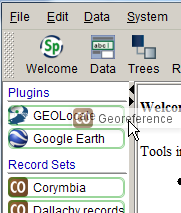

    If the record set contains records that do not have **Geography** information and/or records that already have latitude and longitude, a warning will be issued:
    
    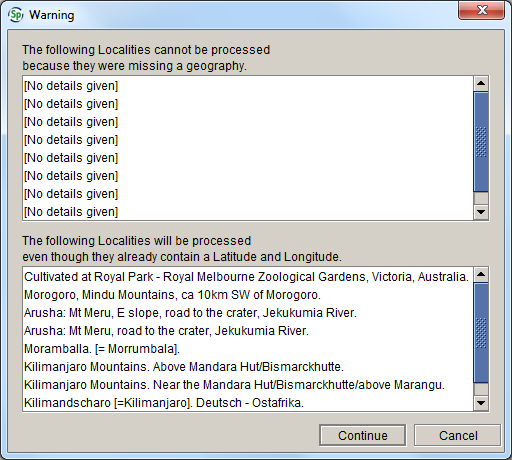
    
    Click **Continue** if you want to continue the georeferencing process regardless, or **Cancel** if you want to change the record set first. Do not click **Continue** unless you want to overwrite the existing latitude and longitude values, which is probably *not* what you want to do.
    
    The GEOLocate progress window will indicate how many of the records in the record set have been georeferenced:
    
    
    
    A dialogue window will indicate whether or not GEOLocate has found any matching localities.

3.  If there are no results click **OK** to return to the **Plugins** screen. If there are matching records, click **Yes** to view them in the **GEOLocate results window** (below).

### GEOLocate results window

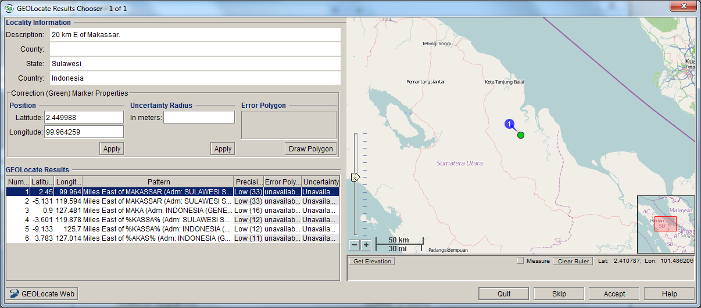

-   If there is more than one result, you can scroll through the list of results to view their locations on the map. The first result in the list is not always the correct one: in the example above, the first result is on Sumatra, not Sulawesi.

-   You can zoom in and out to get a more detailed view or a better overview by clicking the + and – buttons, moving the pointer in the zoom scale, or scrolling your mouse wheel. It can be useful to zoom out until you see the place marks for all the results so you can compare them easily. You can also pan the map by holding the left-hand mouse button down and dragging the map into the desired position. The result that is highlighted in the list (the first result in the above example) will have a green place marker; the other results will have red place markers:

    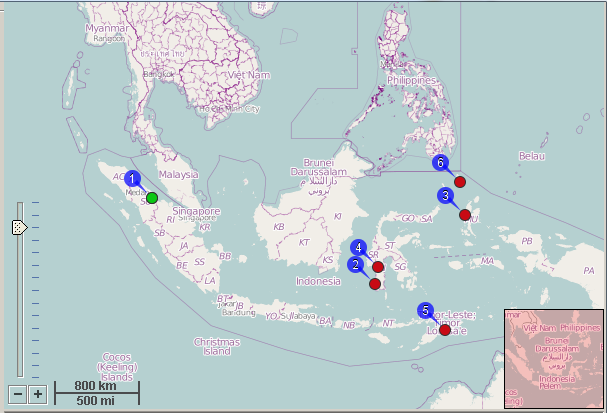

-   You can adjust the georeference by clicking on the place marker of the highlighted record (i.e. whichever one is green), holding the left mouse button down and dragging the marker to the desired position:

    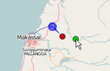

-   The new latitude and longitude of the green dot will appear under **Position** in the **Correction (Green) Marker Properties** box (there is no need to click the **Apply** button):

    
 

    (The latitude and longitude displayed under the map are the mouse position, not the position of the green marker.)

-   You can make the green marker jump back to its original position by clicking on the original red marker. The other fields in the **Correction (Green) Marker Properties** box have not been implemented in Specify, so any data entered in there won’t be stored in the database.

-   To save the geocode, click the **Accept** button at the bottom of the form. When using GEOLocate from the **Locality** form, the GEOLocate window will be closed; when using GEOLocate in the **Plugins** tab, the GEOLocate results window will display the results for the next record in the record set.

{: .alert .alert-danger}
**Caution!** 
If GEOLocate results are accepted, they will overwrite any existing data in the **Latitude and longitude** fields.
  
#### Other controls

-   Clicking the **GEOLocate Web** button will transfer the result of the GEOLocate query to the GEOLocate website. The GEOLocate website will display exactly the same information as the plugin in Specify, but uses Google Maps as the base map, which might give more map detail. Changes you make on the GEOLocate website will not be stored in the database, so it is a safe option if you need to play around a bit to determine the correct geocode.

-   Clicking the **Help** button will open **Specify Help**

-   When GEOLocate is used in the **Locality** form, clicking **Skip** will close the GEOLocate window; when GEOLocate is used in the **Plugins** tab, clicking **Skip** will get you to the results of the next record in the record set

-   Clicking the **Quit** button closes the GEOLocate window.

::: tip
**Note**
When you georeferenced a specimen using GEOLocate, it will populate **Latitude and longitude, Datum**, **Source** and **Protocol**. **Uncertainty** still has to be entered in the **Locality** form.
:::
  
## World Wind

World Wind is an open-source, 3D, interactive world viewer. It can be used in Specify to display the locality of **Collection object** records, or to map localities during data entry.

Clicking the **Display in World Wind** button will open the NASA World Wind application. A text box at the top of the World Wind window allows latitude and longitude or a locality name to be entered:

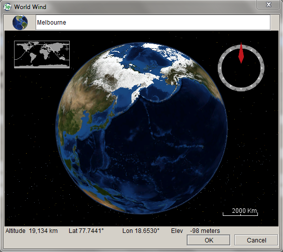

Press **Enter** after typing the locality name. The location is then displayed on a World Wind map:

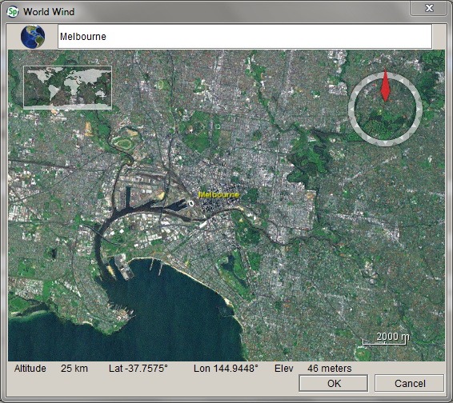

If the **Collection object** has been georeferenced, or if there is a locality in the **Locality** form, World Wind will automatically plot the location on the map once the button is clicked. **Never close the window by clicking the** OK **button unless you want to change the geocode in the** Locality **record. **

The following mouse and keyboard controls operate in World Wind:

For a mouse with a scroll wheel:

What?              | How?
-------------------|---------------------------------------------------------------------------------------
**Pan **           | Click and drag the left mouse button to pan in all directions
**Zoom **          | Use the scroll wheel on the mouse or click and drag the left and right mouse buttons to zoom in and out
**Tilt **          | Click and drag the right mouse button up and down, or press the **PgUp** and **PgDn** keys to tilt the map.
**Rotate **        | Click and drag the right mouse button left and right to rotate the map.  *Note:* crossing the top and bottom half of the screen while rotating will change the rotation direction.
**Stop **          | Press the spacebar to stop the map
**Reset heading ** | Press **N** to reset the heading
**Reset all **     | Press **R** to reset all settings

For a mouse with a single button:

What?              | How?
-------------------|---------------------------------------------------------------------------------------
**Pan **           | Click and drag the left mouse button to pan in all directions. Click the left mouse button once to center the view.
**Zoom **          | Press and hold the **Ctrl** key on the keyboard and click and drag the left mouse button up and down to zoom in and out
**Tilt **          | Press and hold the **Shift** key on the keyboard and click and drag the left mouse button up and down to tilt the map
**Rotate **        | Press and hold the **Shift** key on the keyboard and click and drag the left mouse button to rotate the map left and right.
**Stop **          | Press the spacebar to stop the map
**Reset heading ** | Press **N** to reset the heading
**Reset all **     | Press **R** to reset all settings

## Google Earth

The Google Earth plugin is used as a means of visualising **Collection object** records from Specify in Google Earth. The full version of Google Earth 4.3 (or higher) must be installed on the local computer for the Specify Google Earth plugin to work.

Specify plots **Collection object** records in Google Earth based on the latitude and longitude provided in the **Locality** form. Google Earth can either be launched in the **Locality** form, or by dragging and dropping a record set onto the Google Earth icon in the **Plugins** module.

Before plotting specimen records using **Google Earth**, make sure that all records in the record set contain latitude and longitude values.

### Using Google Earth in the Locality form

To launch Google Earth from the **Locality** form:

1.  Open a **Collection object** record and click on the **Locality** information symbol to view the **Locality** form:

    

1.  Click the **Display in Google Earth** button at the bottom of the **Locality** form:

    

-   Google Earth will open, and the **Collection object** records in the record set will be mapped:

    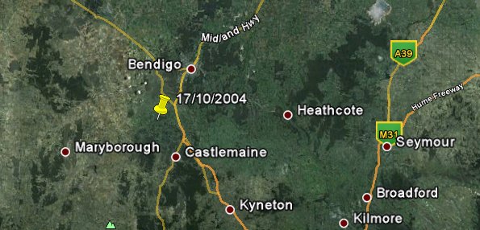

### Using Google Earth in the Plugins module

To launch Google Earth from the **Plugins** module:

1.  Open the **Plugins** module by clicking on the **Plugins** button in the task bar

2.  Click and drag a Record set on to the **Google Earth** icon in the side bar:

    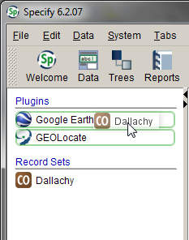

    -   Google Earth will open, and the **Collection object** records in the record set will be mapped:
    
        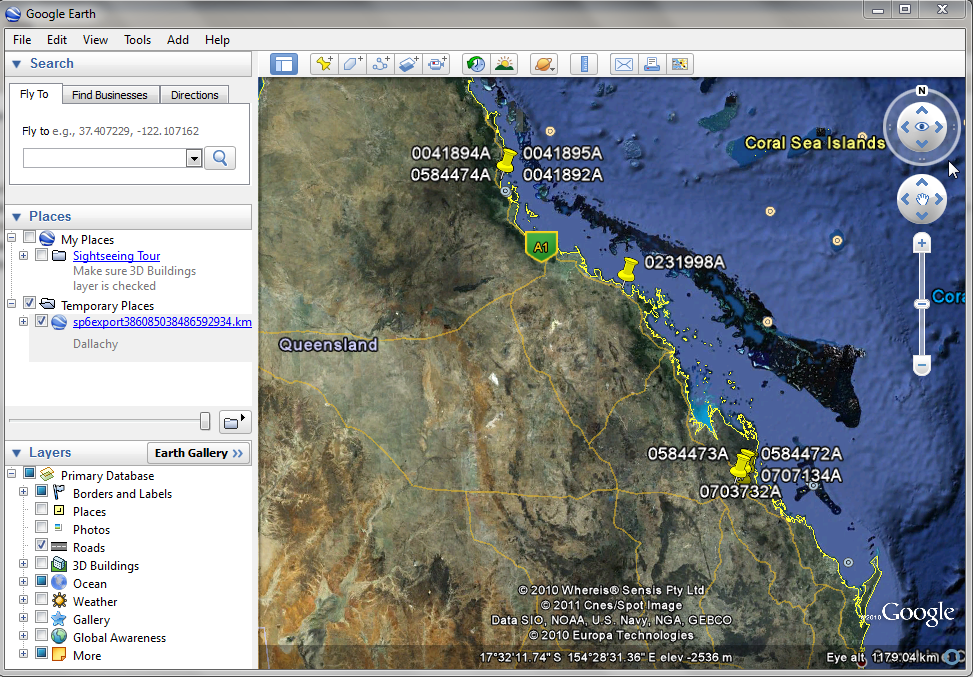
    
    -   Collection object information is shown in the Google Earth information window:
    
        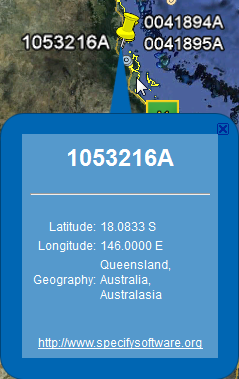